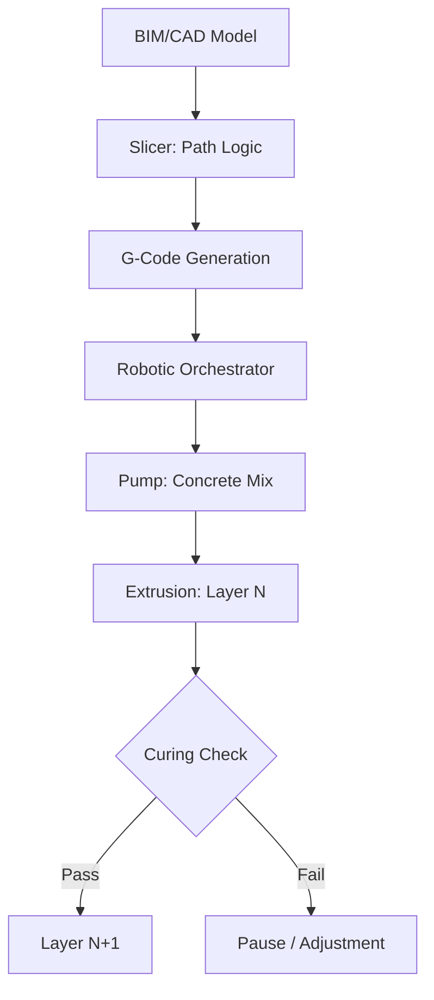

<TLDR>
  3D construction printing isn't just about speed; it's about precision. By moving from subtractive to additive manufacturing, we can reduce material waste by up to 60% and integrate complex thermal geometries directly into the wall structure. This is the definition of Green Infrastructure: high-performance, low-waste, and local-first.
</TLDR>

The first time I saw a gantry-style 3D printer extruding a bead of carbon-fiber reinforced concrete, I saw more than just a faster way to build. I saw a technical shift toward **Material Sovereignty**—a concept that has been a recurring theme in my recent research.

In the traditional construction world, we are often bound by the dimensions of the lumber yard and the limitations of the mold. The waste is staggering; global averages suggest a massive percentage of materials shipped to a site end up in a dumpster. In theory, treating infrastructure as a software problem—a set of instructions that translates digital intent into physical reality—could offer a new path toward zero-waste precision.

## The Foundation: The Ink and the Pen

Before we dive into the material science, we need to understand the hardware. 3D construction printing generally falls into two camps: **Gantry Systems** and **Robotic Arms**.

* **Gantry Systems**: These are essentially giant versions of your desktop FDM printer. A massive frame is built around the job site, and the nozzle moves along X, Y, and Z axes. They are incredibly stable and can print entire city blocks at scale, but they require a significant setup footprint.
* **Robotic Arms**: These are nimble, multi-axis industrial robots (like those used in automotive assembly) mounted on tracks or trailers. They offer more flexibility for complex geometries and can work in tighter spaces, though they often require more advanced pathing logic to ensure structural stability during the print.

The "Ink" is just as critical as the "Pen." We aren't just using standard concrete. We are using specialized **cementitious composites**—mixtures designed to flow like liquid through a nozzle but set instantly to support the weight of the layers above. This "stackability" is the true engineering hurdle of any 3D build.

## The Why: Material Optimization

In traditional construction, every curve is a cost center. Forms are expensive, waste is inevitable, and labor is repetitive. Additive manufacturing reverses this. For a 3D printer, a complex, parametrically optimized curve costs the same as a straight line.

This allows us to leverage **Topology Optimization**. We can print walls with internal hollow cores that act as natural insulation or service channels for wiring and plumbing—integrated directly during the extrusion process. More importantly, it enables the use of **Green Geopolymers**. By using industrial by-products like fly ash or slag as binders instead of traditional Portland cement, we can slash the carbon footprint of the "Body" of a building before the roof even goes on.

## The How: From Slicing to Extrusion

The bridging of the "Brain" (Digital Design) and the "Body" (Physical Structure) follows a predictable, yet rigid, pipeline. This isn't just "printing"; it's a high-stakes orchestration of material science and robotics.

## The Contractor's New Role

This technology doesn't eliminate the contractor; it elevates them. The "Contractor of the Future" is less a manual laborer and more a **System Orchestrator**.

1. **Material Scientist**: They must understand the rheology of the mix—how temperature and humidity affect the flow on a Tuesday versus a Thursday.
2. **Robotic Pilot**: They manage the digital twin of the build, monitoring sensors for deviation and adjusting pathing in real-time.
3. **Infrastructure Architect**: They focus on the integration of MEP (Mechanical, Electrical, Plumbing) within the printed channels, reducing the need for destructive drilling and "after-the-fact" modifications.

## Where This Goes / What I Learned

This research into 3D construction highlights a fundamental shift: **Infrastructure is becoming Software**. When you can program the thermal mass of a wall or the structural density of a corner, you are no longer limited by the "standard units" of the local hardware store.

While the Gekro Lab isn't currently printing walls, the principles of **Green Infrastructure**—prioritizing the precise application of material over the brute-force methods of the past—provide a roadmap for how we might eventually bridge the gap between digital intelligence and our physical environments.
