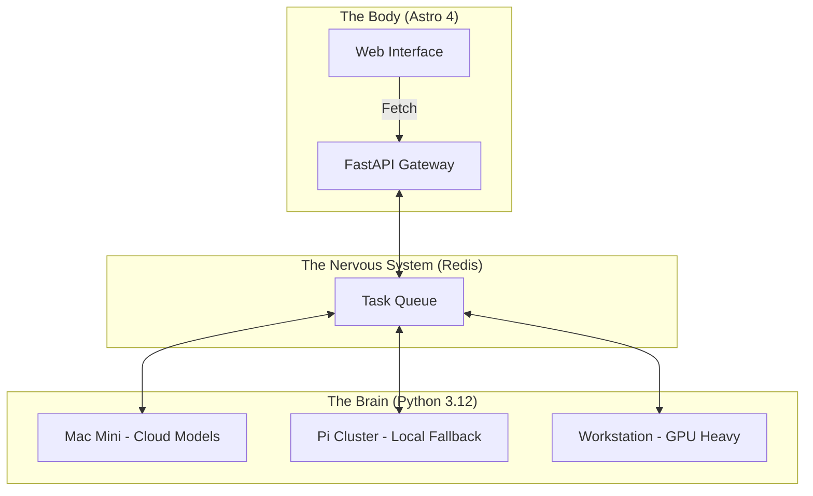

<TLDR>
  Monoliths are a debt trap for AI developers. I split Gekro into a Python-powered "Brain" for asynchronous reasoning and an Astro-based "Body" for high-performance delivery. This post breaks down the hardware stack—from Mac Minis to Pi clusters—and the FastAPI nervous system that bridges them.
</TLDR>

Most developers treat an LLM like a glorified database query—a synchronous request-response cycle handled within a single Next.js or Node server. This is architectural suicide. When you're running complex agentic workflows that might take 30 seconds to "think" and another 10 to validate, you cannot block your UI thread. In my lab, I’ve pioneered a **Split-Brain Architecture**. The "Brain" (Intelligence) lives in specialized Python environments across a distributed hardware cluster, while the "Body" (Interface) is a lean, mean Astro machine that prioritizes speed and SEO.

## The Architecture

My lab is distributed. I don't believe in putting all my compute in one basket. A single deployment going down shouldn't take the lab's intelligence offline; the architecture should survive any individual failure.



| Layer | Technology | Primary Role |
| :--- | :--- | :--- |
| **Body** | Astro + Tailwind v4 | UI delivery, SEO, and static documentation. |
| **Brain** | Python + LangGraph | Long-running reasoning cycles and model orchestration. |
| **Nervous System** | FastAPI + Redis | Asynchronous state management and event routing. |
| **Compute** | Together AI / Ollama | Inference engines (Cloud and Local). |

## The Build

Implementation starts with decoupling. The "Brain" should never care about CSS, and the "Body" should never care about temperature-sampling or top-p values.

### 1. The Brain: A Stateless Logic Engine
I use FastAPI to expose the agents. This allows the Astro "Body" to trigger thoughts without managing the underlying Python dependencies.

```python
# brain/main.py
from fastapi import FastAPI, BackgroundTasks
from pydantic import BaseModel
import redis

app = FastAPI()
r = redis.Redis(host='localhost', port=6379, db=0)

class Task(BaseModel):
    instruction: str
    session_id: str

@app.post("/think")
async def run_thought_cycle(task: Task, background_tasks: BackgroundTasks):
    # Update Body that we are 'Thinking'
    r.set(f"status:{task.session_id}", "processing")
    
    # Run the expensive AI logic in the background
    background_tasks.add_task(expensive_reasoning, task.instruction, task.session_id)
    
    return {"status": "accepted", "session_id": task.session_id}

def expensive_reasoning(prompt, sid):
    from gekro_client import GekroLLMClient
    client = GekroLLMClient()
    result = client.chat([{"role": "user", "content": prompt}])
    r.set(f"status:{sid}", "completed")
    r.set(f"result:{sid}", result)
```

### 2. The Body: Astro Request Pattern
In Astro, I fetch the initial state during SSR, but use a small "Island" (Preact or SolidJS) to poll the status if a thought cycle is active. This keeps the initial load instant.

```astro
---
// apps/web/src/pages/lab.astro
import LabStatus from '../components/LabStatus.tsx';

const initialStatus = await fetch('http://brain-gateway/status').then(res => res.json());
---

<Layout title="Lab Controls">
  <h1>System Orchestration</h1>
  <!-- The 'Island' that handles the live updates -->
  <LabStatus client:load initialData={initialStatus} />
</Layout>
```

### WSL2 Note
When bridging these layers on a Windows machine, I run Redis and the FastAPI "Brain" inside WSL2 but use the Windows-native Astro dev server for the "Body." This allows me to use the Windows Chrome debugger for UI work while the heavy Linux-optimized Python code runs in its natural environment.

## The Tradeoffs

The biggest challenge isn't the code; it's **State Synchronization**. If the Brain completes a task but the Body doesn't poll for the update, the user sees a stale UI. I spent three weeks chasing a bug where an agent had finished summarizing a 4k log file, but the Redis key hadn't propagated correctly, leading to "Infinite Thinking" loops in the browser. 

The complexity of a distributed system is its own form of debt. If you're building a simple app, don't do this. But if you're building a lab that needs to survive a 2 AM cloud blackout, you need the resilience that only a split-brain architecture provides.

## Where This Goes

This setup is moving toward **Physical Feedback**. I'm currently wiring the "Brain" outputs to a set of Hue lights in my DFW office. If the lab detects a critical failure on a remote server, the room literally turns red. Architecture isn't just about software; it's about the environment where the software works.
