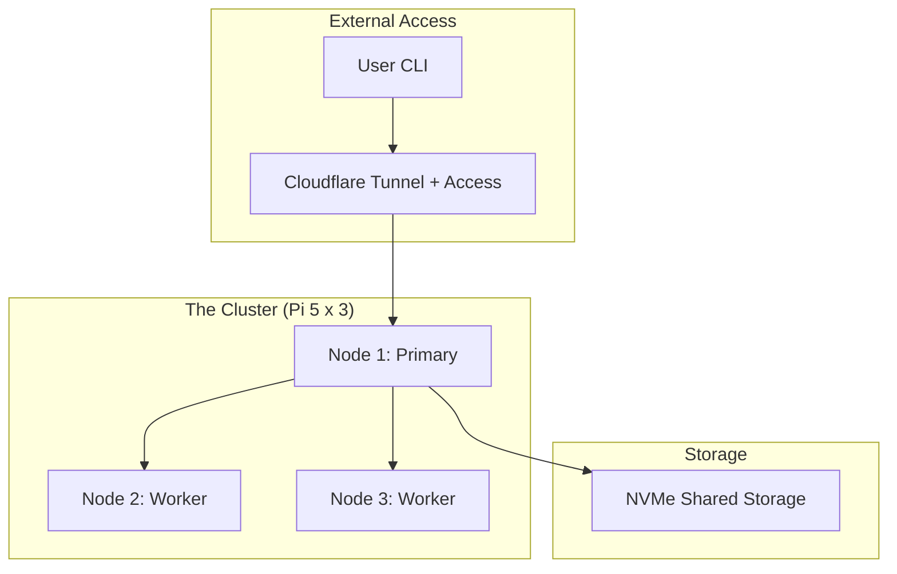

---
title: "Self-Hosted LLM Lab"
description: "Running Llama 3 on a local Raspberry Pi cluster with Ollama and Cloudflare Tunnels."
summary: "Running Llama 3 on a local Raspberry Pi cluster with Ollama and Cloudflare Tunnels. This experiment explores the limits of edge compute for decentralized intelligence."
aiSummary: "Deployed a concurrent Ollama inference cluster across a 3-node Raspberry Pi 5 cluster (16GB each). Used Cloudflare Tunnels with Access policies for secure remote CLI access to the private intelligence layer."
status: "completed"
startDate: "June 2025"
stack:
  - "Raspberry Pi"
  - "Ollama"
  - "Docker"
  - "Cloudflare Tunnels"
topics:
  - "Self-Hosted"
  - "Edge Compute"
  - "Infrastructure"
difficulty: "Intermediate"
---


## What I Was Trying to Solve

Building AI shouldn't require a $10,000 GPU or a $20/month subscription to a closed API. I wanted to see if I could build a "Poor Man's Supercomputer"—a cluster of low-cost ARM devices that could run a competent language model for basic lab assistance.

The goal wasn't just raw performance. It was about **sovereignty**—having a private brain that remains functional even when the global internet is fragmented.

---


## Architecture: The ARM Intelligence Layer

The cluster consists of three Raspberry Pi 5s (16GB) networked via a high-speed switch. Each node runs a headless Ubuntu Server environment with an M.2 NVMe 256GB SSD, and **Ollama** serving as the core inference engine. Rather than splitting a single model across nodes, each Pi runs its own Ollama instance and handles independent requests concurrently.



---


## The Build: Scaling with Ollama

The real challenge wasn't just installing Ollama, but making it accessible and resilient across a distributed network.

### 1. Headless Setup and Thermal Management

I use **Argon ONE V3** cases for each Pi 5. At full inference load, a Pi 5 will throttle within 60 seconds without active cooling. The Argon cases provide both passive cooling via the aluminum shell and active cooling via a software-controlled fan.

```bash
# Standardizing the environment across all 4 nodes
curl -fsSL https://ollama.com/install.sh | sh
sudo systemctl enable ollama
```

### 2. Secure Remote Access via Cloudflare Tunnels

I refuse to open ports on my home firewall. Instead, I use **Cloudflare Tunnels** (`cloudflared`) to create a secure, encrypted connection. This links the lab's primary node securely to the internet. I layer **Cloudflare Access** on top to require authentication---without it, Ollama's API has no built-in auth and would be wide open to anyone who discovers the hostname.

```yaml
# config.yml for Cloudflare Tunnel
tunnel: lab-intelligence-tunnel
credentials-file: /home/rohit/.cloudflared/cert.json

ingress:
  - hostname: brain.gekro.com
    service: http://localhost:11434
  - service: http_status:404
```

This allows me to use the `OLLAMA_HOST` variable on my laptop anywhere in the world:

```bash
export OLLAMA_HOST=brain.gekro.com
ollama run llama3 "Summarize these lab logs."
```

---


## What I Learned (The "How" of Bottlenecks)

1. **Memory Bandwidth is the Real Ceiling** — While the Pi 5 is fast, its memory bandwidth is the primary bottleneck. For ARM clusters, **Concurrency** is a much better use of hardware than model splitting. Handling 3 different small requests on 3 different nodes beats model parallelism over Gigabit Ethernet.

2. **Power Stability** — A 3-node cluster draws significant power under load (~35-40W). I switched to a dedicated **PoE+ (Power over Ethernet)** switch to power the nodes. This reduced cable clutter and ensured consistent 5V/5A supply, preventing brownouts.

3. **Storage Latency** — Don't run your models off SD cards. The initial model load time on an SD card was over 45 seconds. By switching to an **M.2 NVMe 256GB SSD** via the M.2 HAT, load times dropped to under 8 seconds.

## Where This Goes

I'm currently experimenting with **Distroless Ollama Containers**. The goal is to strip away the entire Linux userland and run Ollama as a minimal binary. This squeezes an extra 5-10% of RAM for larger parameter models. The lab is a game of millimeters.
