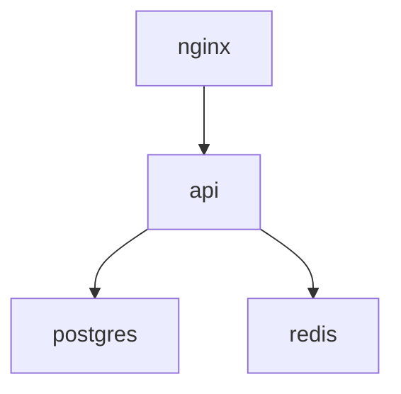

## What It Does

Docker Compose Visualizer parses a `docker-compose.yml` file and renders it visually: each service as a card showing image, ports, volumes, environment variables, and networks, with `depends_on` arrows linking services in a dependency graph. It also runs a set of lint checks for the most common production mistakes and outputs the dependency graph as Mermaid syntax for use in documentation.

## How to Use It

1. Paste your `docker-compose.yml` content into the input area, or upload the file directly.
2. The service cards render immediately with all config visible.
3. The dependency graph shows `depends_on` arrows — follow them to understand startup ordering.
4. Check the lint panel for any flagged issues (port collisions, orphan networks, missing restart policies).
5. Copy the Mermaid output and paste it into GitHub comments, Notion, or architecture docs for instant diagrams.

## What It Catches

| Issue | Example | Severity |
|---|---|---|
| Port collision | Two services binding `8080:80` | High |
| Orphan network | Network declared but no service uses it | Low |
| Missing depends_on | App references DB env vars but no depends_on | Medium |
| Circular dependency | A depends on B depends on A | High |
| Implicit `latest` tag | `image: postgres` (no version pinned) | Medium |
| Missing restart policy | No `restart:` on long-running services | Low |
| Privileged container | `privileged: true` | Medium |
| Dangerous bind mount | `/:/host` or similar | High |

## Why Compose Becomes Unreadable at 5+ Services

A two-service compose file — app and database — is readable as text. You can hold the whole thing in your head. At five services, you're scrolling to trace a dependency. At ten services, you're grep-ing the file to find which service exposes which port. At fifteen or more services (which is not unusual in a home lab or microservices stack), the compose file is actively opaque — you can't see the startup order, you can't tell which services share a network, and you can't spot port conflicts without a systematic scan.

The visual card layout answers the most common questions instantly:
- "What image is running in this container?" — top of the card
- "Which ports does this service expose?" — port tags on the card
- "What does this service depend on?" — follow the arrows in the dependency graph
- "Which services are on the same network?" — network tags group them visually

## How to Use the Dependency Graph to Debug Startup Ordering

The dependency graph is the highest-value output for debugging. `depends_on` controls startup ordering: service B won't start until service A is running (or healthy, if `condition: service_healthy` is set). When services fail to connect to a dependency on startup, the most common cause is missing or incorrect `depends_on` — the dependent service started before its dependency was ready.

The graph makes this visible: if your `api` service doesn't have an arrow to your `postgres` service, `api` may start before `postgres` is ready, fail the database connection, and exit. With the graph, you see the gap. Add `depends_on: postgres` (or better, `condition: service_healthy` with a postgres healthcheck) and restart.

**Common production mistakes surfaced by the graph:**

1. **Missing `depends_on` for shared databases.** The most common mistake. Services assume the database is up because it was manually started first during development. In automated deployments, there's no such guarantee.

2. **No restart policy.** A service with no `restart:` directive stops permanently if it crashes. For any production service, `restart: unless-stopped` or `restart: on-failure` should be the default. The lint check flags every long-running service without a restart policy.

3. **Implicit `latest` tag.** `image: postgres` resolves to `postgres:latest` at pull time. In 6 months, `latest` is Postgres 17 instead of 16, and your schema migrations break. Always pin a version: `image: postgres:16.2`.

4. **Port collisions.** When two services try to bind the same host port, Docker Compose will fail on startup with an unclear error. The lint check finds collisions before you try to start the stack.

5. **Orphan networks.** Declaring a network in the `networks:` block but not attaching any service to it produces a dangling network that Docker creates but nothing uses. Cleanup debt.

## The Mermaid Output for Documentation

The Mermaid output pastes directly into:
- GitHub issues and PRs (GitHub natively renders Mermaid in Markdown)
- Notion pages
- Architecture decision records
- Blog posts and experiment writeups

Example output for a 4-service stack:

This becomes a rendered diagram in any Mermaid-supporting viewer. For infrastructure docs — README files, runbooks, architecture decision logs — this is significantly clearer than a wall of YAML.

## Tips & Power Use

- **Use the lint panel before every compose change.** Add a service, paste the updated file, check for new collisions or missing dependencies. Faster than reading the YAML line by line.
- **The Mermaid output for your Pi cluster.** If you're running a home lab with multiple docker-compose files, generate and save the Mermaid diagrams for each stack. Paste them into a README or a Notion page for a visual inventory of your running services.
- **Visualize before `docker compose up --build`.** Catching a port collision here saves the time of a full build cycle.
- **Validate restart policies.** For any home lab or production stack, every service in the dependency graph should have a restart policy. The missing-restart-policy lint check is the fastest way to audit this.
- **Pair with the [systemd Unit File Generator](/apps/systemd-unit-generator/)** for services you want to run as native systemd services instead of in Docker — useful for lightweight services on a Pi where container overhead matters.

## Limitations

- **YAML subset only** — handles standard compose v2/v3 syntax. Doesn't handle YAML anchors/aliases (`&` and `*`), multi-doc files (`---`), or `${VAR}` environment variable substitution
- **No swarm/stack-specific syntax** — `deploy:` blocks are read but not deeply analyzed
- **No `build:` graph** — only services with an `image:` are graphed; multi-stage build chains aren't traversed
- **No security audit beyond simple checks** — for real CIS Docker Benchmark validation, use `docker-bench-security`
- **No live inspection** — this is a static analysis tool, not a connection to the Docker daemon; it doesn't know what's actually running
