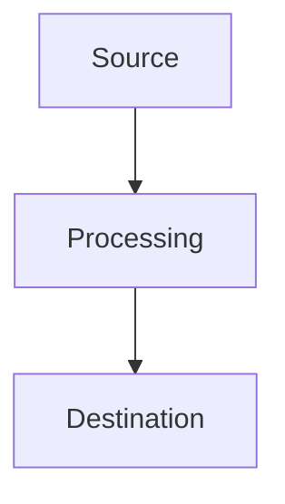

<TLDR>
  [3-4 sentence high-level summary of the architectural choice, the problem, and the solution. Must focus on 'Why' and 'Engineer-to-Engineer' value.]
</TLDR>

[Introduction: Hook the reader with a technical observation or a 'problem from the lab'. 1st person, direct, no corporate jargon.]

## [Technical Component 1: The Why]

[Detailed technical explanation. Use lists or tables for data.]

## [Technical Component 2: The How]

[Implementation details. Specific hardware/software specs.]

```[language]
// Complete, runnable code block. No placeholders.
```

## [Technical Component 3: The Architecture/Visual]

[Optional Mermaid diagram or detailed description of the flow.]



## [The Tradeoffs / Challenges]

[Technical accuracy: What failed? What was hard? Where are the bottlenecks?]

## Where This Goes / What I Learned

[Conclusion: 1. Technical takeaway. 2. Future direction. No "In conclusion..." phrasing.]
