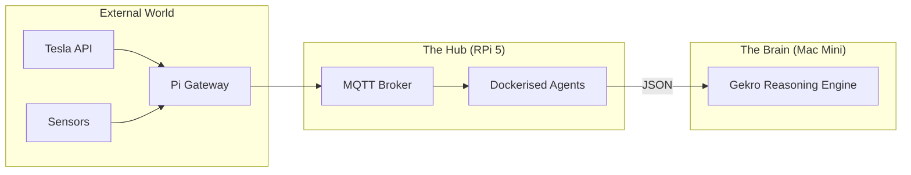

<TLDR>
  Don't waste a $2,000 workstation on cron jobs and MQTT brokering. I use a Raspberry Pi 5 with an NVMe SSD as the "Lab Assistant"—an always-on node that handles the repetitive, low-compute tasks that keep the lab's heartbeat steady. This post covers the hardware setup and the Dockerized utility stack that bridges my physical world (Tesla/Home) to my AI agents.
</TLDR>

In a world of multi-billion dollar data centers, the $80 computer is my most reliable employee. When I first started Gekro in DFW, I realized I needed a "Ground Truth" node—something that stayed alive even when my main Mac Mini was rebooting or my workstation was pinned under a 3D render. The Raspberry Pi is the anchor. It doesn't do the heavy "thinking," but it ensures that the data the Brain needs (like my Tesla's charging state or the office temperature) is always available and indexed.

## The Architecture

The Pi acts as the **Gateway Layer**. It sits between the chaotic world of IoT devices and the high-performance reasoning layer. 



| Component | Hardware / Software | Role |
| :--- | :--- | :--- |
| **Board** | Raspberry Pi 5 (8GB) | High-performance ARM compute. |
| **Storage** | PCIe HAT + NVMe Gen 3 SSD | Prevents SD card corruption and speeds up I/O. |
| **Broker** | Mosquitto (Docker) | The "Post Office" for all lab telemetry. |
| **Scheduler** | Cron / Supercronic | Triggers nightly research and cleanup agents. |

## The Build

A production Pi needs to be "Immutability-First." I don't install anything on the base OS except Docker and Tailscale.

### 1. The NVMe Advantage
If you're still using SD cards for anything other than a weekend project, you're building on sand. I lost three weeks of data when a log-heavy agent shredded a high-end SD card. Now, I use an NVMe SSD.

```bash
# Verify NVMe is detected and using Gen 3 speeds
lsblk
sudo lspci -vvv | grep LnkSta
```

### 2. The Dockerized Assistant Stack
I keep a `docker-compose.yml` for the Assistant Node that starts automatically on boot.

```yaml
services:
  mqtt:
    image: eclipse-mosquitto:latest
    ports:
      - "1883:1883"
    volumes:
      - ./mosquitto/config:/mosquitto/config

  tesla-telemetry:
    build: ./agents/tesla-bridge
    restart: always
    environment:
      - TESLA_VIN=${VIN}
      - MQTT_HOST=mqtt

  nightly-summarizer:
    image: python:3.12-slim
    volumes:
      - ./scripts:/app
    command: ["python", "/app/daily_digest.py"]
```

### 3. WSL2 Note: Remote Management
I never plug a monitor into the Pi. I use a specific Zsh function in my WSL2 environment to jump into any node in the cluster instantly.

```bash
# Fast SSH to lab nodes
lab() {
  ssh rohit@192.168.1.$1
}
# Usage: lab 50 (connects to Pi at .50)
```

## The Tradeoffs

The Pi's biggest weakness is **Compute Saturation**. I once tried to run a local vector database (ChromaDB) on the Pi alongside four other agents. The I/O wait times spiked, and my MQTT bridge started dropping messages from my Tesla. You have to be a "Resource Scavenger." I’ve learned to strictly limit the Pi to **I/O bound tasks** (API fetching, message routing) and offload all **CPU/GPU bound tasks** to the Mac Mini.

Also, **Power Matters**. A "standard" USB-C phone charger will cause the Pi 5 to throttle under load. I had to upgrade to the official 27W PD power supply to keep the NVMe drive and the active cooler running at full capacity during summer heatwaves in Texas.

## Where This Goes

I'm currently wiring a **Physical Killswitch** to the Pi's GPIO pins. If I detect an agent acting erratically or hitting an API spend limit, a physical button on my desk will send a SIGTERM to the entire Docker stack. Total sovereignty means having a physical hand on the plug.
