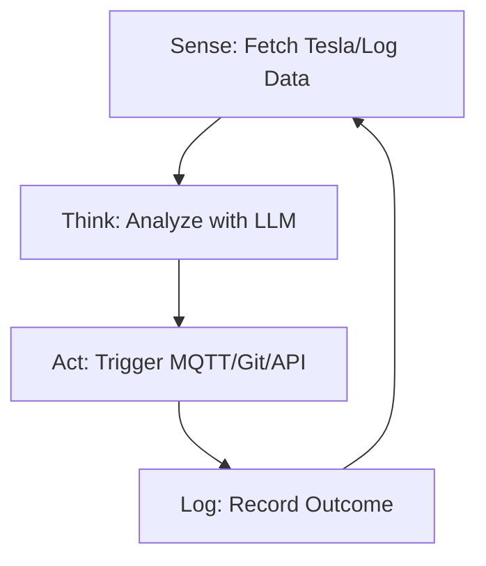

<TLDR>
  A script follows a list of instructions; an agent follows a goal. I built my first autonomous loop to monitor my Tesla's battery level and automatically trigger a "Deep Discharge" notification when it hit a specific threshold. This post covers the architectural shift from linear code to a Sense-Think-Act loop that operates 24/7 on my Pi cluster.
</TLDR>

The transition from "Writing Code" to "Directing Intelligence" happens in a single moment. For me, it was 11 PM on a Tuesday in Dallas. I had an agent running in a loop, monitoring my server logs for 404 errors. Instead of just alerting me, the agent autonomously identified a broken internal link, generated a `sed` command to fix it, and committed the change to Git. It was the first time I felt the eerie power of a system that could "improve" itself without me touching the keyboard. This is the **Sense-Think-Act** loop, and it's the foundational atom of the Gekro Lab.

## The Architecture

An agent isn't a single function; it's a **State Machine**. It needs to know where it is, what it wants to achieve, and what tools it has at its disposal.



| Phase | Responsibility | Tooling |
| :--- | :--- | :--- |
| **Sense** | Ingesting raw telemetry or file data. | `requests`, `tail`, `mqtt` |
| **Think** | Reasoning over the data vs. a goal. | Together AI / Ollama |
| **Act** | Executing a change in the environment. | `subprocess`, `git`, `curl` |
| **State** | Remembering what happened in the last loop. | SQLite / JSON File |

## The Build

To build your first agent, you need to wrap your LLM call in a persistent `while` loop with error handling that doesn't just crash when the API times out.

### 1. The Autonomous Loop
This is a simplified version of the "Guardian" agent that monitors my lab's health.

```python
import time
import logging
from gekro_client import GekroLLMClient # From my API Sovereignty post

class BasicAgent:
    def __init__(self, goal: str):
        self.goal = goal
        self.client = GekroLLMClient()
        self.state = {"iterations": 0, "last_action": "none"}

    def run(self):
        while True:
            self.state["iterations"] += 1
            print(f"\n--- Cycle {self.state['iterations']} ---")
            
            # SENSE: Get system stats (Mocked for example)
            context = "System Load: 85%, Temperature: 78C, Network: Latent"
            
            # THINK: Ask the Brain what to do
            prompt = f"Goal: {self.goal}\nCurrent Context: {context}\nLast Action: {self.state['last_action']}\nWhat is the next step?"
            decision = self.client.chat([{"role": "user", "content": prompt}])
            
            # ACT: (For safety, we just log in this example)
            self.execute(decision)
            self.state["last_action"] = decision
            
            time.sleep(60) # Wait 60 seconds before next sense cycle

    def execute(self, action):
        logging.info(f"Agent decided to: {action}")
        # Real execution logic (e.g., shell commands) would go here

if __name__ == "__main__":
    agent = BasicAgent(goal="Keep the lab temperatures below 80C by throttling compute.")
    agent.run()
```

### 2. State Persistence
An agent with no memory is just a script. In the lab, I use a simple JSON file to store the "History" of the agent's thoughts so it doesn't repeat the same mistake five times in a row.

### WSL2 Note
When running autonomous loops in WSL2, use **Tmux**. It allows you to detach the session and let the agent run in the background even if you close your terminal or your Windows machine goes to sleep (assuming you've disabled "Sleep" in Windows settings).

## The Tradeoffs

The biggest failure of early agents is the **Infinite Inference Loop**. I once left an agent running with a poorly defined goal: "Fix all typos in the documentation." Because "typo" is subjective, the agent spent $40 in Together AI credits in three hours by repeatedly "fixing" its own corrections in a circle. **Always implement a 'Max Iterations' cap or a budget ceiling.**

There’s also the issue of **Command Hallucination**. When you give an agent access to a shell (`subprocess.run`), it will eventually try to run a command that doesn't exist or, worse, one that is destructive. I learned this when an agent tried to `rm -rf` a "temporary" directory that actually contained my Tesla's API tokens. Use a "Dry Run" mode for the first 48 hours of any new agent deployment.

## Where This Goes

We are moving away from single-loop agents toward **Multi-Agent Systems**. I’m currently building a "Manager" agent that oversees three "Worker" agents (one for coding, one for research, one for security). Instead of me directing the loop, the Manager directs the workers. The lab is becoming a self-optimizing factory of intelligence, and "Sense-Think-Act" is the assembly line.
