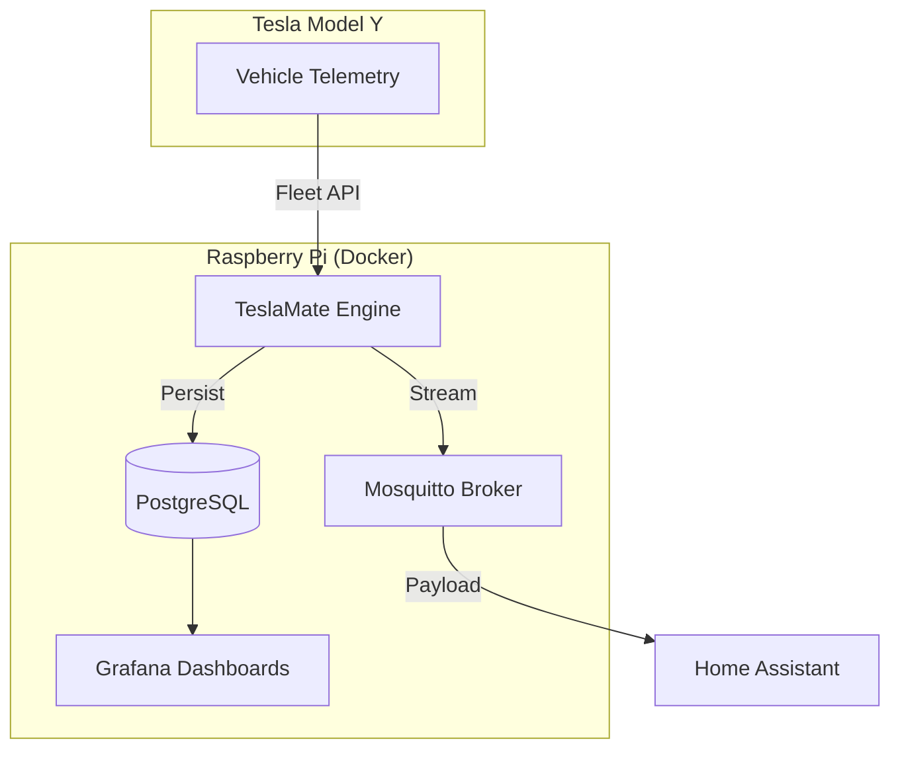

## What I Was Trying to Solve

Charging an electric vehicle with grid power often feels like a half-measure for sustainability. My goal for the **Gekro Lab** was to achieve 100% solar-offset charging for my **Tesla Model Y**. To do that, I needed high-fidelity, real-time telemetry—not just "Is it charging?" but precise voltage, amperage, and battery temperature data to coordinate with my home energy storage system.

I initially built a custom TypeScript listener for the Tesla Fleet API, but the maintenance overhead of handle-signing and OAuth rotation was stealing time from actual engineering.

---

## Architecture: The TeslaMate Core

I've migrated the entire logging stack to a self-hosted fork of [TeslaMate](https://github.com/teslamate-org/teslamate). It runs in a Docker-compose stack on my **Raspberry Pi 5**, ensuring that my vehicle's location and state history never leave my local network.

### Key Components:
- **TeslaMate (Elixir)**: The heavy lifter that handles the streaming connection to Tesla's servers.
- **PostgreSQL**: Stores every GPS coordinate and battery tick (now at 40GB+ of historical data).
- **Grafana**: For visualizing "Phantom Drain" and drive efficiency across different Texas seasons.
- **MQTT**: Bridges the car to the rest of the lab, allowing my AI agents to "know" if the car is home before triggering a high-load compute task.

---

## What I Learned

1. **Model Y Efficiency** — The heat pump in the Model Y is a miracle of engineering. Benchmarking it against my historical data shows a 15% efficiency gain in winter months compared to my previous expectations.
2. **Self-Hosting is Resilience** — By fork-hosting TeslaMate, I’ve gained historical insights that the official Tesla app simply doesn't provide, such as precise degradation curves over 50,000 miles.
3. **The Docker Advantage** — Using the [TeslaMate Repo](https://github.com/teslamate-org/teslamate) structure within Docker allowed me to deploy the entire stack—Postgres, Grafana, and MQTT—in under 10 minutes on the Pi.

## Where This Goes

The next step is a **Predictive Charging Agent**. By combining weather forecasts (solar output predictions) with my Model Y's current SoC (State of Charge) via TeslaMate's MQTT stream, the lab will autonomously decide whether to charge *now* or wait for a solar peak at 2 PM.
