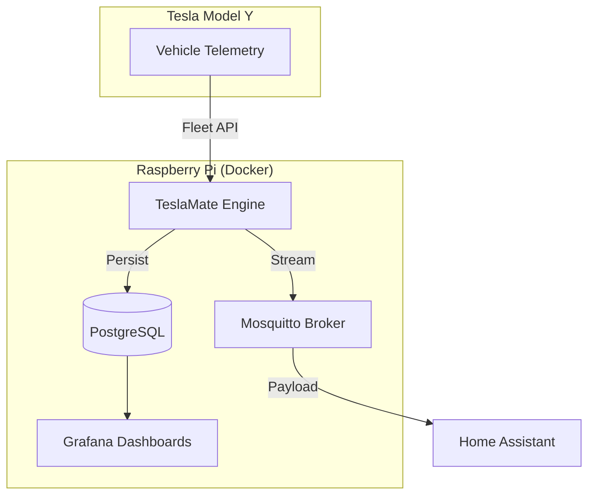

## What I Was Trying to Solve

Charging an electric vehicle with grid power often feels like a half-measure for sustainability. My goal for the **Gekro Lab** was to achieve 100% solar-offset charging for my **Tesla Model Y**. To do that, I needed high-fidelity, real-time telemetry.

I needed more than just "Is it charging?". I required precise voltage, amperage, and battery temperature data to coordinate with my home energy storage system. I initially built a custom TypeScript listener for the Tesla Fleet API.

However, the maintenance overhead of handle-signing and OAuth rotation was stealing time from actual engineering. I needed a "Set and Forget" infrastructure that was as resilient as the car itself.

---

## Architecture: The TeslaMate Core

I've migrated the entire logging stack to a self-hosted fork of [TeslaMate](https://github.com/teslamate-org/teslamate). It runs in a Docker-compose stack on my **Raspberry Pi 5**. This ensures that my vehicle's location and state history never leave my local network.



### The Stack Implementation

The system is defined by a standard `docker-compose.yml` that handles the inter-container networking. The most critical part is the volume persistence for PostgreSQL. This ensures I don't lose data during Pi reboots.

```yaml
services:
  teslamate:
    image: teslamate/teslamate:latest
    restart: always
    environment:
      - DATABASE_USER=${USER}
      - DATABASE_PASS=${PASS}
      - DATABASE_NAME=teslamate
      - DATABASE_HOST=database
      - MQTT_HOST=mosquitto
    ports:
      - 4000:4000

  database:
    image: postgres:16-alpine
    restart: always
    volumes:
      - teslamate-db:/var/lib/postgresql/data

  mosquitto:
    image: eclipse-mosquitto:latest
    ports:
      - 1883:1883
```

### MQTT Payload Structure

Once TeslaMate is running, it publishes a rich stream of data to Mosquitto. I use these specific topics to trigger my solar charging agents in the lab:

- `teslamate/cars/1/battery_level`: Used to determine if the car is "Ready" for a high-amp burst.
- `teslamate/cars/1/latitude`: Used to verify the car is actually at the "Gekro Lab" geofence.
- `teslamate/cars/1/status`: Ensures the car is 'online' or 'charging' before sending commands.

---

## What I Learned

1. **Self-Hosting is Resilience** — By fork-hosting TeslaMate, I’ve gained historical insights that the official Tesla app simply doesn't provide. I can now see precise degradation curves over **20,000 miles** without worrying about Tesla's API changing the UI tomorrow.

2. **The Docker Advantage** — Using the [TeslaMate Repo](https://github.com/teslamate-org/teslamate) structure within Docker allowed me to deploy the entire stack—Postgres, Grafana, and MQTT—in under 10 minutes on the Pi.

3. **Data Sovereignty** — Real-time telemetry is sensitive. Knowing my car's GPS and battery history is stored on a local SSD behind a Tailscale firewall gives me peace of mind. I can build more invasive agents without compromising my privacy.

## Where This Goes

The next step is a **Predictive Charging Agent**. By combining weather forecasts with my Model Y's current SoC via TeslaMate's MQTT stream, the lab will autonomously decide whether to charge *now* or wait for a solar peak. Total automation means the car is always fueled by the sun, scheduled by the Brain.
