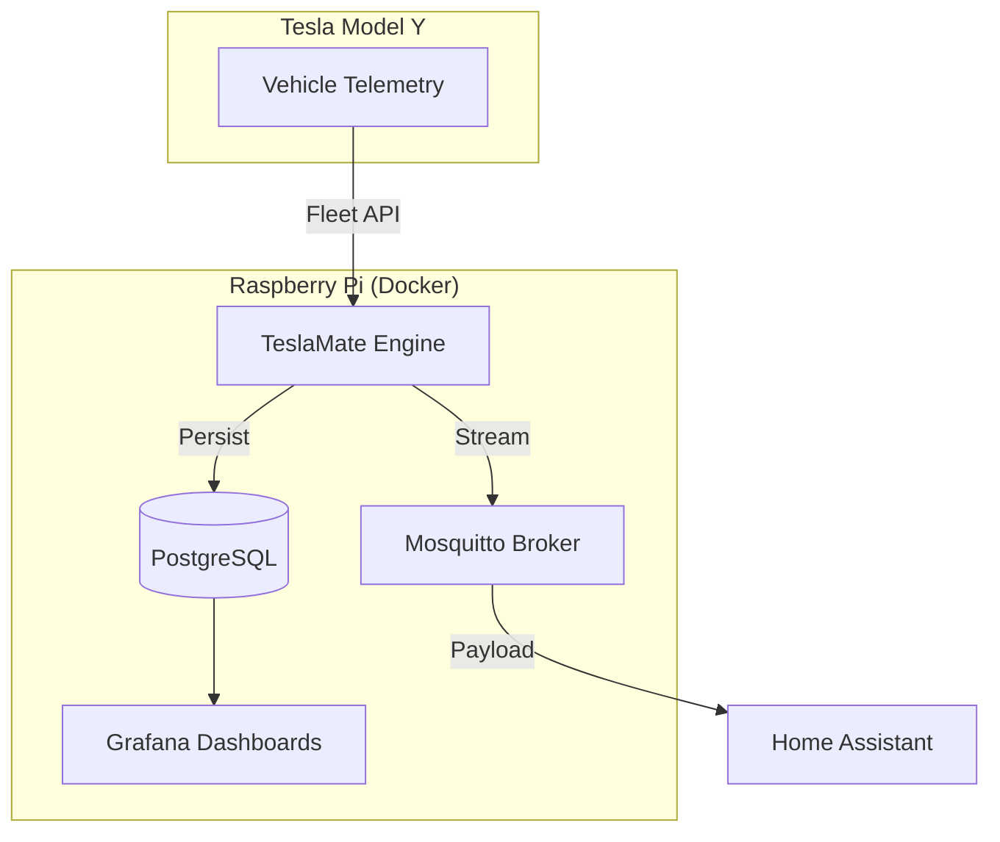

---
title: "EV Data Logger"
description: "Self-hosted TeslaMate instance for Model Y telemetry, charging analysis and long-run battery data."
summary: "Transitioned from a custom TypeScript listener to a self-hosted TeslaMate fork running on a Raspberry Pi 5. Tracks every drive, charge, and phantom drain on my Model Y with 100% data sovereignty."
aiSummary: "Deployed a self-hosted TeslaMate instance in Docker to monitor his Tesla Model Y. Captures drive, charge and battery telemetry to a local Postgres database, publishing live state over MQTT for home automation."
status: "active"
startDate: "2024-06-01"
stack:
  - "TeslaMate"
  - "Docker"
  - "PostgreSQL"
  - "Grafana"
  - "MQTT"
topics:
  - "Green Tech"
  - "IoT"
  - "Self-Hosting"
difficulty: "Intermediate"
---

## What I Was Trying to Solve

The Tesla app tells you almost nothing worth knowing. It will show you the state of charge and roughly what a trip cost, and then it forgets. My goal for the **Gekro Lab** was a complete, permanent record of my **Tesla Model Y**: every drive, every charge curve, every overnight drain. To do that, I needed high-fidelity, real-time telemetry.

I needed more than just "Is it charging?". I required precise voltage, amperage, and battery temperature data, sampled often enough to reconstruct a charging session rather than summarise it. I initially built a custom TypeScript listener for the Tesla Fleet API.

However, the maintenance overhead of handle-signing and OAuth rotation was stealing time from actual engineering. I needed a "Set and Forget" infrastructure that was as resilient as the car itself.

---

## Architecture: The TeslaMate Core

I've migrated the entire logging stack to a self-hosted instance of [TeslaMate](https://github.com/teslamate-org/teslamate). It runs in a Docker-compose stack on my **Raspberry Pi 5 (16GB)**. This ensures that my vehicle's location and state history never leave my local network.


```mermaid
graph TD
    subgraph "Tesla Model Y"
        V[Vehicle Telemetry]
    end
    subgraph "Raspberry Pi (Docker)"
        TM[TeslaMate Engine] -->|Stream| MQTT[Mosquitto Broker]
        TM -->|Persist| DB[(PostgreSQL)]
        DB --> G[Grafana Dashboards]
    end
    V -->|Fleet API| TM
    MQTT -->|Payload| HA[Home Assistant]
```

### The Stack Implementation

The system is defined by a standard `docker-compose.yml` that handles the inter-container networking. The most critical part is the volume persistence for PostgreSQL. This ensures I don't lose data during Pi reboots.

```yaml
services:
  teslamate:
    image: teslamate/teslamate:latest
    restart: always
    environment:
      - DATABASE_USER=${USER}
      - DATABASE_PASS=${PASS}
      - DATABASE_NAME=teslamate
      - DATABASE_HOST=database
      - MQTT_HOST=mosquitto
    ports:
      - 4000:4000

  database:
    image: postgres:16-alpine
    restart: always
    volumes:
      - teslamate-db:/var/lib/postgresql/data

  mosquitto:
    image: eclipse-mosquitto:latest
    ports:
      - 1883:1883
```

### MQTT Payload Structure

Once TeslaMate is running, it publishes a rich stream of data to Mosquitto. I use these specific topics to drive the charging automations in the lab:

- `teslamate/cars/1/battery_level`: Used to determine if the car is "Ready" for a high-amp burst.
- `teslamate/cars/1/latitude`: Used to verify the car is actually at the "Gekro Lab" geofence.
- `teslamate/cars/1/status`: Ensures the car is 'online' or 'charging' before sending commands.

---

## What I Learned

1. **Self-Hosting is Resilience** - By hosting TeslaMate locally, I’ve gained historical insights that the official Tesla app simply doesn't provide. I can now see precise degradation curves over **20,000 miles** without worrying about Tesla's API changing the UI tomorrow.

2. **The Docker Advantage** - Using the [TeslaMate Repo](https://github.com/teslamate-org/teslamate) structure within Docker allowed me to deploy the entire stack-Postgres, Grafana, and MQTT-in under 10 minutes on the Pi.

3. **Data Sovereignty** - Real-time telemetry is sensitive. Knowing my car's GPS and battery history is stored on a local SSD behind a Tailscale firewall gives me peace of mind. I can build more invasive agents without compromising my privacy.

## Where This Goes

The next step is a **Scheduling Agent**. By combining my Model Y's current SoC from TeslaMate's MQTT stream with the overnight rate window, the lab can decide when a session should start rather than beginning the moment the cable is plugged in. The longer-term payoff is the dataset itself: with enough seasons logged, battery degradation and real cost per mile can be measured against the car's own history instead of a spec sheet.
