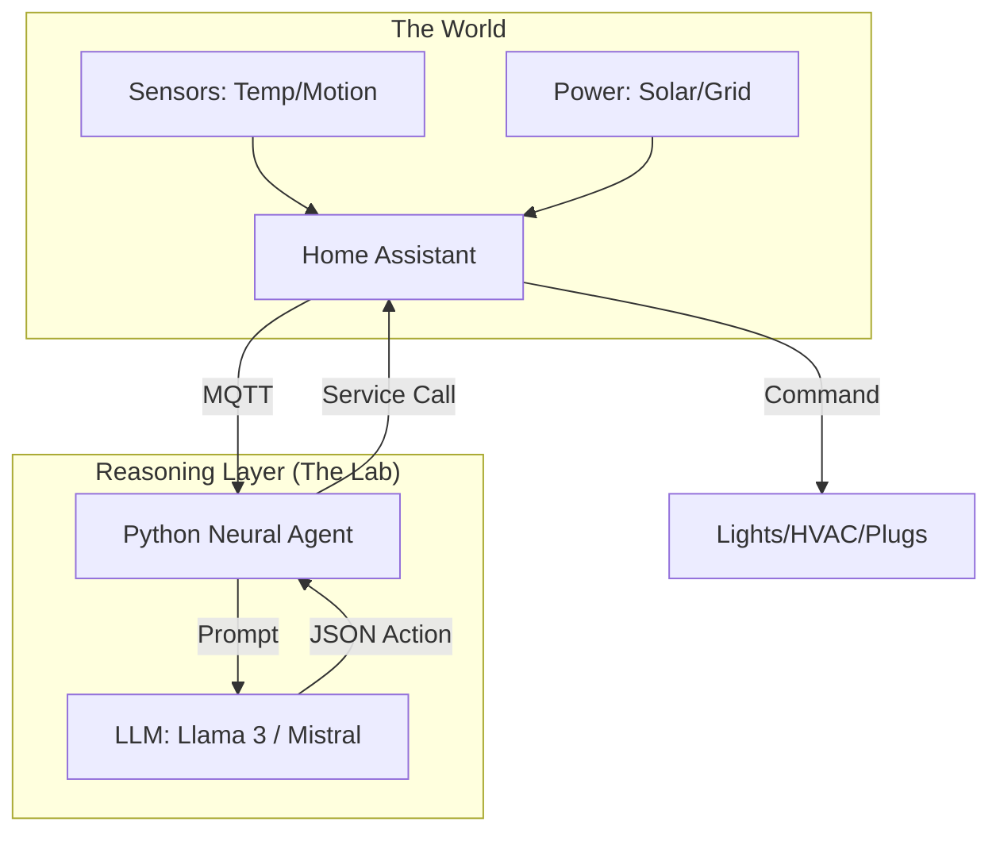

## What I Was Trying to Solve

Smart homes today aren't smart; they are just remote-controlled. Most solutions rely on static "if-this-then-that" rules which fail the moment life deviates from a schedule. I wanted a system that could understand **context**.

Knowing that when I'm in a deep work session, the lights should stay cool and notifications should be silenced. When I'm winding down, the environment should shift automatically. The goal was to replace static rules with a dynamic **Neural Controller**.

This controller reasons about my needs using a local LLM or a cloud-based inference provider. Absolute privacy was the starting point. No data about my home state should live on a third-party server without encryption.

---


## Architecture: The Brain-Home Bridge

The system uses a hub-and-spoke model. **Home Assistant (HA)** acts as the physical hardware bridge, while a custom **Python Neural Agent** acts as the high-level reasoning engine.




### 1. Home Assistant Configuration

I use Home Assistant's **MQTT Statestream** to push every sensor update into a unified message bus. This allows the Python agent to "listen" to the entire house without querying the HA API continuously.

```yaml
# configuration.yaml snippet
mqtt_statestream:
  base_topic: internal/home
  publish_attributes: true
  publish_timestamps: true
```


### 2. The Neural Agent Logic

The Python agent maintains a "Current State Buffer." When a significant event occurs, the agent triggers a reasoning loop. Example events include my Tesla arriving home or solar production dropping below 500W.

```python
import mqtt_client
from gekro_brain import BrainClient

def on_message(topic, payload):
    # Process incoming home telemetry
    home_state.update(topic, payload)
    
    # Trigger reasoning if specific thresholds are hit
    if home_state.energy_surplus > 1000:
        decision = brain.reason("Current energy surplus is high. What lab task should I start?")
        execute_decision(decision)
```


### 3. Prompt Engineering for IoT

To prevent the LLM from hallucinating commands, I use a strict **Tool-Use Schema**. The prompt includes the available entities and their current states. Output is required to be a valid JSON object.

```text
SYSTEM: You are the Gekro Home Orchestrator.
CONTEXT: Tesla Model Y is charging (Level: 65%), Solar Generation: 4.2kW, Current Home Load: 1.2kW.
GOAL: Maximize solar utilization.
COMMANDS: [charge_tesla(amps), start_lab_compute(), cool_office()]
OUTPUT: JSON only.
```


---


## What I Learned


1. **Context Filtering is Finite** — You can't feed the LLM every single sensor state. Preprocessing data into meaningful "Situational Reports" is essential to avoid token waste.


2. **Latency is the UX Killer** — If it takes 5 seconds for the lab to respond to a toggle request, it's a failure. I use **Small Models (7B)** for reactive tasks and **Large Models (70B+)** only for high-priority architectural decisions.


3. **Local Sovereignty is Freedom** — By hosting logic on a local Raspberry Pi 5, the house remains "intelligent" even without internet. The local MQTT broker handles the internal nervous system, isolated from external cloud outages.


## Where This Goes


The next iteration includes **Visual Intelligence**. FOOTAGE from the lab's overhead cameras will be piped into a Vision LLM (like LLaVA). The agent will be able to "see" where I am in a physical build and hand me the right tools. True orchestration is a symphony of both digital and physical awareness.
