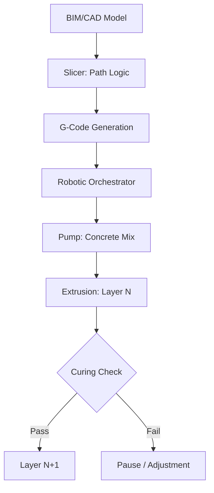

<TLDR>
  السرعة هي المكسب الواضح في البناء بالطباعة 3D، لكن الدقة هي المكسب الأكبر. بالانتقال من التصنيع الاختزالي إلى التصنيع الإضافي، يمكننا خفض هدر المواد بنسبة تصل إلى 60% ودمج هندسات حرارية معقدة مباشرة في بنية الجدار. وهذا هو تعريف البنية التحتية الخضراء: عالية الأداء، قليلة الهدر، ومحلية أولًا.
</TLDR>

في المرة الأولى التي رأيت فيها طابعة 3D من نوع الجسر المتحرك تبثق خيطًا من الخرسانة المسلّحة بألياف الكربون، رأيت أكثر من مجرد طريقة أسرع للبناء. رأيت تحولًا تقنيًا نحو **سيادة المواد**، وهو مفهوم تكرر كثيرًا في أبحاثي الأخيرة.

في عالم البناء التقليدي، كثيرًا ما نكون مقيَّدين بأبعاد مستودع الأخشاب وبحدود القالب. والهدر هائل؛ إذ تشير المتوسطات العالمية إلى أن نسبة كبيرة جدًا من المواد المشحونة إلى الموقع تنتهي في حاوية النفايات. من الناحية النظرية، فإن التعامل مع البنية التحتية كمسألة برمجية، أي مجموعة تعليمات تترجم النية الرقمية إلى واقع مادي، قد يفتح طريقًا جديدًا نحو دقة بلا هدر.

## الأساس: الحبر والقلم

قبل أن نتعمق في علم المواد، علينا أن نفهم العتاد. تنقسم الطباعة 3D في البناء عمومًا إلى معسكرين: **أنظمة الجسر المتحرك** و**الأذرع الروبوتية**.

* **أنظمة الجسر المتحرك**: هي في الأساس نسخ عملاقة من طابعة FDM المكتبية لديك. يُبنى إطار ضخم حول موقع العمل وتتحرك الفوهة على المحاور X وY وZ. وهي مستقرة للغاية ويمكنها طباعة أحياء كاملة على نطاق واسع، لكنها تتطلب مساحة تجهيز كبيرة.
* **الأذرع الروبوتية**: هي روبوتات صناعية رشيقة متعددة المحاور (مثل تلك المستخدمة في خطوط تجميع السيارات) مثبتة على سكك أو مقطورات. توفر مرونة أكبر للهندسات المعقدة ويمكنها العمل في مساحات أضيق، وإن كانت تحتاج غالبًا إلى منطق مسارات أكثر تقدمًا لضمان الثبات الإنشائي أثناء الطباعة.

و"الحبر" لا يقل أهمية عن "القلم". نحن لا نستخدم الخرسانة العادية، بل **مركبات إسمنتية** متخصصة: خلطات صُممت لتتدفق كالسائل عبر الفوهة ثم تتصلب فورًا لتتحمل وزن الطبقات التي فوقها. هذه "القابلية للتراص" هي العقبة الهندسية الحقيقية في أي بناء مطبوع بتقنية 3D.

## السبب: تحسين المواد

في البناء التقليدي، كل منحنى مركز تكلفة. القوالب باهظة، والهدر لا مفر منه، والعمالة متكررة. أما التصنيع الإضافي فيعكس ذلك. بالنسبة لطابعة 3D، منحنى معقد مُحسَّن بارامتريًا يكلف تمامًا مثل الخط المستقيم.

وهذا يتيح لنا الاستفادة من **تحسين الطوبولوجيا**. يمكننا طباعة جدران بنوى داخلية مجوفة تعمل كعزل طبيعي أو كقنوات خدمات للأسلاك والسباكة، وتُدمج مباشرة أثناء عملية البثق. والأهم أنه يتيح استخدام **البوليمرات الجيولوجية الخضراء**. فباستخدام نواتج صناعية ثانوية مثل الرماد المتطاير أو الخبث كمواد رابطة بدلًا من إسمنت بورتلاند التقليدي، يمكننا خفض البصمة الكربونية لـ"جسد" المبنى بشكل كبير قبل أن يوضع السقف.

## الكيفية: من التقطيع إلى البثق

إن الجسر بين "الدماغ" (التصميم الرقمي) و"الجسد" (البنية المادية) يتبع مسارًا متوقعًا لكنه صارم. إنه تنسيق عالي المخاطر بين علم المواد والروبوتات.

## الدور الجديد للمقاول

هذه التقنية لا تلغي المقاول، بل ترفع مكانته. "مقاول المستقبل" أقل ارتباطًا بالعمل اليدوي وأكثر ارتباطًا بكونه **منسّق أنظمة**.

1. **عالم مواد**: عليه أن يفهم ريولوجيا الخلطة، أي كيف تؤثر الحرارة والرطوبة في التدفق يوم الثلاثاء مقارنة بيوم الخميس.
2. **قائد الروبوتات**: يدير التوأم الرقمي للمبنى، ويراقب المستشعرات بحثًا عن أي انحراف، ويعدّل المسارات في الوقت الفعلي.
3. **مهندس البنية التحتية**: يركز على دمج أعمال MEP (الميكانيكا والكهرباء والسباكة) داخل القنوات المطبوعة، مما يقلل الحاجة إلى الحفر الهادم والتعديلات "بعد الفراغ".

## إلى أين يتجه هذا / ما تعلمته

يبرز هذا البحث في البناء بتقنية 3D تحولًا جوهريًا: **البنية التحتية تصبح برمجيات**. عندما تستطيع برمجة الكتلة الحرارية لجدار أو الكثافة الإنشائية لركن، فلن تظل مقيَّدًا بـ"الوحدات القياسية" في متجر الأدوات المحلي.

ومع أن مختبر Gekro لا يطبع الجدران حاليًا، فإن مبادئ **البنية التحتية الخضراء**، التي تفضّل التطبيق الدقيق للمواد على أساليب القوة الغاشمة في الماضي، تقدم خريطة طريق لكيفية سدّ الفجوة يومًا ما بين الذكاء الرقمي وبيئاتنا المادية.
