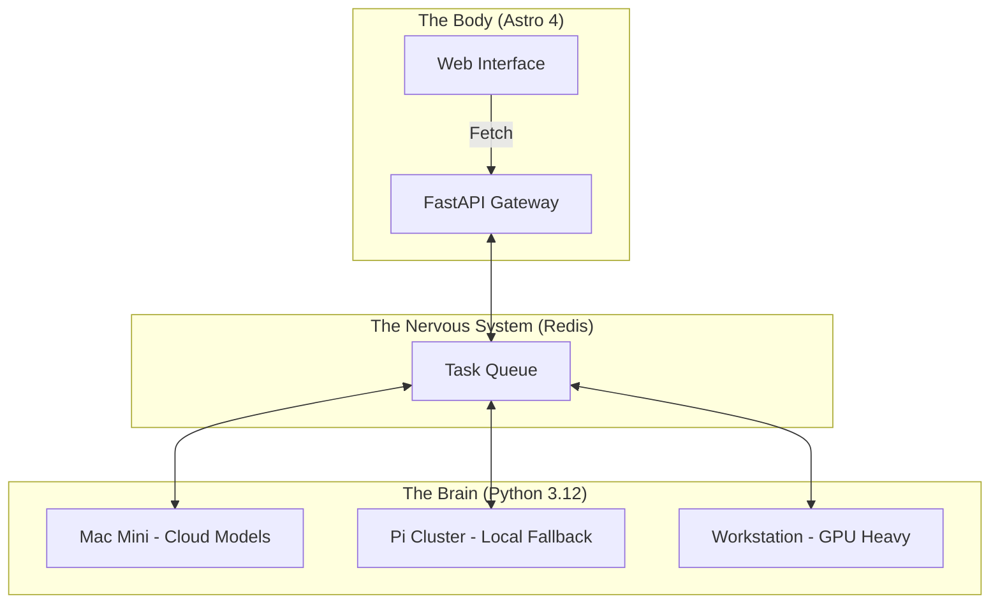

<TLDR>
  الأنظمة الأحادية فخ ديون للمطورين العاملين في الذكاء الاصطناعي. قسّمت Gekro إلى "دماغ" يعمل بـ Python للاستدلال غير المتزامن، و"جسد" قائم على Astro للتسليم عالي الأداء. يفصّل هذا المقال حزمة العتاد، من أجهزة Mac Mini إلى عناقيد Pi، والجهاز العصبي FastAPI الذي يربط بينها.
</TLDR>

يتعامل معظم المطورين مع النموذج اللغوي كأنه استعلام قاعدة بيانات مضخَّم: دورة طلب واستجابة متزامنة تُعالَج داخل خادم Next.js أو Node واحد. وهذا يصمد إلى أن يستغرق العمل وقتًا حقيقيًا. فعندما تشغّل سير عمل وكيلية معقدة قد تستغرق 30 ثانية "للتفكير" و10 ثوانٍ أخرى للتحقق، لا يمكنك حجب خيط الواجهة. في مختبري استقررت على **معمارية الدماغ المنفصل**. يعيش "الدماغ" (الذكاء) في بيئات Python متخصصة موزعة على عنقود عتاد، بينما "الجسد" (الواجهة) آلة Astro رشيقة وخفيفة تعطي الأولوية للسرعة ولتحسين محركات البحث.

## البنية

مختبري موزَّع. لا أؤمن بوضع كل قدرتي الحاسوبية في سلة واحدة. ينبغي ألا يؤدي سقوط نشر واحد إلى إخراج ذكاء المختبر عن الخدمة؛ فالمعمارية يجب أن تصمد أمام أي عطل فردي.



| الطبقة | التقنية | الدور الأساسي |
| :--- | :--- | :--- |
| **الجسد** | Astro + Tailwind v4 | تسليم الواجهة وتحسين محركات البحث والتوثيق الثابت. |
| **الدماغ** | Python + LangGraph | دورات استدلال طويلة الأمد وتنسيق النماذج. |
| **الجهاز العصبي** | FastAPI + Redis | إدارة الحالة غير المتزامنة وتوجيه الأحداث. |
| **الحوسبة** | Together AI / Ollama | محركات الاستدلال (سحابية ومحلية). |

## البناء

يبدأ التنفيذ بفصل الاعتماد المتبادل. ينبغي ألا يهتم "الدماغ" بـ CSS إطلاقًا، وألا يهتم "الجسد" بحرارة أخذ العينات أو قيم top-p.

### 1. الدماغ: محرك منطق بلا حالة

أستخدم FastAPI لعرض الوكلاء. وهذا يتيح لـ"جسد" Astro أن يُطلق الأفكار دون إدارة تبعيات Python الكامنة.

```python
# brain/main.py
from fastapi import FastAPI, BackgroundTasks
from pydantic import BaseModel
import redis

app = FastAPI()
r = redis.Redis(host='localhost', port=6379, db=0)

class Task(BaseModel):
    instruction: str
    session_id: str

@app.post("/think")
async def run_thought_cycle(task: Task, background_tasks: BackgroundTasks):
    # Update Body that we are 'Thinking'
    r.set(f"status:{task.session_id}", "processing")
    
    # Run the expensive AI logic in the background
    background_tasks.add_task(expensive_reasoning, task.instruction, task.session_id)
    
    return {"status": "accepted", "session_id": task.session_id}

def expensive_reasoning(prompt, sid):
    from gekro_client import GekroLLMClient
    client = GekroLLMClient()
    result = client.chat([{"role": "user", "content": prompt}])
    r.set(f"status:{sid}", "completed")
    r.set(f"result:{sid}", result)
```

### 2. الجسد: نمط الطلب في Astro

في Astro أجلب الحالة الأولية أثناء SSR، لكنني أستخدم "جزيرة" صغيرة (Preact أو SolidJS) لاستطلاع الحالة إذا كانت دورة تفكير نشطة. وهذا يُبقي التحميل الأولي فوريًا.

```astro
---
// apps/web/src/pages/lab.astro
import LabStatus from '../components/LabStatus.tsx';

const initialStatus = await fetch('http://brain-gateway/status').then(res => res.json());
---

<Layout title="Lab Controls">
  <h1>System Orchestration</h1>
  <!-- The 'Island' that handles the live updates -->
  <LabStatus client:load initialData={initialStatus} />
</Layout>
```

### ملاحظة WSL2

عند ربط هذه الطبقات على جهاز Windows، أشغّل Redis و"دماغ" FastAPI داخل WSL2 لكنني أستخدم خادم تطوير Astro الأصلي في Windows لـ"الجسد". وهذا يتيح لي استخدام مصحح Chrome في Windows لعمل الواجهة بينما تعمل شيفرة Python الثقيلة المحسَّنة لـ Linux في بيئتها الطبيعية.

## المفاضلات

التحدي الأكبر ليس الشيفرة بل **مزامنة الحالة**. إذا أكمل الدماغ مهمة ولم يستطلع الجسد التحديث، يرى المستخدم واجهة قديمة. أمضيت ثلاثة أسابيع أطارد خللًا أنهى فيه وكيل تلخيص ملف سجل بحجم 4k، لكن مفتاح Redis لم ينتشر بشكل صحيح، مما أدى إلى حلقات "تفكير لا نهائي" في المتصفح.

خصصت ساعتين إلى ثلاث ساعات لتنفيذ الفصل نفسه. استغرق يومًا كاملًا. ذهب معظم التجاوز تقريبًا إلى الوصلة بين الدماغ والجسد، وهي مزعجة إلى أن تُضبط الإعدادات ثم تتوقف عن كونها مشكلة بهدوء. لم تؤذني منذ وقت طويل. وكان الأسبوع الأول كله وصلات لا غير.

تعقيد النظام الموزَّع شكل من أشكال الدين بحد ذاته. إذا كنت تبني تطبيقًا بسيطًا فلا تفعل هذا. أما إذا كنت تبني مختبرًا يجب أن ينجو من انقطاع السحابة عند الساعة 2 فجرًا، فأنت بحاجة إلى المرونة التي لا توفرها إلا معمارية الدماغ المنفصل.

كما أنه أقل استقلالية مما يوحي به المخطط. ما زلت أدخل عبر SSH إلى كل جهاز Pi على حدة عند الحاجة، لأن كل واحد منها يشغّل مشروعه الخاص وأعرف أيها أيّ. وهذا أقرب إلى إقرار بأن عنقودًا من ثلاث عقد صغير بما يكفي ليُحفظ في الذهن، وبأنني لم أحتج بعد إلى التظاهر بغير ذلك، منه إلى عيب في التصميم.

## إلى أين يتجه هذا

يتجه هذا الإعداد نحو **التغذية الراجعة المادية**. أقوم حاليًا بتوصيل مخرجات "الدماغ" بمجموعة من أضواء Hue في مكتبي في DFW. وإذا اكتشف المختبر عطلًا حرجًا في خادم بعيد، تتحول الغرفة حرفيًا إلى اللون الأحمر. المعمارية هي البيئة التي تعمل فيها البرمجيات بقدر ما هي البرمجيات نفسها.
