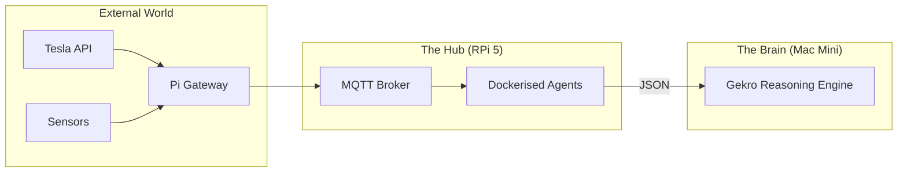

<TLDR>
  لا تهدر محطة عمل بسعر 2,000 دولار على مهام cron ووسيط MQTT. أستخدم Raspberry Pi 5 مع قرص NVMe SSD بوصفه "مساعد المختبر": عقدة دائمة التشغيل تتولى المهام المتكررة منخفضة الحوسبة التي تُبقي نبض المختبر مستقرًا. يغطي هذا المقال إعداد العتاد وحزمة الأدوات المساندة العاملة على Docker التي تربط عالمي المادي (Tesla والمنزل) بوكلاء الذكاء الاصطناعي لديّ.
</TLDR>

في عالم مراكز البيانات التي تكلّف مليارات الدولارات، يبقى الحاسوب الذي يكلّف 80 دولارًا أكثر موظفيّ اعتمادًا. عندما بدأت Gekro في DFW، أدركت أنني أحتاج إلى عقدة "Ground Truth": شيء يبقى حيًّا حتى عندما يعيد جهاز Mac Mini الرئيسي التشغيل أو تنشغل محطة العمل بعملية عرض 3D. Raspberry Pi هي المرساة. لا تقوم بـ"التفكير" الثقيل، لكنها تضمن أن البيانات التي يحتاجها الدماغ (مثل حالة شحن سيارتي Tesla أو درجة حرارة المكتب) متاحة ومفهرسة دائمًا.

## البنية

يعمل جهاز Pi بوصفه **طبقة البوابة**. يقع بين عالم أجهزة IoT الفوضوي وطبقة الاستدلال عالية الأداء.



| المكوّن | العتاد / البرمجيات | الدور |
| :--- | :--- | :--- |
| **اللوحة** | Raspberry Pi 5 (16GB) | حوسبة ARM عالية الأداء. |
| **التخزين** | M.2 HAT + قرص NVMe SSD سعة 256GB | يمنع تلف بطاقة SD ويسرّع عمليات الإدخال والإخراج. |
| **الوسيط** | Mosquitto (Docker) | "مكتب البريد" لكل قياسات المختبر. |
| **المجدول** | Cron / Supercronic | يشغّل وكلاء البحث والتنظيف الليليين. |

## البناء

يجب أن يكون جهاز Pi في بيئة الإنتاج "الثبات أولًا" (Immutability-First). لا أثبّت شيئًا على نظام التشغيل الأساسي سوى Docker وTailscale.

### 1. ميزة NVMe

إذا كنت لا تزال تستخدم بطاقات SD لأي شيء غير مشروع نهاية الأسبوع، فأنت تبني على الرمال. فقدتُ بيانات ثلاثة أسابيع عندما دمّر وكيل يكتب سجلات كثيرة بطاقة SD عالية الجودة. أستخدم الآن قرص NVMe SSD.

```bash
# Verify NVMe is detected and using Gen 3 speeds
lsblk
sudo lspci -vvv | grep LnkSta
```

### 2. حزمة المساعد على Docker

أحتفظ بملف `docker-compose.yml` لعقدة المساعد، ويبدأ تلقائيًا عند الإقلاع.

```yaml
services:
  mqtt:
    image: eclipse-mosquitto:latest
    ports:
      - "1883:1883"
    volumes:
      - ./mosquitto/config:/mosquitto/config

  tesla-telemetry:
    build: ./agents/tesla-bridge
    restart: always
    environment:
      - TESLA_VIN=${VIN}
      - MQTT_HOST=mqtt

  nightly-summarizer:
    image: python:3.12-slim
    volumes:
      - ./scripts:/app
    command: ["python", "/app/daily_digest.py"]
```

### 3. ملاحظة WSL2: الإدارة عن بُعد

لا أوصل شاشة بجهاز Pi أبدًا. أستخدم دالة Zsh مخصصة في بيئة WSL2 لديّ للقفز فورًا إلى أي عقدة في العنقود.

```bash
# Fast SSH to lab nodes
lab() {
  ssh rohit@192.168.1.$1
}
# Usage: lab 50 (connects to Pi at .50)
```

## المفاضلات

أكبر نقاط ضعف Pi هي **تشبّع الحوسبة**. حاولت مرة تشغيل قاعدة بيانات متجهية محلية (ChromaDB) على Pi إلى جانب أربعة وكلاء آخرين. ارتفعت أزمنة انتظار الإدخال والإخراج، وبدأ جسر MQTT لديّ يُسقط رسائل من سيارتي Tesla. عليك أن تكون "جامع موارد". تعلّمت أن أحصر Pi بصرامة في **المهام المقيّدة بالإدخال والإخراج** (جلب بيانات واجهات API وتوجيه الرسائل) وأن أنقل كل **المهام المقيّدة بوحدة المعالجة المركزية والرسومية** إلى Mac Mini.

كما أن **الطاقة مهمة**. شاحن هاتف USB-C "عادي" سيجعل Pi 5 تخفّض أداءها تحت الحمل. اضطررت إلى الترقية إلى مزود الطاقة الرسمي PD بقدرة 27W لإبقاء قرص NVMe والمبرّد النشط يعملان بكامل طاقتهما خلال موجات الحر الصيفية في تكساس.

## إلى أين يتجه هذا

أعمل حاليًا على توصيل **مفتاح إيقاف طارئ مادي** بدبابيس GPIO في Pi. إذا اكتشفت وكيلًا يتصرف بشكل غير منتظم أو يبلغ حد الإنفاق على واجهات API، فسيرسل زر مادي على مكتبي إشارة SIGTERM إلى حزمة Docker بأكملها. السيادة الكاملة تعني أن تكون يدك الفعلية على القابس.
