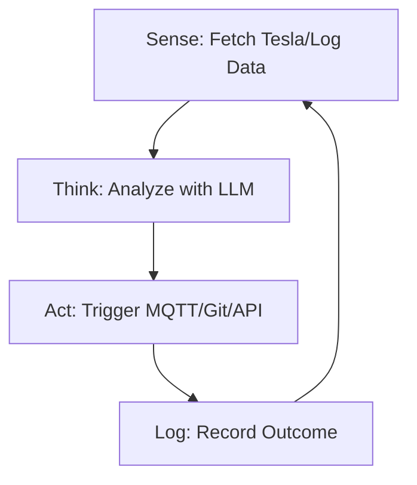

<TLDR>
  السكربت يتبع قائمة تعليمات، أما الوكيل فيتبع هدفًا. بنيت أول حلقة ذاتية التشغيل لمراقبة مستوى بطارية سيارتي Tesla، وتُطلق تلقائيًا إشعار "Deep Discharge" عندما يصل المستوى إلى حد معين. يتناول هذا المقال التحول المعماري من الشيفرة الخطية إلى حلقة Sense-Think-Act التي تعمل 24/7 على عنقود Pi لدي.
</TLDR>

الانتقال من "كتابة الشيفرة" إلى "توجيه الذكاء" يحدث في لحظة واحدة. بالنسبة لي كانت الساعة 11 مساءً من يوم ثلاثاء في دالاس. كان لدي وكيل يعمل في حلقة، يراقب سجلات خادمي بحثًا عن أخطاء 404. وبدلًا من أن ينبهني فحسب، حدد الوكيل بنفسه رابطًا داخليًا معطوبًا، وولّد أمر `sed` لإصلاحه، ثم سجّل التغيير في Git. كانت تلك أول مرة أشعر فيها بالقوة المخيفة لنظام قادر على "تحسين" نفسه دون أن ألمس لوحة المفاتيح. هذه هي حلقة **Sense-Think-Act**، وهي الذرة الأساسية في مختبر Gekro.

## البنية

الوكيل ليس دالة واحدة؛ إنه **آلة حالات**. عليه أن يعرف أين هو، وما الذي يريد تحقيقه، وما الأدوات المتاحة له.



| المرحلة | المسؤولية | الأدوات |
| :--- | :--- | :--- |
| **Sense** | استقبال بيانات القياس الخام أو بيانات الملفات. | `requests`, `tail`, `mqtt` |
| **Think** | الاستدلال على البيانات قياسًا إلى الهدف. | Together AI / Ollama |
| **Act** | تنفيذ تغيير في البيئة. | `subprocess`, `git`, `curl` |
| **State** | تذكّر ما حدث في الحلقة السابقة. | SQLite / ملف JSON |

## البناء

لبناء أول وكيل لك، عليك أن تلفّ استدعاء النموذج اللغوي داخل حلقة `while` دائمة، مع معالجة أخطاء لا تنهار ببساطة عند انتهاء مهلة الـ API.

### 1. الحلقة ذاتية التشغيل

هذه نسخة مبسطة من وكيل "Guardian" الذي يراقب صحة مختبري.

```python
import time
import logging
from gekro_client import GekroLLMClient # From my API Sovereignty post

class BasicAgent:
    def __init__(self, goal: str):
        self.goal = goal
        self.client = GekroLLMClient()
        self.state = {"iterations": 0, "last_action": "none"}

    def run(self):
        while True:
            self.state["iterations"] += 1
            print(f"\n--- Cycle {self.state['iterations']} ---")
            
            # SENSE: Get system stats
            # In production, use psutil.cpu_percent(), MQTT subscriptions, or API calls.
            # This static string is for demonstration only.
            context = "System Load: 85%, Temperature: 78C, Network: Latent"
            
            # THINK: Ask the Brain what to do
            prompt = f"Goal: {self.goal}\nCurrent Context: {context}\nLast Action: {self.state['last_action']}\nWhat is the next step?"
            decision = self.client.chat([{"role": "user", "content": prompt}])
            
            # ACT: (For safety, we just log in this example)
            self.execute(decision)
            self.state["last_action"] = decision
            
            time.sleep(60) # Wait 60 seconds before next sense cycle

    def execute(self, action):
        logging.info(f"Agent decided to: {action}")
        # Real execution logic (e.g., shell commands) would go here

if __name__ == "__main__":
    agent = BasicAgent(goal="Keep the lab temperatures below 80C by throttling compute.")
    agent.run()
```

### 2. حفظ الحالة

الوكيل بلا ذاكرة مجرد سكربت. في المختبر أستخدم ملف JSON بسيطًا لحفظ "سجل" أفكار الوكيل حتى لا يكرر الخطأ نفسه خمس مرات متتالية.

### ملاحظة WSL2

عند تشغيل الحلقات ذاتية التشغيل في WSL2، استخدم **Tmux**. فهو يتيح لك فصل الجلسة وترك الوكيل يعمل في الخلفية حتى لو أغلقت الطرفية أو دخل جهاز Windows في وضع السكون (بافتراض أنك عطّلت "السكون" في إعدادات Windows).

## المفاضلات

أكبر إخفاق للوكلاء الأوائل هو **حلقة الاستدلال اللانهائية**. تركت مرة وكيلًا يعمل بهدف سيئ التحديد: "صحّح كل الأخطاء الإملائية في التوثيق". ولأن "الخطأ الإملائي" مسألة ذاتية، أنفق الوكيل 40 دولارًا من رصيد Together AI خلال ثلاث ساعات وهو "يصحح" تصحيحاته نفسها مرارًا في دائرة مغلقة. **طبّق دائمًا حدًّا أقصى لـ "Max Iterations" أو سقفًا للميزانية.**

وهناك أيضًا مشكلة **هلوسة الأوامر**. عندما تمنح وكيلًا صلاحية الوصول إلى الصدفة (`subprocess.run`)، فسيحاول عاجلًا أو آجلًا تشغيل أمر غير موجود، أو الأسوأ، أمر مدمّر. تعلمت هذا حين حاول وكيل تنفيذ `rm -rf` على مجلد "مؤقت" كان يحتوي في الواقع على رموز API الخاصة بسيارتي Tesla. استخدم وضع "Dry Run" خلال أول 48 ساعة من نشر أي وكيل جديد.

## إلى أين يتجه هذا

نحن نبتعد عن الوكلاء ذوي الحلقة الواحدة نحو **الأنظمة متعددة الوكلاء**. أبني حاليًا وكيل "Manager" يشرف على ثلاثة وكلاء "Worker" (واحد للبرمجة، وآخر للبحث، وثالث للأمن). وبدلًا من أن أوجّه الحلقة بنفسي، يوجّه الـ Manager العاملين. يتحول المختبر إلى مصنع ذكاء يحسّن نفسه بنفسه، و"Sense-Think-Act" هو خط التجميع.
