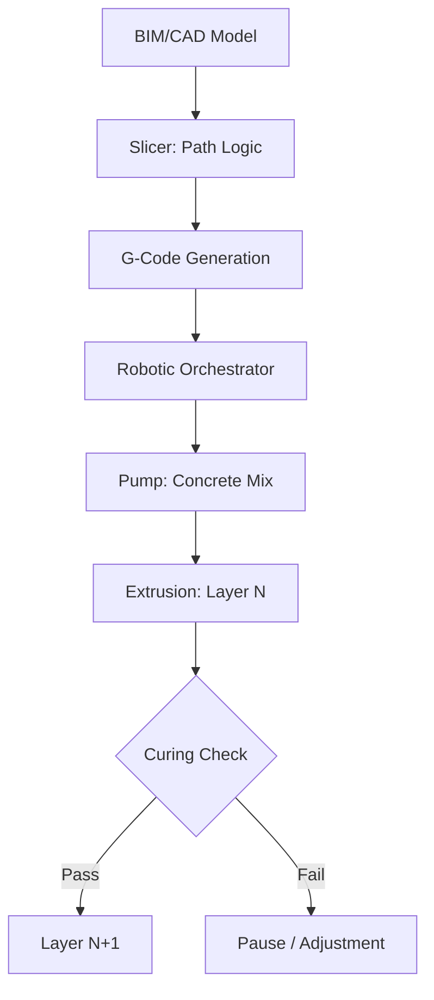

<TLDR>
  3D কনস্ট্রাকশন প্রিন্টিংয়ে গতিই সবচেয়ে স্পষ্ট সুবিধা। নির্ভুলতা তার চেয়েও বড় সুবিধা। সাবট্র্যাকটিভ থেকে অ্যাডিটিভ ম্যানুফ্যাকচারিংয়ে গেলে আমরা উপকরণের অপচয় 60% পর্যন্ত কমাতে পারি এবং জটিল তাপীয় জ্যামিতি সরাসরি দেওয়ালের কাঠামোর মধ্যে মিলিয়ে দিতে পারি। সবুজ অবকাঠামোর সংজ্ঞা এটাই: উচ্চ-ক্ষমতা, কম অপচয় এবং লোকাল-ফার্স্ট।
</TLDR>

প্রথমবার যখন একটি গ্যান্ট্রি-ধরনের 3D প্রিন্টারকে কার্বন-ফাইবার-শক্তিশালী কংক্রিটের ধারা বের করতে দেখলাম, তখন শুধু নির্মাণের একটি দ্রুততর উপায় দেখিনি। দেখেছিলাম **ম্যাটেরিয়াল সার্বভৌমত্বের** দিকে একটি প্রযুক্তিগত বাঁক, যে ধারণা আমার সাম্প্রতিক গবেষণায় বারবার ফিরে এসেছে।

চিরাচরিত নির্মাণ জগতে আমরা প্রায়ই কাঠের গুদামের মাপ আর ছাঁচের সীমাবদ্ধতায় বাঁধা থাকি। অপচয় চোখে পড়ার মতো; বৈশ্বিক গড় অনুযায়ী নির্মাণস্থলে পাঠানো সামগ্রীর বিরাট অংশ শেষ পর্যন্ত আবর্জনার ডাস্টবিনে যায়। তত্ত্বগতভাবে, অবকাঠামোকে সফটওয়্যারের সমস্যা হিসেবে দেখা, অর্থাৎ এমন নির্দেশের সমষ্টি যা ডিজিটাল অভিপ্রায়কে বাস্তব রূপ দেয়, শূন্য-অপচয় নির্ভুলতার একটি নতুন পথ খুলে দিতে পারে।

## ভিত: কালি আর কলম

ম্যাটেরিয়াল সায়েন্সে ডুব দেওয়ার আগে হার্ডওয়্যারটা বুঝে নিতে হবে। 3D কনস্ট্রাকশন প্রিন্টিং সাধারণত দুই শিবিরে পড়ে: **গ্যান্ট্রি সিস্টেম** এবং **রোবটিক আর্ম**।

* **গ্যান্ট্রি সিস্টেম**: এগুলো মূলত আপনার ডেস্কটপ FDM প্রিন্টারের বিশাল সংস্করণ। কাজের জায়গার চারপাশে একটি বিশাল ফ্রেম বানানো হয় এবং নজল X, Y ও Z অক্ষ বরাবর চলে। এগুলো অত্যন্ত স্থিতিশীল এবং বড় পরিসরে গোটা শহরের ব্লক প্রিন্ট করতে পারে, তবে সেটআপের জন্য অনেকটা জায়গা লাগে।
* **রোবটিক আর্ম**: এগুলো চটপটে, মাল্টি-অ্যাক্সিস শিল্প রোবট (যেমন গাড়ি অ্যাসেম্বলিতে ব্যবহার হয়), যা ট্র্যাক বা ট্রেলারে বসানো। জটিল জ্যামিতির জন্য এগুলো বেশি নমনীয় এবং সংকীর্ণ জায়গায় কাজ করতে পারে, যদিও প্রিন্টের সময় কাঠামোগত স্থিতি নিশ্চিত করতে প্রায়ই আরও উন্নত পাথিং লজিক লাগে।

"কালি" "কলমের" মতোই গুরুত্বপূর্ণ। আমরা শুধু সাধারণ কংক্রিট ব্যবহার করি না। আমরা ব্যবহার করি বিশেষ **সিমেন্টিশিয়াস কম্পোজিট**: এমন মিশ্রণ যা নজল দিয়ে তরলের মতো বেরোয় কিন্তু ওপরের স্তরগুলোর ওজন সামলাতে সঙ্গে সঙ্গে জমে যায়। এই "স্ট্যাকেবিলিটি"-ই যেকোনো 3D নির্মাণের আসল ইঞ্জিনিয়ারিং বাধা।

## কেন: উপকরণের সর্বোত্তম ব্যবহার

চিরাচরিত নির্মাণে প্রতিটি বাঁক একটি খরচের কেন্দ্র। ছাঁচ দামি, অপচয় অনিবার্য, আর শ্রম পুনরাবৃত্তিমূলক। অ্যাডিটিভ ম্যানুফ্যাকচারিং এটাকে উল্টে দেয়। 3D প্রিন্টারের কাছে প্যারামেট্রিকভাবে অপ্টিমাইজ করা জটিল বাঁকের খরচ সরলরেখার মতোই।

এর ফলে আমরা **টপোলজি অপ্টিমাইজেশন** কাজে লাগাতে পারি। আমরা ভেতরে ফাঁপা কোরওয়ালা দেওয়াল প্রিন্ট করতে পারি, যা প্রাকৃতিক ইনসুলেশন হিসেবে কাজ করে কিংবা তার ও প্লাম্বিংয়ের সার্ভিস চ্যানেল হয়, আর এসব এক্সট্রুশনের সময়েই সরাসরি তৈরি হয়ে যায়। আরও গুরুত্বপূর্ণ হলো, এটি **সবুজ জিওপলিমার** ব্যবহারের সুযোগ করে দেয়। চিরাচরিত পোর্টল্যান্ড সিমেন্টের বদলে ফ্লাই অ্যাশ বা স্ল্যাগের মতো শিল্পের উপজাতকে বাইন্ডার হিসেবে ব্যবহার করে ছাদ বসানোর আগেই আমরা ভবনের "শরীরের" কার্বন ফুটপ্রিন্ট অনেকখানি কমাতে পারি।

## কীভাবে: স্লাইসিং থেকে এক্সট্রুশন

"ব্রেন" (ডিজিটাল ডিজাইন) আর "বডি" (বাস্তব কাঠামো)-র মধ্যে সেতুবন্ধ একটি অনুমানযোগ্য কিন্তু কঠোর পাইপলাইন মেনে চলে। এটি ম্যাটেরিয়াল সায়েন্স আর রোবোটিক্সের এক উঁচু ঝুঁকির সমন্বয়।

## ঠিকাদারের নতুন ভূমিকা

এই প্রযুক্তি ঠিকাদারকে বাদ দেয় না, বরং উঁচুতে তোলে। "ভবিষ্যতের ঠিকাদার" কায়িক শ্রমিক কম, আর **সিস্টেম অর্কেস্ট্রেটর** বেশি।

1. **ম্যাটেরিয়াল সায়েন্টিস্ট**: তাঁদের মিশ্রণের রিওলজি বুঝতে হবে, অর্থাৎ মঙ্গলবার আর বৃহস্পতিবারে তাপমাত্রা ও আর্দ্রতা প্রবাহকে কীভাবে প্রভাবিত করে।
2. **রোবটিক পাইলট**: তাঁরা নির্মাণের ডিজিটাল টুইন সামলান, বিচ্যুতির জন্য সেন্সর নজরে রাখেন এবং রিয়েল-টাইমে পাথিং সামঞ্জস্য করেন।
3. **অবকাঠামো স্থপতি**: তাঁরা প্রিন্ট করা চ্যানেলের ভেতরে MEP (মেকানিক্যাল, ইলেকট্রিক্যাল, প্লাম্বিং) সমন্বয়ে মন দেন, যাতে ভাঙচুরের ড্রিলিং আর "পরে" করা পরিবর্তনের প্রয়োজন কমে।

## আগামী দিনে / যা শিখলাম

3D নির্মাণ নিয়ে এই গবেষণা একটি মৌলিক বদলের দিকে ইঙ্গিত করে: **অবকাঠামো এখন সফটওয়্যার হয়ে উঠছে**। দেওয়ালের তাপীয় ভর বা কোনো কোণের কাঠামোগত ঘনত্ব যখন আপনি প্রোগ্রাম করতে পারেন, তখন স্থানীয় হার্ডওয়্যার দোকানের "স্ট্যান্ডার্ড মাপে" আর আটকে থাকতে হয় না।

Gekro Lab এখন দেওয়াল প্রিন্ট না করলেও **সবুজ অবকাঠামোর** নীতিগুলো, অর্থাৎ অতীতের গায়ের জোরের পদ্ধতির বদলে উপকরণের নিখুঁত প্রয়োগকে অগ্রাধিকার দেওয়া, একটি রোডম্যাপ দেয় যে ডিজিটাল বুদ্ধিমত্তা আর আমাদের বাস্তব পরিবেশের মধ্যকার ব্যবধান আমরা শেষমেশ কীভাবে ঘোচাতে পারি।
