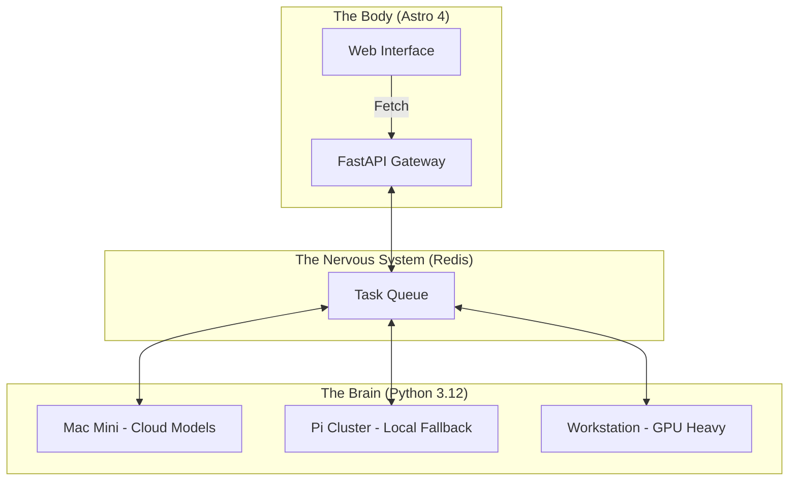

<TLDR>
  মনোলিথ AI ডেভেলপারদের জন্য ঋণের ফাঁদ। আমি Gekro-কে ভাগ করেছি অ্যাসিঙ্ক্রোনাস রিজনিংয়ের জন্য Python-চালিত "ব্রেন" আর উচ্চ-ক্ষমতার ডেলিভারির জন্য Astro-ভিত্তিক "বডি"-তে। এই লেখায় হার্ডওয়্যার স্ট্যাক, Mac Mini থেকে Pi ক্লাস্টার পর্যন্ত, আর তাদের জুড়ে দেওয়া FastAPI স্নায়ুতন্ত্র ভেঙে দেখানো হয়েছে।
</TLDR>

বেশির ভাগ ডেভেলপার LLM-কে একটি ফুলিয়ে-ফাঁপানো ডেটাবেস কোয়েরির মতো দেখেন: একটি Next.js বা Node সার্ভারের ভেতরে সামলানো সিঙ্ক্রোনাস রিকোয়েস্ট-রেসপন্স চক্র। কাজে সত্যিকারের সময় লাগা পর্যন্তই এটা টেকে। আপনি যখন জটিল এজেন্টিক ওয়ার্কফ্লো চালান যেগুলোর "ভাবতে" 30 সেকেন্ড আর যাচাই করতে আরও 10 সেকেন্ড লাগতে পারে, তখন আপনি আপনার UI থ্রেড আটকে রাখতে পারেন না। আমার ল্যাবে আমি স্থির করেছি **স্প্লিট-ব্রেন আর্কিটেকচার**। "ব্রেন" (বুদ্ধিমত্তা) থাকে বিতরিত হার্ডওয়্যার ক্লাস্টার জুড়ে ছড়ানো বিশেষায়িত Python পরিবেশে, আর "বডি" (ইন্টারফেস) একটি ছিমছাম, চটপটে Astro মেশিন যা গতি আর SEO-কে অগ্রাধিকার দেয়।

## আর্কিটেকচার

আমার ল্যাব বিতরিত। আমি সব কম্পিউট এক ঝুড়িতে রাখায় বিশ্বাস করি না। একটি ডিপ্লয়মেন্ট বসে গেলে ল্যাবের বুদ্ধিমত্তা অফলাইনে চলে যাওয়া উচিত নয়; আর্কিটেকচারকে যেকোনো একক ব্যর্থতা সামলে টিকে থাকতে হবে।



| স্তর | প্রযুক্তি | প্রধান ভূমিকা |
| :--- | :--- | :--- |
| **বডি** | Astro + Tailwind v4 | UI ডেলিভারি, SEO ও স্ট্যাটিক ডকুমেন্টেশন। |
| **ব্রেন** | Python + LangGraph | দীর্ঘমেয়াদি রিজনিং চক্র ও মডেল অর্কেস্ট্রেশন। |
| **স্নায়ুতন্ত্র** | FastAPI + Redis | অ্যাসিঙ্ক্রোনাস স্টেট ম্যানেজমেন্ট ও ইভেন্ট রাউটিং। |
| **কম্পিউট** | Together AI / Ollama | ইনফারেন্স ইঞ্জিন (ক্লাউড ও লোকাল)। |

## নির্মাণ

বাস্তবায়ন শুরু হয় ডিকাপলিং দিয়ে। "ব্রেন"-এর কখনও CSS নিয়ে মাথা ঘামানো উচিত নয়, আর "বডি"-র কখনও টেম্পারেচার-স্যাম্পলিং বা top-p মান নিয়ে নয়।

### 1. ব্রেন: একটি স্টেটলেস লজিক ইঞ্জিন

এজেন্টদের প্রকাশ করতে আমি FastAPI ব্যবহার করি। এতে Astro "বডি" নিচের Python ডিপেন্ডেন্সি না সামলেই ভাবনা চালু করতে পারে।

```python
# brain/main.py
from fastapi import FastAPI, BackgroundTasks
from pydantic import BaseModel
import redis

app = FastAPI()
r = redis.Redis(host='localhost', port=6379, db=0)

class Task(BaseModel):
    instruction: str
    session_id: str

@app.post("/think")
async def run_thought_cycle(task: Task, background_tasks: BackgroundTasks):
    # Update Body that we are 'Thinking'
    r.set(f"status:{task.session_id}", "processing")
    
    # Run the expensive AI logic in the background
    background_tasks.add_task(expensive_reasoning, task.instruction, task.session_id)
    
    return {"status": "accepted", "session_id": task.session_id}

def expensive_reasoning(prompt, sid):
    from gekro_client import GekroLLMClient
    client = GekroLLMClient()
    result = client.chat([{"role": "user", "content": prompt}])
    r.set(f"status:{sid}", "completed")
    r.set(f"result:{sid}", result)
```

### 2. বডি: Astro রিকোয়েস্ট প্যাটার্ন

Astro-তে আমি SSR-এর সময় প্রাথমিক স্টেট আনি, কিন্তু কোনো ভাবনা-চক্র সক্রিয় থাকলে স্ট্যাটাস পোল করতে একটি ছোট "আইল্যান্ড" (Preact বা SolidJS) ব্যবহার করি। এতে প্রথম লোড তাৎক্ষণিক থাকে।

```astro
---
// apps/web/src/pages/lab.astro
import LabStatus from '../components/LabStatus.tsx';

const initialStatus = await fetch('http://brain-gateway/status').then(res => res.json());
---

<Layout title="Lab Controls">
  <h1>System Orchestration</h1>
  <!-- The 'Island' that handles the live updates -->
  <LabStatus client:load initialData={initialStatus} />
</Layout>
```

### WSL2 নোট

Windows মেশিনে এই স্তরগুলো জুড়ে দেওয়ার সময় আমি Redis আর FastAPI "ব্রেন" চালাই WSL2-এর ভেতরে, কিন্তু "বডি"-র জন্য Windows-নেটিভ Astro ডেভ সার্ভার ব্যবহার করি। এতে আমি UI-র কাজে Windows-এর Chrome ডিবাগার ব্যবহার করতে পারি, আর Linux-এর জন্য অপ্টিমাইজ করা ভারী Python কোড তার স্বাভাবিক পরিবেশে চলে।

## সমঝোতা

সবচেয়ে বড় চ্যালেঞ্জ কোড নয়; সেটা **স্টেট সিঙ্ক্রোনাইজেশন**। ব্রেন কোনো কাজ শেষ করলেও বডি যদি আপডেটের জন্য পোল না করে, ব্যবহারকারী পুরোনো UI দেখেন। আমি তিন সপ্তাহ একটি বাগের পেছনে ছুটেছি, যেখানে একটি এজেন্ট 4k লগ ফাইলের সারসংক্ষেপ শেষ করেছিল, কিন্তু Redis কী ঠিকমতো ছড়ায়নি, ফলে ব্রাউজারে "অসীম ভাবনা"-র লুপ তৈরি হয়েছিল।

আমি বিভাজন করতে দুই থেকে তিন ঘণ্টার বাজেট ধরেছিলাম। লেগেছে পুরো একদিন। প্রায় সব বাড়তি সময় গেছে ব্রেন আর বডির মাঝের সেলাইয়ে, যেটা সেটিংস ঠিক না হওয়া পর্যন্ত খুঁতখুঁতে, তারপর নিঃশব্দে সমস্যা হওয়া বন্ধ করে। অনেক দিন হলো সেটা আমাকে ভোগায়নি। প্রথম সপ্তাহটা কেবল সেলাই আর সেলাই।

বিতরিত সিস্টেমের জটিলতা নিজেই একরকম ঋণ। আপনি যদি একটি সাধারণ অ্যাপ বানান, এটা করবেন না। কিন্তু যদি এমন ল্যাব বানান যাকে রাত 2টার ক্লাউড ব্ল্যাকআউট পেরোতে হবে, তাহলে সেই স্থিতিস্থাপকতা দরকার যা শুধু স্প্লিট-ব্রেন আর্কিটেকচারই দেয়।

ডায়াগ্রাম যতটা বোঝায়, এটা ততটা হাত-ছাড়া নয়। প্রয়োজনে আমি এখনও আলাদা আলাদা Pi-তে SSH করি, কারণ প্রতিটি নিজের প্রজেক্ট চালায় আর আমি জানি কোনটা কোনটা। এটা নকশার ত্রুটির চেয়ে বরং এই স্বীকারোক্তি যে তিন-নোডের ক্লাস্টার এত ছোট যে মাথায় রাখা যায়, আর এর বাইরে ভান করার দরকার আমার এখনও পড়েনি।

## আগামী দিনে

এই সেটআপ এগোচ্ছে **ফিজিক্যাল ফিডব্যাকের** দিকে। আমি এখন "ব্রেন"-এর আউটপুট DFW-তে আমার অফিসের একগুচ্ছ Hue লাইটের সঙ্গে জুড়ছি। ল্যাব কোনো দূরবর্তী সার্ভারে গুরুতর ব্যর্থতা ধরলে ঘরটা আক্ষরিক অর্থেই লাল হয়ে যায়। আর্কিটেকচার যতটা সফটওয়্যার, ততটাই সেই পরিবেশ যেখানে সফটওয়্যার চলে।
