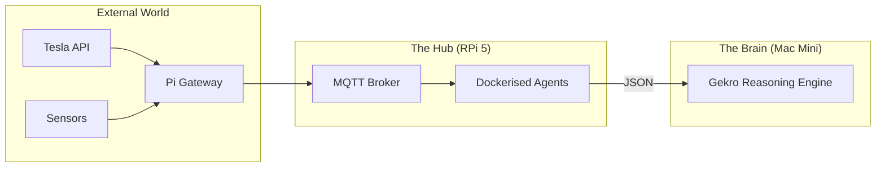

<TLDR>
  MQTT ব্রোকার আর cron জবের কাজে 2,000 ডলারের ওয়ার্কস্টেশন নষ্ট করবেন না। আমি NVMe SSD সহ একটি Raspberry Pi 5 ব্যবহার করি "ল্যাব অ্যাসিস্ট্যান্ট" হিসেবে: একটি সব সময় চালু নোড, যা পুনরাবৃত্তিমূলক, কম কম্পিউটের সেই কাজগুলো সামলায় যেগুলো ল্যাবের হৃদস্পন্দন স্থির রাখে। এই লেখায় আছে হার্ডওয়্যার সেটআপ এবং Docker-ভিত্তিক ইউটিলিটি স্ট্যাক, যা আমার বাস্তব জগৎ (Tesla ও বাড়ি) আর আমার AI এজেন্টদের জুড়ে দেয়।
</TLDR>

বিলিয়ন ডলারের ডেটা সেন্টারের এই দুনিয়ায়, 80 ডলারের এই কম্পিউটারটিই আমার সবচেয়ে নির্ভরযোগ্য কর্মী। DFW-তে যখন Gekro শুরু করি, তখন বুঝলাম আমার একটি "Ground Truth" নোড দরকার: এমন কিছু, যা তখনও চালু থাকবে যখন আমার প্রধান Mac Mini রিবুট হচ্ছে বা আমার ওয়ার্কস্টেশন কোনো 3D রেন্ডারের চাপে আটকে আছে। Raspberry Pi হলো সেই নোঙর। এটা ভারী "চিন্তার" কাজ করে না, কিন্তু নিশ্চিত করে যে ব্রেনের যে ডেটা দরকার (যেমন আমার Tesla-র চার্জিংয়ের অবস্থা বা অফিসের তাপমাত্রা) তা সব সময় পাওয়া যায় এবং ইনডেক্স করা থাকে।

## আর্কিটেকচার

Pi কাজ করে **গেটওয়ে লেয়ার** হিসেবে। এটি বসে IoT ডিভাইসের বিশৃঙ্খল জগৎ আর উচ্চ-ক্ষমতার রিজনিং লেয়ারের মাঝখানে।



| উপাদান | হার্ডওয়্যার / সফটওয়্যার | ভূমিকা |
| :--- | :--- | :--- |
| **বোর্ড** | Raspberry Pi 5 (16GB) | উচ্চ-ক্ষমতার ARM কম্পিউট। |
| **স্টোরেজ** | M.2 HAT + NVMe 256GB SSD | SD কার্ড নষ্ট হওয়া ঠেকায় এবং I/O দ্রুত করে। |
| **ব্রোকার** | Mosquitto (Docker) | ল্যাবের সব টেলিমেট্রির "ডাকঘর"। |
| **শিডিউলার** | Cron / Supercronic | রাতের গবেষণা ও পরিষ্কারের এজেন্ট চালু করে। |

## নির্মাণ

প্রোডাকশন Pi-কে হতে হয় "Immutability-First"। বেস OS-এ আমি Docker আর Tailscale ছাড়া কিছুই ইনস্টল করি না।

### 1. NVMe-র সুবিধা

সপ্তাহান্তের প্রকল্প ছাড়া অন্য কোনো কাজে যদি এখনও SD কার্ড ব্যবহার করেন, তাহলে আপনি বালির ওপর বাড়ি বানাচ্ছেন। প্রচুর লগ লেখা একটি এজেন্ট একটি দামি SD কার্ড নষ্ট করে ফেলায় আমি তিন সপ্তাহের ডেটা হারিয়েছিলাম। এখন আমি NVMe SSD ব্যবহার করি।

```bash
# Verify NVMe is detected and using Gen 3 speeds
lsblk
sudo lspci -vvv | grep LnkSta
```

### 2. Docker-ভিত্তিক অ্যাসিস্ট্যান্ট স্ট্যাক

অ্যাসিস্ট্যান্ট নোডের জন্য আমি একটি `docker-compose.yml` রাখি, যেটি বুট হলেই নিজে থেকে চালু হয়।

```yaml
services:
  mqtt:
    image: eclipse-mosquitto:latest
    ports:
      - "1883:1883"
    volumes:
      - ./mosquitto/config:/mosquitto/config

  tesla-telemetry:
    build: ./agents/tesla-bridge
    restart: always
    environment:
      - TESLA_VIN=${VIN}
      - MQTT_HOST=mqtt

  nightly-summarizer:
    image: python:3.12-slim
    volumes:
      - ./scripts:/app
    command: ["python", "/app/daily_digest.py"]
```

### 3. WSL2 নোট: রিমোট ম্যানেজমেন্ট

আমি Pi-তে কখনও মনিটর লাগাই না। ক্লাস্টারের যেকোনো নোডে তাৎক্ষণিক পৌঁছাতে আমি আমার WSL2 পরিবেশে একটি বিশেষ Zsh ফাংশন ব্যবহার করি।

```bash
# Fast SSH to lab nodes
lab() {
  ssh rohit@192.168.1.$1
}
# Usage: lab 50 (connects to Pi at .50)
```

## সমঝোতা

Pi-র সবচেয়ে বড় দুর্বলতা **কম্পিউট স্যাচুরেশন**। একবার আমি Pi-তে আরও চারটি এজেন্টের সঙ্গে একটি লোকাল ভেক্টর ডেটাবেস (ChromaDB) চালানোর চেষ্টা করেছিলাম। I/O অপেক্ষার সময় হু হু করে বাড়ল, আর আমার MQTT ব্রিজ আমার Tesla-র বার্তা হারাতে শুরু করল। আপনাকে "রিসোর্স স্ক্যাভেঞ্জার" হতে হবে। আমি শিখেছি Pi-কে কড়াভাবে **I/O-বাউন্ড কাজে** (API থেকে ডেটা আনা, বার্তা রাউট করা) সীমিত রাখতে এবং সব **CPU/GPU-বাউন্ড কাজ** Mac Mini-তে পাঠিয়ে দিতে।

আরও একটা কথা: **পাওয়ার গুরুত্বপূর্ণ**। একটি "সাধারণ" USB-C ফোন চার্জার লোডের সময় Pi 5-কে থ্রটল করাবে। টেক্সাসের গ্রীষ্মের তাপপ্রবাহে NVMe ড্রাইভ ও অ্যাকটিভ কুলারকে পূর্ণ ক্ষমতায় চালু রাখতে আমাকে অফিশিয়াল 27W PD পাওয়ার সাপ্লাইতে যেতে হয়েছে।

## আগামী দিনে

এই মুহূর্তে আমি Pi-র GPIO পিনে একটি **ফিজিক্যাল কিলসুইচ** জুড়ছি। কোনো এজেন্টকে অস্বাভাবিক আচরণ করতে বা API খরচের সীমায় পৌঁছাতে দেখলে আমার ডেস্কের একটি সত্যিকারের বোতাম পুরো Docker স্ট্যাকে SIGTERM পাঠিয়ে দেবে। পূর্ণ সার্বভৌমত্ব মানে প্লাগের ওপর নিজের হাত থাকা।
