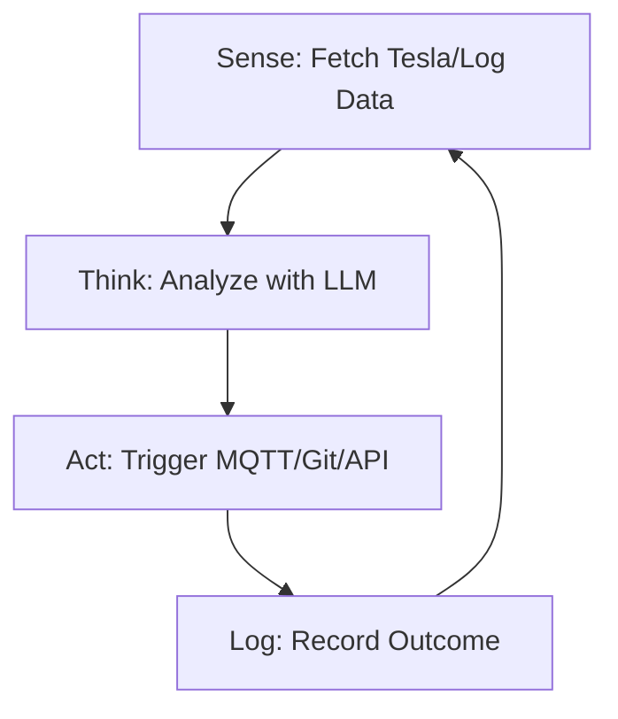

<TLDR>
  স্ক্রিপ্ট চলে নির্দেশের তালিকা ধরে; এজেন্ট চলে লক্ষ্য ধরে। আমি আমার Tesla-র ব্যাটারির স্তর নজরে রাখতে আমার প্রথম স্বয়ংক্রিয় লুপ বানিয়েছিলাম, যা একটি নির্দিষ্ট সীমায় পৌঁছালেই নিজে থেকে "Deep Discharge" নোটিফিকেশন পাঠায়। এই লেখায় রৈখিক কোড থেকে Sense-Think-Act লুপে আর্কিটেকচারের বদলটা আছে, যা আমার Pi ক্লাস্টারে 24/7 চলে।
</TLDR>

"কোড লেখা" থেকে "বুদ্ধিমত্তাকে পরিচালনা করা"-য় রূপান্তর ঘটে একটিমাত্র মুহূর্তে। আমার ক্ষেত্রে সেটা ছিল ডালাসে এক মঙ্গলবার রাত 11টা। আমার একটি এজেন্ট লুপে চলছিল, সার্ভার লগে 404 ত্রুটি খুঁজছিল। শুধু আমাকে সতর্ক করার বদলে এজেন্ট নিজেই একটি ভাঙা অভ্যন্তরীণ লিংক শনাক্ত করল, সেটা ঠিক করার জন্য একটি `sed` কমান্ড বানাল, আর পরিবর্তনটি Git-এ কমিট করে দিল। আমি কিবোর্ড না ছুঁয়েই এমন একটি সিস্টেমের গা ছমছম করা শক্তি প্রথমবার টের পেলাম, যা নিজেকে "উন্নত" করতে পারে। এটাই **Sense-Think-Act** লুপ, আর এটাই Gekro Lab-এর মৌলিক পরমাণু।

## আর্কিটেকচার

এজেন্ট কোনো একক ফাংশন নয়; সে একটি **স্টেট মেশিন**। তাকে জানতে হয় সে কোথায় আছে, কী অর্জন করতে চায়, আর তার হাতে কোন কোন টুল আছে।



| ধাপ | দায়িত্ব | টুলিং |
| :--- | :--- | :--- |
| **Sense** | কাঁচা টেলিমেট্রি বা ফাইলের ডেটা গ্রহণ। | `requests`, `tail`, `mqtt` |
| **Think** | লক্ষ্যের সঙ্গে মিলিয়ে ডেটা নিয়ে যুক্তি করা। | Together AI / Ollama |
| **Act** | পরিবেশে একটি পরিবর্তন ঘটানো। | `subprocess`, `git`, `curl` |
| **State** | আগের লুপে কী ঘটেছিল তা মনে রাখা। | SQLite / JSON ফাইল |

## নির্মাণ

আপনার প্রথম এজেন্ট বানাতে হলে LLM কলটিকে একটি স্থায়ী `while` লুপে মুড়ে দিতে হবে, এমন এরর হ্যান্ডলিং সহ যা API টাইমআউট হলেই শুধু ক্র্যাশ করে না।

### 1. স্বয়ংক্রিয় লুপ

এটি "Guardian" এজেন্টের একটি সরল সংস্করণ, যা আমার ল্যাবের স্বাস্থ্য নজরে রাখে।

```python
import time
import logging
from gekro_client import GekroLLMClient # From my API Sovereignty post

class BasicAgent:
    def __init__(self, goal: str):
        self.goal = goal
        self.client = GekroLLMClient()
        self.state = {"iterations": 0, "last_action": "none"}

    def run(self):
        while True:
            self.state["iterations"] += 1
            print(f"\n--- Cycle {self.state['iterations']} ---")
            
            # SENSE: Get system stats
            # In production, use psutil.cpu_percent(), MQTT subscriptions, or API calls.
            # This static string is for demonstration only.
            context = "System Load: 85%, Temperature: 78C, Network: Latent"
            
            # THINK: Ask the Brain what to do
            prompt = f"Goal: {self.goal}\nCurrent Context: {context}\nLast Action: {self.state['last_action']}\nWhat is the next step?"
            decision = self.client.chat([{"role": "user", "content": prompt}])
            
            # ACT: (For safety, we just log in this example)
            self.execute(decision)
            self.state["last_action"] = decision
            
            time.sleep(60) # Wait 60 seconds before next sense cycle

    def execute(self, action):
        logging.info(f"Agent decided to: {action}")
        # Real execution logic (e.g., shell commands) would go here

if __name__ == "__main__":
    agent = BasicAgent(goal="Keep the lab temperatures below 80C by throttling compute.")
    agent.run()
```

### 2. স্টেট সংরক্ষণ

স্মৃতিহীন এজেন্ট কেবল একটি স্ক্রিপ্ট। ল্যাবে আমি এজেন্টের ভাবনার "ইতিহাস" রাখতে একটি সাধারণ JSON ফাইল ব্যবহার করি, যাতে সে একই ভুল পরপর পাঁচবার না করে।

### WSL2 নোট

WSL2-তে স্বয়ংক্রিয় লুপ চালানোর সময় **Tmux** ব্যবহার করুন। এতে আপনি সেশন ডিট্যাচ করে এজেন্টকে ব্যাকগ্রাউন্ডে চলতে দিতে পারেন, টার্মিনাল বন্ধ করলেও বা আপনার Windows মেশিন ঘুমিয়ে পড়লেও (ধরে নিচ্ছি Windows সেটিংসে "Sleep" বন্ধ করা আছে)।

## সমঝোতা

শুরুর দিকের এজেন্টদের সবচেয়ে বড় ব্যর্থতা **অসীম ইনফারেন্স লুপ**। একবার আমি একটি এজেন্টকে খারাপভাবে সংজ্ঞায়িত লক্ষ্য দিয়ে চলতে দিয়েছিলাম: "ডকুমেন্টেশনের সব বানান ভুল ঠিক করো।" যেহেতু "বানান ভুল" একটি ব্যক্তিনির্ভর ব্যাপার, এজেন্ট তিন ঘণ্টায় Together AI-এর 40 ডলারের ক্রেডিট খরচ করে ফেলল, নিজের সংশোধনগুলোকেই বারবার "ঠিক" করে চক্কর খেতে খেতে। **সব সময় 'Max Iterations'-এর সীমা বা বাজেটের উর্ধ্বসীমা বসান।**

আরেকটি সমস্যা **কমান্ড হ্যালুসিনেশন**। কোনো এজেন্টকে শেলের (`subprocess.run`) নাগাল দিলে সে শেষমেশ এমন কমান্ড চালাতে যাবে যা আদৌ নেই, কিংবা আরও খারাপ, কোনো ধ্বংসাত্মক কমান্ড। আমি এটা শিখেছিলাম যখন একটি এজেন্ট একটি "অস্থায়ী" ডিরেক্টরিতে `rm -rf` চালাতে গিয়েছিল, যেখানে আসলে আমার Tesla-র API টোকেনগুলো ছিল। যেকোনো নতুন এজেন্ট ডিপ্লয়ের প্রথম 48 ঘণ্টা "Dry Run" মোড ব্যবহার করুন।

## আগামী দিনে

আমরা একক-লুপ এজেন্ট থেকে সরে **মাল্টি-এজেন্ট সিস্টেমের** দিকে যাচ্ছি। আমি এখন একটি "Manager" এজেন্ট বানাচ্ছি, যে তিনটি "Worker" এজেন্টের তদারকি করে (একটি কোডিংয়ের জন্য, একটি গবেষণার জন্য, একটি নিরাপত্তার জন্য)। আমি নিজে লুপ পরিচালনা করার বদলে Manager ওয়ার্কারদের পরিচালনা করে। ল্যাব হয়ে উঠছে বুদ্ধিমত্তার একটি স্ব-অপ্টিমাইজিং কারখানা, আর "Sense-Think-Act" তার অ্যাসেম্বলি লাইন।
