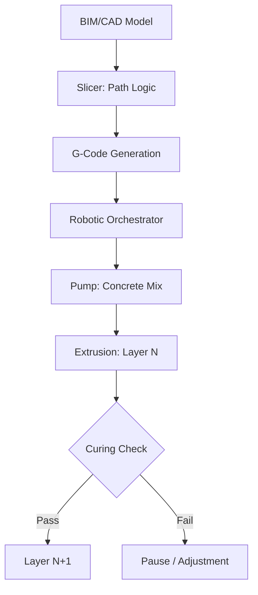

<TLDR>
  La velocidad es la ventaja evidente de la impresión 3D en construcción. La precisión es la mayor. Al pasar de la fabricación sustractiva a la aditiva, podemos reducir el desperdicio de material hasta un 60% e integrar geometrías térmicas complejas directamente en la estructura del muro. Esa es la definición de infraestructura verde: de alto rendimiento, con poco desperdicio y local-first.
</TLDR>

La primera vez que vi una impresora 3D de pórtico extruyendo un cordón de hormigón reforzado con fibra de carbono, vi algo más que una forma más rápida de construir. Vi un giro técnico hacia la **Soberanía de Materiales**, un concepto que ha sido un tema recurrente en mi investigación reciente.

En la construcción tradicional, solemos estar atados a las dimensiones del almacén de madera y a las limitaciones del molde. El desperdicio es enorme: los promedios globales sugieren que un porcentaje muy alto de los materiales enviados a una obra acaba en un contenedor de escombros. En teoría, tratar la infraestructura como un problema de software, un conjunto de instrucciones que traduce la intención digital en realidad física, podría ofrecer un nuevo camino hacia la precisión sin desperdicio.

## Los cimientos: la tinta y la pluma

Antes de entrar en la ciencia de materiales, tenemos que entender el hardware. La impresión 3D en construcción se divide, en general, en dos campos: los **sistemas de pórtico** y los **brazos robóticos**.

* **Sistemas de pórtico**: Son, en esencia, versiones gigantes de tu impresora FDM de escritorio. Se levanta un enorme armazón alrededor de la obra y la boquilla se mueve por los ejes X, Y y Z. Son muy estables y pueden imprimir manzanas enteras a escala, pero exigen una huella de instalación considerable.
* **Brazos robóticos**: Son robots industriales multieje y ágiles (como los de las líneas de montaje de automoción) montados sobre rieles o remolques. Ofrecen más flexibilidad para geometrías complejas y pueden trabajar en espacios más reducidos, aunque a menudo requieren una lógica de trayectorias más avanzada para garantizar la estabilidad estructural durante la impresión.

La "tinta" es tan importante como la "pluma". No usamos hormigón convencional, sino **compuestos cementicios** especializados: mezclas diseñadas para fluir como un líquido por una boquilla y fraguar al instante para soportar el peso de las capas superiores. Esa "apilabilidad" es el verdadero obstáculo de ingeniería de cualquier construcción impresa en 3D.

## El porqué: optimización de materiales

En la construcción tradicional, cada curva es un centro de costes. Los encofrados son caros, el desperdicio es inevitable y la mano de obra es repetitiva. La fabricación aditiva lo invierte todo. Para una impresora 3D, una curva compleja y optimizada paramétricamente cuesta lo mismo que una línea recta.

Esto nos permite aprovechar la **optimización topológica**. Podemos imprimir muros con núcleos huecos internos que actúan como aislamiento natural o como canales de servicio para cableado y fontanería, integrados directamente durante el proceso de extrusión. Y, lo que es más importante, permite usar **geopolímeros verdes**. Al emplear subproductos industriales como la ceniza volante o la escoria como aglutinantes en lugar del cemento Portland tradicional, podemos reducir drásticamente la huella de carbono del "cuerpo" de un edificio antes incluso de colocar el tejado.

## El cómo: del laminado a la extrusión

El puente entre el "cerebro" (el diseño digital) y el "cuerpo" (la estructura física) sigue un proceso predecible, pero rígido. Es una orquestación de alto riesgo entre ciencia de materiales y robótica.

## El nuevo papel del contratista

Esta tecnología no elimina al contratista, lo eleva. El "contratista del futuro" es menos un trabajador manual y más un **orquestador de sistemas**.

1. **Científico de materiales**: Debe entender la reología de la mezcla, es decir, cómo la temperatura y la humedad afectan al flujo un martes frente a un jueves.
2. **Piloto de robots**: Gestiona el gemelo digital de la obra, vigila los sensores en busca de desviaciones y ajusta las trayectorias en tiempo real.
3. **Arquitecto de infraestructura**: Se centra en integrar las instalaciones MEP (mecánicas, eléctricas y de fontanería) dentro de los canales impresos, lo que reduce la necesidad de taladrar y de hacer modificaciones "a posteriori".

## Hacia dónde va esto / Lo que aprendí

Esta investigación sobre la construcción 3D pone de manifiesto un cambio fundamental: **la infraestructura se está convirtiendo en software**. Cuando puedes programar la masa térmica de un muro o la densidad estructural de una esquina, ya no estás limitado por las "unidades estándar" de la ferretería local.

Aunque el Gekro Lab no imprime muros por ahora, los principios de la **infraestructura verde**, que priorizan la aplicación precisa del material frente a los métodos de fuerza bruta del pasado, ofrecen una hoja de ruta de cómo podríamos acabar tendiendo un puente entre la inteligencia digital y nuestros entornos físicos.
