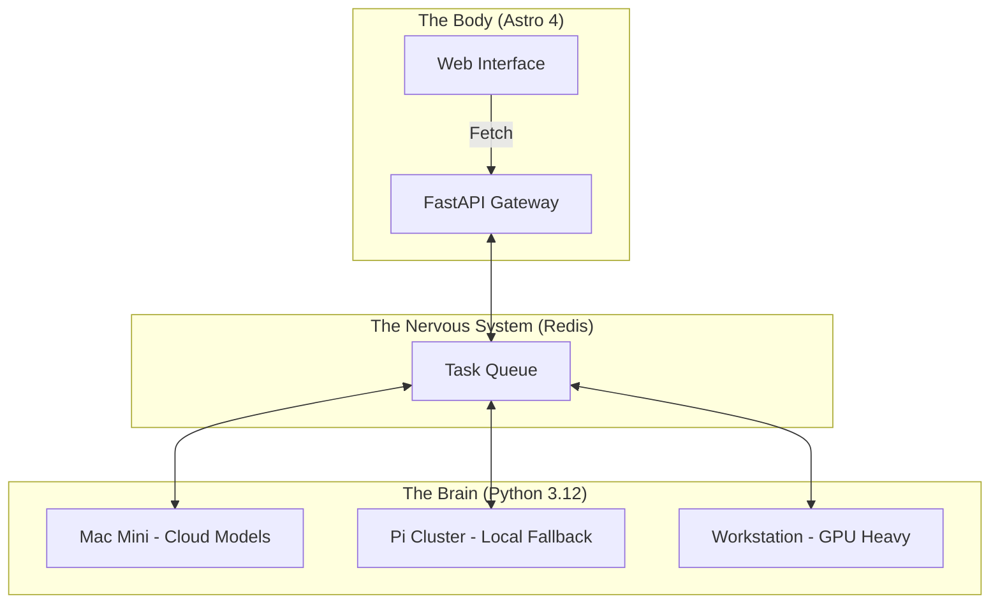

<TLDR>
  Los monolitos son una trampa de deuda para los desarrolladores de IA. Dividí Gekro en un "cerebro" con Python para el razonamiento asíncrono y un "cuerpo" basado en Astro para una entrega de alto rendimiento. Este artículo desglosa la pila de hardware, desde los Mac Mini hasta los clústeres de Pi, y el sistema nervioso de FastAPI que los conecta.
</TLDR>

La mayoría de los desarrolladores tratan a un LLM como una glorificada consulta a una base de datos: un ciclo síncrono de petición y respuesta gestionado dentro de un único servidor de Next.js o Node. Eso aguanta justo hasta que el trabajo tarda de verdad. Cuando ejecutas flujos agénticos complejos que pueden tardar 30 segundos en "pensar" y otros 10 en validar, no puedes bloquear el hilo de tu interfaz. En mi laboratorio me he decantado por una **arquitectura de cerebro dividido**. El "cerebro" (la inteligencia) vive en entornos Python especializados repartidos por un clúster de hardware distribuido, mientras que el "cuerpo" (la interfaz) es una máquina Astro ligera y ágil que prioriza la velocidad y el SEO.

## La arquitectura

Mi laboratorio es distribuido. No creo en poner todo el cómputo en una sola cesta. Que se caiga un único despliegue no debería dejar sin conexión la inteligencia del laboratorio; la arquitectura debe sobrevivir a cualquier fallo individual.



| Capa | Tecnología | Función principal |
| :--- | :--- | :--- |
| **Cuerpo** | Astro + Tailwind v4 | Entrega de la interfaz, SEO y documentación estática. |
| **Cerebro** | Python + LangGraph | Ciclos de razonamiento de larga duración y orquestación de modelos. |
| **Sistema nervioso** | FastAPI + Redis | Gestión asíncrona del estado y enrutamiento de eventos. |
| **Cómputo** | Together AI / Ollama | Motores de inferencia (en la nube y locales). |

## La construcción

La implementación empieza por el desacoplamiento. Al "cerebro" nunca debería importarle el CSS, y al "cuerpo" nunca deberían importarle la temperatura del muestreo ni los valores de top-p.

### 1. El cerebro: un motor de lógica sin estado

Uso FastAPI para exponer los agentes. Así, el "cuerpo" de Astro puede lanzar pensamientos sin gestionar las dependencias de Python que hay debajo.

```python
# brain/main.py
from fastapi import FastAPI, BackgroundTasks
from pydantic import BaseModel
import redis

app = FastAPI()
r = redis.Redis(host='localhost', port=6379, db=0)

class Task(BaseModel):
    instruction: str
    session_id: str

@app.post("/think")
async def run_thought_cycle(task: Task, background_tasks: BackgroundTasks):
    # Update Body that we are 'Thinking'
    r.set(f"status:{task.session_id}", "processing")
    
    # Run the expensive AI logic in the background
    background_tasks.add_task(expensive_reasoning, task.instruction, task.session_id)
    
    return {"status": "accepted", "session_id": task.session_id}

def expensive_reasoning(prompt, sid):
    from gekro_client import GekroLLMClient
    client = GekroLLMClient()
    result = client.chat([{"role": "user", "content": prompt}])
    r.set(f"status:{sid}", "completed")
    r.set(f"result:{sid}", result)
```

### 2. El cuerpo: el patrón de peticiones de Astro

En Astro, obtengo el estado inicial durante el SSR, pero uso una pequeña "isla" (Preact o SolidJS) para consultar el estado si hay un ciclo de pensamiento activo. Así la carga inicial sigue siendo instantánea.

```astro
---
// apps/web/src/pages/lab.astro
import LabStatus from '../components/LabStatus.tsx';

const initialStatus = await fetch('http://brain-gateway/status').then(res => res.json());
---

<Layout title="Lab Controls">
  <h1>System Orchestration</h1>
  <!-- The 'Island' that handles the live updates -->
  <LabStatus client:load initialData={initialStatus} />
</Layout>
```

### Nota sobre WSL2

Cuando conecto estas capas en una máquina Windows, ejecuto Redis y el "cerebro" de FastAPI dentro de WSL2, pero uso el servidor de desarrollo de Astro nativo de Windows para el "cuerpo". Así puedo usar el depurador de Chrome de Windows para el trabajo de interfaz mientras el código Python, muy optimizado para Linux, se ejecuta en su entorno natural.

## Las contrapartidas

El mayor reto no es el código, sino la **sincronización del estado**. Si el cerebro completa una tarea pero el cuerpo no consulta la actualización, el usuario ve una interfaz obsoleta. Pasé tres semanas persiguiendo un fallo en el que un agente había terminado de resumir un archivo de log de 4k, pero la clave de Redis no se había propagado bien, lo que provocaba bucles de "pensamiento infinito" en el navegador.

Calculé de dos a tres horas para hacer la división. Llevó un día entero. Casi todo el retraso se fue en la costura entre el cerebro y el cuerpo, que es un fastidio hasta que los ajustes quedan bien y luego deja de ser un problema sin hacer ruido. Hace mucho que no me da guerra. La primera semana fue pura costura.

La complejidad de un sistema distribuido es una forma de deuda en sí misma. Si estás construyendo una aplicación sencilla, no lo hagas. Pero si construyes un laboratorio que necesita sobrevivir a un apagón de la nube a las 2 de la madrugada, necesitas la resiliencia que solo ofrece una arquitectura de cerebro dividido.

También exige más intervención de la que sugiere el diagrama. Sigo entrando por SSH a cada Pi cuando hace falta, porque cada una ejecuta su propio proyecto y sé cuál es cuál. Eso es menos un defecto del diseño que una admisión de que un clúster de tres nodos es lo bastante pequeño como para llevarlo en la cabeza, y de que todavía no he necesitado fingir lo contrario.

## Hacia dónde va esto

Este montaje avanza hacia la **retroalimentación física**. Ahora mismo estoy conectando las salidas del "cerebro" a un conjunto de luces Hue en mi oficina de DFW. Si el laboratorio detecta un fallo crítico en un servidor remoto, la habitación se pone literalmente roja. La arquitectura es tanto el entorno en el que se ejecuta el software como el propio software.
