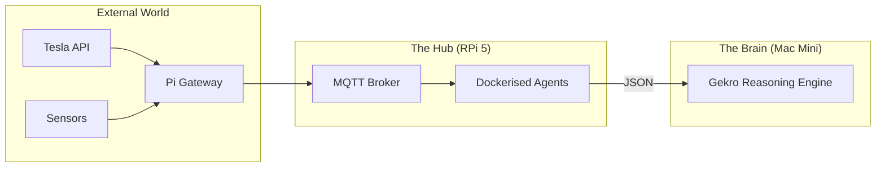

<TLDR>
  No malgastes una estación de trabajo de 2,000 dólares en tareas cron y en un broker MQTT. Uso una Raspberry Pi 5 con un SSD NVMe como "asistente de laboratorio": un nodo siempre encendido que se encarga de las tareas repetitivas y de poco cómputo que mantienen estable el pulso del laboratorio. Este artículo cubre la configuración del hardware y la pila de utilidades en Docker que conecta mi mundo físico (Tesla y casa) con mis agentes de IA.
</TLDR>

En un mundo de centros de datos de miles de millones de dólares, el ordenador de 80 dólares es mi empleado más fiable. Cuando empecé Gekro en DFW, me di cuenta de que necesitaba un nodo de "Ground Truth": algo que siguiera vivo incluso cuando mi Mac Mini principal se estaba reiniciando o mi estación de trabajo estaba saturada por un render 3D. La Raspberry Pi es el ancla. No hace el "pensamiento" pesado, pero garantiza que los datos que el Cerebro necesita (como el estado de carga de mi Tesla o la temperatura de la oficina) estén siempre disponibles e indexados.

## La arquitectura

La Pi actúa como la **capa de pasarela**. Se sitúa entre el mundo caótico de los dispositivos IoT y la capa de razonamiento de alto rendimiento.



| Componente | Hardware / Software | Función |
| :--- | :--- | :--- |
| **Placa** | Raspberry Pi 5 (16GB) | Cómputo ARM de alto rendimiento. |
| **Almacenamiento** | M.2 HAT + SSD NVMe de 256GB | Evita la corrupción de la tarjeta SD y acelera la E/S. |
| **Broker** | Mosquitto (Docker) | La "oficina de correos" de toda la telemetría del laboratorio. |
| **Planificador** | Cron / Supercronic | Lanza los agentes nocturnos de investigación y limpieza. |

## La construcción

Una Pi de producción tiene que ser "inmutable primero". No instalo nada en el sistema operativo base salvo Docker y Tailscale.

### 1. La ventaja del NVMe

Si todavía usas tarjetas SD para algo más que un proyecto de fin de semana, estás construyendo sobre arena. Perdí tres semanas de datos cuando un agente que escribía muchos logs destrozó una tarjeta SD de gama alta. Ahora uso un SSD NVMe.

```bash
# Verify NVMe is detected and using Gen 3 speeds
lsblk
sudo lspci -vvv | grep LnkSta
```

### 2. La pila del asistente en Docker

Mantengo un `docker-compose.yml` para el nodo asistente que arranca solo al encender.

```yaml
services:
  mqtt:
    image: eclipse-mosquitto:latest
    ports:
      - "1883:1883"
    volumes:
      - ./mosquitto/config:/mosquitto/config

  tesla-telemetry:
    build: ./agents/tesla-bridge
    restart: always
    environment:
      - TESLA_VIN=${VIN}
      - MQTT_HOST=mqtt

  nightly-summarizer:
    image: python:3.12-slim
    volumes:
      - ./scripts:/app
    command: ["python", "/app/daily_digest.py"]
```

### 3. Nota sobre WSL2: administración remota

Nunca conecto un monitor a la Pi. Uso una función de Zsh específica en mi entorno WSL2 para saltar al instante a cualquier nodo del clúster.

```bash
# Fast SSH to lab nodes
lab() {
  ssh rohit@192.168.1.$1
}
# Usage: lab 50 (connects to Pi at .50)
```

## Las contrapartidas

El mayor punto débil de la Pi es la **saturación de cómputo**. Una vez intenté ejecutar una base de datos vectorial local (ChromaDB) en la Pi junto con otros cuatro agentes. Los tiempos de espera de E/S se dispararon y mi puente MQTT empezó a perder mensajes de mi Tesla. Hay que ser un "carroñero de recursos". He aprendido a limitar la Pi estrictamente a **tareas limitadas por E/S** (obtener datos de APIs, enrutar mensajes) y a delegar en el Mac Mini todas las **tareas limitadas por CPU/GPU**.

Además, **la alimentación importa**. Un cargador de móvil USB-C "estándar" hará que la Pi 5 reduzca su rendimiento bajo carga. Tuve que pasar a la fuente de alimentación PD oficial de 27W para mantener el disco NVMe y el disipador activo a plena capacidad durante las olas de calor del verano en Texas.

## Hacia dónde va esto

Ahora mismo estoy conectando un **interruptor de emergencia físico** a los pines GPIO de la Pi. Si detecto que un agente se comporta de forma errática o alcanza un límite de gasto de API, un botón físico en mi escritorio enviará un SIGTERM a toda la pila de Docker. La soberanía total significa tener una mano física sobre el enchufe.
