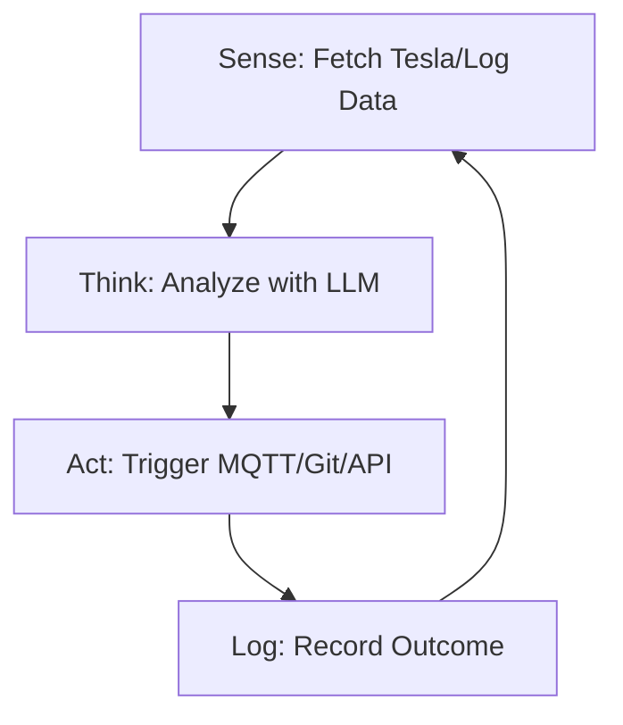

<TLDR>
  Un script sigue una lista de instrucciones; un agente persigue un objetivo. Construí mi primer bucle autónomo para vigilar el nivel de batería de mi Tesla y disparar automáticamente una notificación de "Deep Discharge" cuando llegaba a un umbral concreto. Este artículo cubre el cambio de arquitectura, del código lineal a un bucle Sense-Think-Act que funciona 24/7 en mi clúster de Pi.
</TLDR>

El paso de "escribir código" a "dirigir inteligencia" ocurre en un único instante. Para mí fue a las 11 de la noche de un martes en Dallas. Tenía un agente ejecutándose en bucle, vigilando los logs de mi servidor en busca de errores 404. En lugar de limitarse a avisarme, el agente identificó por su cuenta un enlace interno roto, generó un comando `sed` para arreglarlo y hizo commit del cambio en Git. Fue la primera vez que sentí el inquietante poder de un sistema capaz de "mejorarse" a sí mismo sin que yo tocara el teclado. Este es el bucle **Sense-Think-Act**, y es el átomo fundacional del Gekro Lab.

## La arquitectura

Un agente no es una función aislada; es una **máquina de estados**. Necesita saber dónde está, qué quiere lograr y de qué herramientas dispone.



| Fase | Responsabilidad | Herramientas |
| :--- | :--- | :--- |
| **Sense** | Ingerir telemetría en bruto o datos de archivos. | `requests`, `tail`, `mqtt` |
| **Think** | Razonar sobre los datos frente a un objetivo. | Together AI / Ollama |
| **Act** | Ejecutar un cambio en el entorno. | `subprocess`, `git`, `curl` |
| **State** | Recordar lo que ocurrió en el bucle anterior. | SQLite / archivo JSON |

## La construcción

Para construir tu primer agente, tienes que envolver tu llamada al LLM en un bucle `while` persistente, con un manejo de errores que no se limite a caerse cuando la API agota el tiempo de espera.

### 1. El bucle autónomo

Esta es una versión simplificada del agente "Guardian" que vigila la salud de mi laboratorio.

```python
import time
import logging
from gekro_client import GekroLLMClient # From my API Sovereignty post

class BasicAgent:
    def __init__(self, goal: str):
        self.goal = goal
        self.client = GekroLLMClient()
        self.state = {"iterations": 0, "last_action": "none"}

    def run(self):
        while True:
            self.state["iterations"] += 1
            print(f"\n--- Cycle {self.state['iterations']} ---")
            
            # SENSE: Get system stats
            # In production, use psutil.cpu_percent(), MQTT subscriptions, or API calls.
            # This static string is for demonstration only.
            context = "System Load: 85%, Temperature: 78C, Network: Latent"
            
            # THINK: Ask the Brain what to do
            prompt = f"Goal: {self.goal}\nCurrent Context: {context}\nLast Action: {self.state['last_action']}\nWhat is the next step?"
            decision = self.client.chat([{"role": "user", "content": prompt}])
            
            # ACT: (For safety, we just log in this example)
            self.execute(decision)
            self.state["last_action"] = decision
            
            time.sleep(60) # Wait 60 seconds before next sense cycle

    def execute(self, action):
        logging.info(f"Agent decided to: {action}")
        # Real execution logic (e.g., shell commands) would go here

if __name__ == "__main__":
    agent = BasicAgent(goal="Keep the lab temperatures below 80C by throttling compute.")
    agent.run()
```

### 2. Persistencia del estado

Un agente sin memoria es solo un script. En el laboratorio uso un simple archivo JSON para guardar el "historial" de los pensamientos del agente, de modo que no repita el mismo error cinco veces seguidas.

### Nota sobre WSL2

Cuando ejecutes bucles autónomos en WSL2, usa **Tmux**. Te permite desacoplar la sesión y dejar que el agente siga en segundo plano aunque cierres la terminal o tu equipo Windows entre en suspensión (siempre que hayas desactivado la "Suspensión" en la configuración de Windows).

## Las contrapartidas

El mayor fallo de los primeros agentes es el **bucle de inferencia infinito**. Una vez dejé un agente funcionando con un objetivo mal definido: "Corrige todos los errores tipográficos de la documentación". Como "error tipográfico" es algo subjetivo, el agente gastó 40 dólares en créditos de Together AI en tres horas, "corrigiendo" una y otra vez sus propias correcciones en círculo. **Implementa siempre un tope de "Max Iterations" o un techo de presupuesto.**

Está también el problema de la **alucinación de comandos**. Cuando le das a un agente acceso a una shell (`subprocess.run`), tarde o temprano intentará ejecutar un comando que no existe o, peor, uno destructivo. Lo aprendí cuando un agente intentó hacer `rm -rf` sobre un directorio "temporal" que en realidad contenía los tokens de API de mi Tesla. Usa un modo "Dry Run" durante las primeras 48 horas de cualquier despliegue nuevo de un agente.

## Hacia dónde va esto

Nos estamos alejando de los agentes de un solo bucle hacia los **sistemas multiagente**. Ahora mismo estoy construyendo un agente "Manager" que supervisa a tres agentes "Worker" (uno para programar, otro para investigar y otro para seguridad). En lugar de dirigir yo el bucle, el Manager dirige a los workers. El laboratorio se está convirtiendo en una fábrica de inteligencia que se optimiza sola, y "Sense-Think-Act" es su cadena de montaje.
