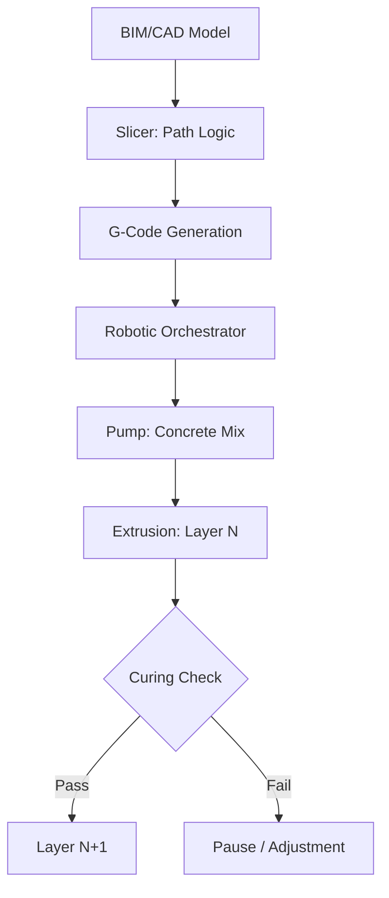

<TLDR>
  3D कंस्ट्रक्शन प्रिंटिंग में रफ़्तार सबसे साफ़ फ़ायदा है। सटीकता उससे भी बड़ा फ़ायदा है। सबट्रैक्टिव से एडिटिव मैन्युफैक्चरिंग की ओर जाकर हम सामग्री की बर्बादी 60% तक घटा सकते हैं और जटिल थर्मल ज्यामितियों को सीधे दीवार की संरचना में जोड़ सकते हैं। ग्रीन इंफ्रास्ट्रक्चर की परिभाषा यही है: उच्च-प्रदर्शन, कम बर्बादी और लोकल-फ़र्स्ट।
</TLDR>

पहली बार जब मैंने गैंट्री-स्टाइल 3D प्रिंटर को कार्बन-फ़ाइबर से मज़बूत कंक्रीट की धार निकालते देखा, तो मुझे निर्माण का सिर्फ़ एक तेज़ तरीक़ा नहीं दिखा। मुझे **मटीरियल सॉवरेनिटी** की ओर एक तकनीकी बदलाव दिखा, एक ऐसी अवधारणा जो मेरे हाल के शोध में बार-बार लौटती रही है।

पारंपरिक निर्माण की दुनिया में हम अक्सर लकड़ी के गोदाम के आकारों और साँचे की सीमाओं से बँधे होते हैं। बर्बादी चौंकाने वाली है; वैश्विक औसत बताते हैं कि निर्माण स्थल पर भेजी गई सामग्री का एक बहुत बड़ा हिस्सा कचरे के डिब्बे में पहुँच जाता है। सैद्धांतिक रूप से, इंफ्रास्ट्रक्चर को सॉफ़्टवेयर की समस्या की तरह देखना, यानी निर्देशों का ऐसा समूह जो डिजिटल इरादे को भौतिक वास्तविकता में बदल दे, शून्य-बर्बादी वाली सटीकता की ओर एक नया रास्ता खोल सकता है।

## नींव: स्याही और कलम

मटीरियल साइंस में उतरने से पहले हमें हार्डवेयर को समझना होगा। 3D कंस्ट्रक्शन प्रिंटिंग आमतौर पर दो खेमों में बँटी है: **गैंट्री सिस्टम** और **रोबोटिक आर्म**।

* **गैंट्री सिस्टम**: ये मूल रूप से आपके डेस्कटॉप FDM प्रिंटर के विशाल रूप हैं। जॉब साइट के चारों ओर एक विशाल फ़्रेम खड़ा किया जाता है और नोज़ल X, Y और Z अक्षों पर चलता है। ये बेहद स्थिर होते हैं और पूरे शहरी ब्लॉक बड़े पैमाने पर प्रिंट कर सकते हैं, लेकिन इनके सेटअप के लिए काफ़ी जगह चाहिए।
* **रोबोटिक आर्म**: ये फुर्तीले, मल्टी-एक्सिस औद्योगिक रोबोट हैं (जैसे ऑटोमोबाइल असेंबली में इस्तेमाल होते हैं), जो पटरियों या ट्रेलरों पर लगे होते हैं। ये जटिल ज्यामितियों के लिए ज़्यादा लचीलापन देते हैं और तंग जगहों में भी काम कर सकते हैं, हालाँकि प्रिंट के दौरान संरचनात्मक स्थिरता सुनिश्चित करने के लिए इन्हें अक्सर ज़्यादा उन्नत पाथिंग लॉजिक की ज़रूरत पड़ती है।

स्याही भी उतनी ही अहम है जितनी कलम। हम सिर्फ़ साधारण कंक्रीट इस्तेमाल नहीं करते। हम ख़ास **सीमेंटीशियस कंपोज़िट** इस्तेमाल करते हैं: ऐसे मिश्रण जो नोज़ल से तरल की तरह बहें, पर ऊपर की परतों का वज़न सँभालने के लिए तुरंत जम जाएँ। यह "स्टैकेबिलिटी" किसी भी 3D निर्माण की असली इंजीनियरिंग चुनौती है।

## क्यों: सामग्री का अनुकूलन

पारंपरिक निर्माण में हर मोड़ एक लागत केंद्र है। साँचे महँगे हैं, बर्बादी अपरिहार्य है और श्रम दोहराव वाला है। एडिटिव मैन्युफैक्चरिंग इसे उलट देती है। 3D प्रिंटर के लिए पैरामीट्रिक रूप से अनुकूलित जटिल मोड़ की लागत सीधी रेखा जितनी ही है।

इससे हम **टोपोलॉजी ऑप्टिमाइज़ेशन** का फ़ायदा उठा सकते हैं। हम ऐसी दीवारें प्रिंट कर सकते हैं जिनके भीतर खोखले कोर प्राकृतिक इन्सुलेशन का काम करें या तारों और प्लंबिंग के लिए सर्विस चैनल बनें, और ये सीधे एक्सट्रूज़न के दौरान ही बन जाएँ। इससे भी अहम बात यह है कि यह **ग्रीन जियोपॉलिमर** के इस्तेमाल को संभव बनाता है। पारंपरिक पोर्टलैंड सीमेंट की जगह फ़्लाई ऐश या स्लैग जैसे औद्योगिक उप-उत्पादों को बाइंडर की तरह इस्तेमाल करके हम छत पड़ने से पहले ही इमारत के "शरीर" का कार्बन फ़ुटप्रिंट बहुत घटा सकते हैं।

## कैसे: स्लाइसिंग से एक्सट्रूज़न तक

डिज़ाइन के "ब्रेन" (डिजिटल डिज़ाइन) और "बॉडी" (भौतिक संरचना) को जोड़ने का काम एक अनुमानित, पर कठोर पाइपलाइन से होता है। यह मटीरियल साइंस और रोबोटिक्स का ऊँचे दाँव वाला समन्वय है।

## ठेकेदार की नई भूमिका

यह तकनीक ठेकेदार को हटाती नहीं, ऊपर उठाती है। "भविष्य का ठेकेदार" हाथ का काम करने वाले मज़दूर से कम और **सिस्टम ऑर्केस्ट्रेटर** ज़्यादा है।

1. **मटीरियल साइंटिस्ट**: उन्हें मिश्रण की रियोलॉजी समझनी होगी, यानी मंगलवार और गुरुवार को तापमान और नमी प्रवाह को कैसे प्रभावित करते हैं।
2. **रोबोटिक पायलट**: वे निर्माण के डिजिटल ट्विन को सँभालते हैं, विचलन के लिए सेंसरों पर नज़र रखते हैं और रियल-टाइम में पाथिंग समायोजित करते हैं।
3. **इंफ्रास्ट्रक्चर आर्किटेक्ट**: वे प्रिंट किए गए चैनलों के भीतर MEP (मैकेनिकल, इलेक्ट्रिकल, प्लंबिंग) के एकीकरण पर ध्यान देते हैं, जिससे तोड़-फोड़ वाली ड्रिलिंग और "बाद में" किए जाने वाले बदलावों की ज़रूरत घटती है।

## आगे की राह / मैंने क्या सीखा

3D कंस्ट्रक्शन पर यह शोध एक बुनियादी बदलाव की ओर इशारा करता है: **इंफ्रास्ट्रक्चर सॉफ़्टवेयर बनता जा रहा है**। जब आप दीवार के थर्मल मास या किसी कोने के संरचनात्मक घनत्व को प्रोग्राम कर सकते हैं, तो आप स्थानीय हार्डवेयर स्टोर की "मानक इकाइयों" से बँधे नहीं रहते।

हालाँकि Gekro Lab अभी दीवारें प्रिंट नहीं कर रही, पर **ग्रीन इंफ्रास्ट्रक्चर** के सिद्धांत, यानी अतीत के ज़ोर-ज़बरदस्ती वाले तरीकों की जगह सामग्री के सटीक इस्तेमाल को प्राथमिकता देना, एक रोडमैप देते हैं कि हम अंततः डिजिटल बुद्धिमत्ता और अपने भौतिक परिवेश के बीच की खाई को कैसे पाट सकते हैं।
