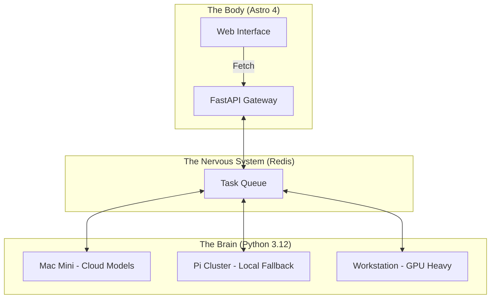

<TLDR>
  मोनोलिथ AI डेवलपर्स के लिए क़र्ज़ का जाल हैं। मैंने Gekro को असिंक्रोनस रीज़निंग के लिए Python-संचालित "ब्रेन" और उच्च-प्रदर्शन डिलीवरी के लिए Astro-आधारित "बॉडी" में बाँट दिया। यह लेख हार्डवेयर स्टैक को, Mac Mini से लेकर Pi क्लस्टर तक, और उन्हें जोड़ने वाले FastAPI तंत्रिका-तंत्र को खोलकर समझाता है।
</TLDR>

ज़्यादातर डेवलपर LLM को एक बढ़ा-चढ़ाकर बताई गई डेटाबेस क्वेरी की तरह देखते हैं: किसी एक Next.js या Node सर्वर के भीतर सँभाला जाने वाला सिंक्रोनस रिक्वेस्ट-रिस्पॉन्स चक्र। यह तब तक चलता है जब तक काम में सचमुच समय न लगे। जब आप जटिल एजेंटिक वर्कफ़्लो चला रहे हों जो "सोचने" में 30 सेकंड और वैलिडेट करने में 10 सेकंड और ले सकते हैं, तो आप अपना UI थ्रेड ब्लॉक नहीं कर सकते। मेरी लैब में मैंने **स्प्लिट-ब्रेन आर्किटेक्चर** अपनाया है। "ब्रेन" (बुद्धिमत्ता) वितरित हार्डवेयर क्लस्टर में फैले विशेष Python एनवायरनमेंट में रहता है, जबकि "बॉडी" (इंटरफ़ेस) एक छरहरी, चुस्त Astro मशीन है जो रफ़्तार और SEO को प्राथमिकता देती है।

## आर्किटेक्चर

मेरी लैब वितरित है। मैं अपना सारा कंप्यूट एक ही टोकरी में रखने में यक़ीन नहीं करता। किसी एक डिप्लॉयमेंट के ठप होने से लैब की बुद्धिमत्ता ऑफ़लाइन नहीं होनी चाहिए; आर्किटेक्चर को किसी भी अकेली विफलता से बच निकलना चाहिए।



| परत | तकनीक | मुख्य भूमिका |
| :--- | :--- | :--- |
| **बॉडी** | Astro + Tailwind v4 | UI डिलीवरी, SEO और स्थिर डॉक्यूमेंटेशन। |
| **ब्रेन** | Python + LangGraph | लंबे चलने वाले रीज़निंग चक्र और मॉडल ऑर्केस्ट्रेशन। |
| **तंत्रिका-तंत्र** | FastAPI + Redis | असिंक्रोनस स्टेट प्रबंधन और इवेंट रूटिंग। |
| **कंप्यूट** | Together AI / Ollama | इन्फ़रेंस इंजन (क्लाउड और लोकल)। |

## निर्माण

कार्यान्वयन की शुरुआत डिकपलिंग से होती है। "ब्रेन" को कभी CSS की परवाह नहीं होनी चाहिए, और "बॉडी" को कभी टेम्परेचर-सैंपलिंग या top-p मानों की।

### 1. ब्रेन: एक स्टेटलेस लॉजिक इंजन

मैं एजेंटों को सामने लाने के लिए FastAPI इस्तेमाल करता हूँ। इससे Astro की "बॉडी" बिना Python डिपेंडेंसी सँभाले विचार शुरू करवा सकती है।

```python
# brain/main.py
from fastapi import FastAPI, BackgroundTasks
from pydantic import BaseModel
import redis

app = FastAPI()
r = redis.Redis(host='localhost', port=6379, db=0)

class Task(BaseModel):
    instruction: str
    session_id: str

@app.post("/think")
async def run_thought_cycle(task: Task, background_tasks: BackgroundTasks):
    # Update Body that we are 'Thinking'
    r.set(f"status:{task.session_id}", "processing")
    
    # Run the expensive AI logic in the background
    background_tasks.add_task(expensive_reasoning, task.instruction, task.session_id)
    
    return {"status": "accepted", "session_id": task.session_id}

def expensive_reasoning(prompt, sid):
    from gekro_client import GekroLLMClient
    client = GekroLLMClient()
    result = client.chat([{"role": "user", "content": prompt}])
    r.set(f"status:{sid}", "completed")
    r.set(f"result:{sid}", result)
```

### 2. बॉडी: Astro रिक्वेस्ट पैटर्न

Astro में मैं SSR के दौरान शुरुआती स्टेट लाता हूँ, लेकिन अगर कोई विचार-चक्र चल रहा हो तो स्टेटस पोल करने के लिए एक छोटे "आइलैंड" (Preact या SolidJS) का इस्तेमाल करता हूँ। इससे पहला लोड तुरंत होता है।

```astro
---
// apps/web/src/pages/lab.astro
import LabStatus from '../components/LabStatus.tsx';

const initialStatus = await fetch('http://brain-gateway/status').then(res => res.json());
---

<Layout title="Lab Controls">
  <h1>System Orchestration</h1>
  <!-- The 'Island' that handles the live updates -->
  <LabStatus client:load initialData={initialStatus} />
</Layout>
```

### WSL2 नोट

Windows मशीन पर इन परतों को जोड़ते समय मैं Redis और FastAPI "ब्रेन" को WSL2 के भीतर चलाता हूँ, लेकिन "बॉडी" के लिए Windows-नेटिव Astro डेव सर्वर इस्तेमाल करता हूँ। इससे मैं UI के काम के लिए Windows के Chrome डीबगर का उपयोग कर पाता हूँ, जबकि Linux के लिए अनुकूलित भारी Python कोड अपने स्वाभाविक एनवायरनमेंट में चलता है।

## समझौते

सबसे बड़ी चुनौती कोड नहीं है; वह **स्टेट सिंक्रोनाइज़ेशन** है। अगर ब्रेन कोई काम पूरा कर ले लेकिन बॉडी अपडेट के लिए पोल न करे, तो उपयोगकर्ता को पुराना UI दिखता है। मैंने तीन हफ़्ते एक ऐसे बग का पीछा करते हुए बिताए जिसमें एजेंट 4k लॉग फ़ाइल का सारांश बना चुका था, लेकिन Redis की कुंजी ठीक से प्रोपेगेट नहीं हुई थी, जिससे ब्राउज़र में "अनंत सोच" के लूप बन रहे थे।

मैंने बँटवारा करने के लिए दो से तीन घंटे का बजट रखा था। उसमें पूरा एक दिन लग गया। लगभग सारी देरी ब्रेन और बॉडी के बीच की सीवन पर गई, जो तब तक झंझट वाली है जब तक सेटिंग्स ठीक न हों, फिर चुपचाप समस्या नहीं रहती। उसने मुझे लंबे समय से परेशान नहीं किया है। पहला हफ़्ता बस सीवन ही सीवन था।

वितरित सिस्टम की जटिलता अपने आप में एक तरह का क़र्ज़ है। अगर आप कोई साधारण ऐप बना रहे हैं, तो यह मत कीजिए। लेकिन अगर आप ऐसी लैब बना रहे हैं जिसे रात 2 बजे के क्लाउड ब्लैकआउट में भी टिकना है, तो आपको वह लचीलापन चाहिए जो सिर्फ़ स्प्लिट-ब्रेन आर्किटेक्चर देता है।

यह उतना बिना-दख़ल का भी नहीं है जितना डायग्राम सुझाता है। मैं अब भी ज़रूरत पड़ने पर अलग-अलग Pi में SSH करता हूँ, क्योंकि हर एक अपना प्रोजेक्ट चला रहा है और मुझे पता है कि कौन-सा कौन-सा है। यह डिज़ाइन की ख़ामी से ज़्यादा इस बात की स्वीकारोक्ति है कि तीन-नोड वाला क्लस्टर इतना छोटा है कि उसे दिमाग़ में रखा जा सकता है, और मुझे अब तक इससे अलग दिखावा करने की ज़रूरत नहीं पड़ी।

## आगे की राह

यह सेटअप **फ़िज़िकल फ़ीडबैक** की ओर बढ़ रहा है। मैं फ़िलहाल "ब्रेन" के आउटपुट को DFW के अपने दफ़्तर में लगी Hue लाइटों से जोड़ रहा हूँ। अगर लैब को किसी रिमोट सर्वर पर गंभीर विफलता दिखे, तो कमरा सचमुच लाल हो जाता है। आर्किटेक्चर उतना ही वह माहौल है जिसमें सॉफ़्टवेयर चलता है, जितना ख़ुद सॉफ़्टवेयर।
