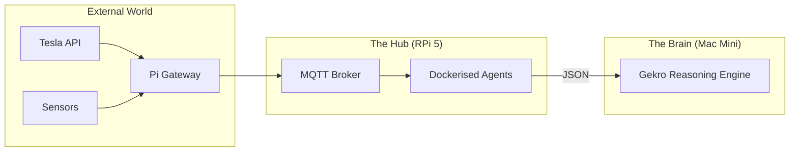

<TLDR>
  2,000 डॉलर के वर्कस्टेशन को cron जॉब्स और MQTT ब्रोकरिंग पर बर्बाद न करें। मैं NVMe SSD वाले Raspberry Pi 5 को "लैब असिस्टेंट" की तरह इस्तेमाल करता हूँ: एक हमेशा चालू नोड, जो दोहराए जाने वाले, कम कंप्यूट वाले उन कामों को संभालता है जिनसे लैब की धड़कन स्थिर रहती है। यह लेख हार्डवेयर सेटअप और Docker पर चलने वाले यूटिलिटी स्टैक को कवर करता है, जो मेरी भौतिक दुनिया (Tesla और घर) को मेरे AI एजेंटों से जोड़ता है।
</TLDR>

अरबों डॉलर के डेटा सेंटरों की इस दुनिया में, 80 डॉलर का यह कंप्यूटर मेरा सबसे भरोसेमंद कर्मचारी है। जब मैंने DFW में Gekro शुरू किया, तो मुझे समझ आया कि मुझे एक "Ground Truth" नोड चाहिए: ऐसा नोड जो तब भी चालू रहे जब मेरा मुख्य Mac Mini रीबूट हो रहा हो या मेरा वर्कस्टेशन किसी 3D रेंडर के नीचे दबा हो। Raspberry Pi वह लंगर है। यह भारी "सोच-विचार" का काम नहीं करता, लेकिन यह पक्का करता है कि ब्रेन को जिस डेटा की ज़रूरत है (जैसे मेरी Tesla की चार्जिंग स्थिति या ऑफ़िस का तापमान) वह हमेशा उपलब्ध और इंडेक्स किया हुआ रहे।

## आर्किटेक्चर

Pi **गेटवे लेयर** का काम करता है। यह IoT उपकरणों की अव्यवस्थित दुनिया और उच्च-प्रदर्शन वाली रीज़निंग लेयर के बीच बैठता है।



| घटक | हार्डवेयर / सॉफ़्टवेयर | भूमिका |
| :--- | :--- | :--- |
| **बोर्ड** | Raspberry Pi 5 (16GB) | उच्च-प्रदर्शन ARM कंप्यूट। |
| **स्टोरेज** | M.2 HAT + NVMe 256GB SSD | SD कार्ड के करप्ट होने से बचाता है और I/O तेज़ करता है। |
| **ब्रोकर** | Mosquitto (Docker) | लैब की सारी टेलीमेट्री का "डाकघर"। |
| **शेड्यूलर** | Cron / Supercronic | रात के रिसर्च और सफ़ाई वाले एजेंट चलाता है। |

## निर्माण

प्रोडक्शन Pi को "Immutability-First" होना चाहिए। मैं बेस OS पर Docker और Tailscale के अलावा कुछ भी इंस्टॉल नहीं करता।

### 1. NVMe का फ़ायदा

अगर आप वीकेंड प्रोजेक्ट के अलावा किसी भी काम के लिए अब भी SD कार्ड इस्तेमाल कर रहे हैं, तो आप रेत पर निर्माण कर रहे हैं। जब ढेर सारे लॉग लिखने वाले एक एजेंट ने हाई-एंड SD कार्ड को बर्बाद कर दिया, तो मेरा तीन हफ़्ते का डेटा चला गया। अब मैं NVMe SSD इस्तेमाल करता हूँ।

```bash
# Verify NVMe is detected and using Gen 3 speeds
lsblk
sudo lspci -vvv | grep LnkSta
```

### 2. Docker पर असिस्टेंट स्टैक

मैं असिस्टेंट नोड के लिए एक `docker-compose.yml` रखता हूँ, जो बूट होते ही अपने आप शुरू हो जाता है।

```yaml
services:
  mqtt:
    image: eclipse-mosquitto:latest
    ports:
      - "1883:1883"
    volumes:
      - ./mosquitto/config:/mosquitto/config

  tesla-telemetry:
    build: ./agents/tesla-bridge
    restart: always
    environment:
      - TESLA_VIN=${VIN}
      - MQTT_HOST=mqtt

  nightly-summarizer:
    image: python:3.12-slim
    volumes:
      - ./scripts:/app
    command: ["python", "/app/daily_digest.py"]
```

### 3. WSL2 नोट: रिमोट मैनेजमेंट

मैं Pi में कभी मॉनिटर नहीं लगाता। क्लस्टर के किसी भी नोड में तुरंत पहुँचने के लिए मैं अपने WSL2 एनवायरनमेंट में एक ख़ास Zsh फ़ंक्शन इस्तेमाल करता हूँ।

```bash
# Fast SSH to lab nodes
lab() {
  ssh rohit@192.168.1.$1
}
# Usage: lab 50 (connects to Pi at .50)
```

## समझौते

Pi की सबसे बड़ी कमज़ोरी **कंप्यूट सैचुरेशन** है। मैंने एक बार Pi पर चार और एजेंटों के साथ एक लोकल वेक्टर डेटाबेस (ChromaDB) चलाने की कोशिश की। I/O वेट टाइम बढ़ गया और मेरा MQTT ब्रिज मेरी Tesla के संदेश गिराने लगा। आपको "रिसोर्स स्कैवेंजर" बनना पड़ता है। मैंने सीखा है कि Pi को सख़्ती से **I/O-बाउंड कामों** (API से डेटा लाना, संदेश रूट करना) तक सीमित रखूँ और सारे **CPU/GPU-बाउंड काम** Mac Mini पर भेज दूँ।

साथ ही, **पावर मायने रखती है**। एक "स्टैंडर्ड" USB-C फ़ोन चार्जर Pi 5 को लोड में थ्रॉटल करवा देगा। टेक्सास की गर्मियों की लू के दौरान NVMe ड्राइव और ऐक्टिव कूलर को पूरी क्षमता पर चलाए रखने के लिए मुझे आधिकारिक 27W PD पावर सप्लाई पर जाना पड़ा।

## आगे की राह

मैं इस समय Pi के GPIO पिनों से एक **फ़िज़िकल किलस्विच** जोड़ रहा हूँ। अगर मुझे कोई एजेंट अजीब व्यवहार करता या API ख़र्च की सीमा छूता दिखे, तो मेरी डेस्क पर रखा एक असली बटन पूरे Docker स्टैक को SIGTERM भेज देगा। पूरी संप्रभुता का मतलब है प्लग पर अपना असली हाथ होना।
