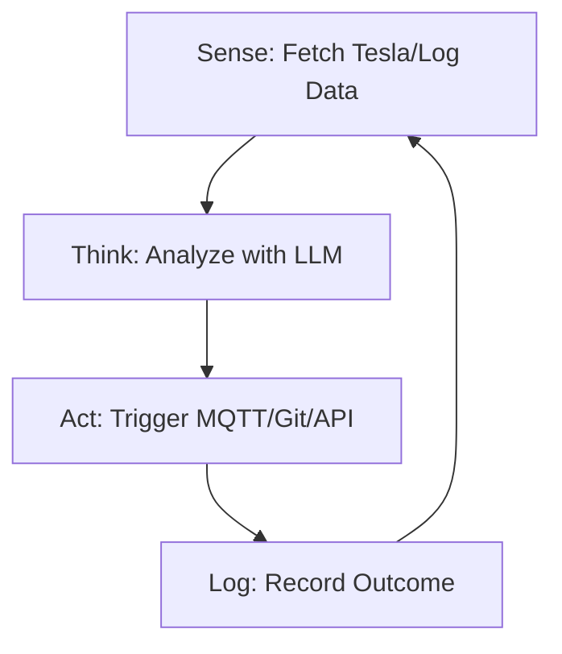

<TLDR>
  स्क्रिप्ट निर्देशों की सूची का पालन करती है; एजेंट एक लक्ष्य का। मैंने अपनी Tesla की बैटरी का स्तर देखने के लिए अपना पहला स्वायत्त लूप बनाया, जो बैटरी एक तय सीमा पर पहुँचते ही अपने आप "Deep Discharge" नोटिफ़िकेशन भेज देता है। यह लेख रेखीय कोड से Sense-Think-Act लूप की ओर आर्किटेक्चर के बदलाव को समझाता है, जो मेरे Pi क्लस्टर पर 24/7 चलता है।
</TLDR>

"कोड लिखने" से "बुद्धिमत्ता को निर्देशित करने" की ओर बदलाव एक ही पल में होता है। मेरे लिए वह डलास में एक मंगलवार की रात 11 बजे का पल था। मेरा एक एजेंट लूप में चल रहा था और मेरे सर्वर लॉग में 404 त्रुटियाँ देख रहा था। सिर्फ़ मुझे अलर्ट भेजने के बजाय, एजेंट ने खुद एक टूटा हुआ आंतरिक लिंक पहचाना, उसे ठीक करने के लिए एक `sed` कमांड बनाई और बदलाव को Git में कमिट कर दिया। यह पहली बार था जब मैंने ऐसे सिस्टम की अजीब-सी ताक़त महसूस की जो मेरे कीबोर्ड छुए बिना खुद को "बेहतर" बना सकता था। यही **Sense-Think-Act** लूप है, और यही Gekro Lab की बुनियादी इकाई है।

## आर्किटेक्चर

एजेंट कोई अकेला फ़ंक्शन नहीं है; वह एक **स्टेट मशीन** है। उसे पता होना चाहिए कि वह कहाँ है, क्या हासिल करना चाहता है और उसके पास कौन-से टूल हैं।



| चरण | ज़िम्मेदारी | टूलिंग |
| :--- | :--- | :--- |
| **Sense** | कच्ची टेलीमेट्री या फ़ाइल डेटा लेना। | `requests`, `tail`, `mqtt` |
| **Think** | लक्ष्य के मुक़ाबले डेटा पर तर्क करना। | Together AI / Ollama |
| **Act** | परिवेश में कोई बदलाव करना। | `subprocess`, `git`, `curl` |
| **State** | पिछले लूप में क्या हुआ, यह याद रखना। | SQLite / JSON फ़ाइल |

## निर्माण

अपना पहला एजेंट बनाने के लिए आपको अपनी LLM कॉल को एक लगातार चलने वाले `while` लूप में लपेटना होगा, जिसमें ऐसी एरर हैंडलिंग हो जो API का टाइमआउट होने पर बस क्रैश न हो जाए।

### 1. स्वायत्त लूप

यह "Guardian" एजेंट का एक सरल रूप है, जो मेरी लैब की सेहत पर नज़र रखता है।

```python
import time
import logging
from gekro_client import GekroLLMClient # From my API Sovereignty post

class BasicAgent:
    def __init__(self, goal: str):
        self.goal = goal
        self.client = GekroLLMClient()
        self.state = {"iterations": 0, "last_action": "none"}

    def run(self):
        while True:
            self.state["iterations"] += 1
            print(f"\n--- Cycle {self.state['iterations']} ---")
            
            # SENSE: Get system stats
            # In production, use psutil.cpu_percent(), MQTT subscriptions, or API calls.
            # This static string is for demonstration only.
            context = "System Load: 85%, Temperature: 78C, Network: Latent"
            
            # THINK: Ask the Brain what to do
            prompt = f"Goal: {self.goal}\nCurrent Context: {context}\nLast Action: {self.state['last_action']}\nWhat is the next step?"
            decision = self.client.chat([{"role": "user", "content": prompt}])
            
            # ACT: (For safety, we just log in this example)
            self.execute(decision)
            self.state["last_action"] = decision
            
            time.sleep(60) # Wait 60 seconds before next sense cycle

    def execute(self, action):
        logging.info(f"Agent decided to: {action}")
        # Real execution logic (e.g., shell commands) would go here

if __name__ == "__main__":
    agent = BasicAgent(goal="Keep the lab temperatures below 80C by throttling compute.")
    agent.run()
```

### 2. स्टेट को सहेजना

बिना याददाश्त वाला एजेंट बस एक स्क्रिप्ट है। लैब में मैं एजेंट के विचारों का "इतिहास" रखने के लिए एक साधारण JSON फ़ाइल इस्तेमाल करता हूँ, ताकि वह एक ही ग़लती लगातार पाँच बार न दोहराए।

### WSL2 नोट

WSL2 में स्वायत्त लूप चलाते समय **Tmux** इस्तेमाल करें। इससे आप सेशन को डिटैच करके एजेंट को बैकग्राउंड में चलता छोड़ सकते हैं, चाहे आप टर्मिनल बंद कर दें या आपकी Windows मशीन स्लीप में चली जाए (बशर्ते आपने Windows सेटिंग्स में "Sleep" बंद कर रखा हो)।

## समझौते

शुरुआती एजेंटों की सबसे बड़ी नाकामी **अनंत इन्फ़रेंस लूप** है। एक बार मैंने एक एजेंट को ऐसे लक्ष्य के साथ चलता छोड़ दिया जो ठीक से परिभाषित नहीं था: "डॉक्यूमेंटेशन की सारी वर्तनी की ग़लतियाँ ठीक करो।" क्योंकि "वर्तनी की ग़लती" व्यक्तिपरक है, एजेंट ने तीन घंटे में Together AI के 40 डॉलर के क्रेडिट फूँक दिए, अपने ही सुधारों को बार-बार "ठीक" करते हुए चक्कर में घूमता रहा। **हमेशा 'Max Iterations' की सीमा या बजट की ऊपरी हद लागू करें।**

एक और समस्या है **कमांड हैलुसिनेशन**। जब आप किसी एजेंट को शेल (`subprocess.run`) की पहुँच देते हैं, तो देर-सबेर वह ऐसी कमांड चलाने की कोशिश करेगा जो मौजूद ही नहीं है, या इससे भी बुरा, कोई विनाशकारी कमांड। मैंने यह तब सीखा जब एक एजेंट ने एक "अस्थायी" डायरेक्टरी पर `rm -rf` चलाने की कोशिश की, जिसमें असल में मेरी Tesla के API टोकन रखे थे। किसी भी नए एजेंट की तैनाती के पहले 48 घंटे "Dry Run" मोड इस्तेमाल करें।

## आगे की राह

हम सिंगल-लूप एजेंटों से हटकर **मल्टी-एजेंट सिस्टम** की ओर बढ़ रहे हैं। मैं फ़िलहाल एक "Manager" एजेंट बना रहा हूँ जो तीन "Worker" एजेंटों की निगरानी करता है (एक कोडिंग के लिए, एक रिसर्च के लिए और एक सुरक्षा के लिए)। लूप को मैं निर्देशित करूँ, इसके बजाय Manager वर्कर्स को निर्देशित करता है। लैब बुद्धिमत्ता की एक ख़ुद को बेहतर बनाने वाली फ़ैक्टरी बनती जा रही है, और "Sense-Think-Act" उसकी असेंबली लाइन है।
