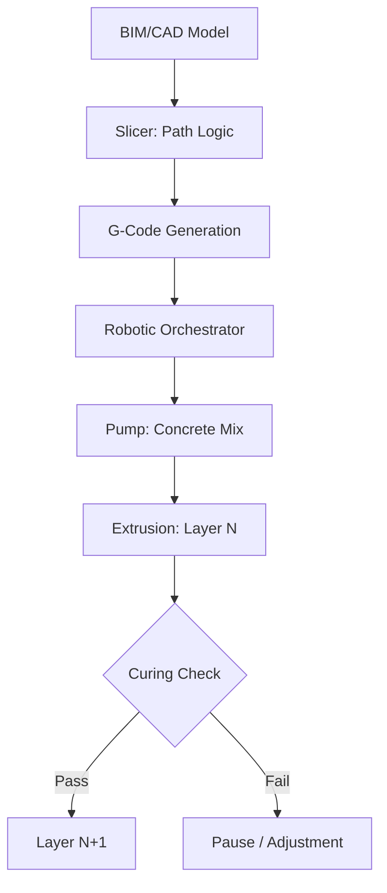

<TLDR>
  3D कन्स्ट्रक्शन प्रिंटिंगमध्ये वेग हा स्पष्ट फायदा आहे. अचूकता हा त्याहून मोठा फायदा आहे. सबट्रॅक्टिव्हकडून ॲडिटिव्ह मॅन्युफॅक्चरिंगकडे जाऊन आपण साहित्याची नासाडी 60% पर्यंत कमी करू शकतो आणि गुंतागुंतीच्या थर्मल भूमितीला थेट भिंतीच्या रचनेत सामावून घेऊ शकतो. ग्रीन इन्फ्रास्ट्रक्चरची व्याख्या हीच आहे: उच्च कार्यक्षमता, कमी नासाडी आणि लोकल-फर्स्ट.
</TLDR>

पहिल्यांदा जेव्हा मी गँट्री-प्रकारच्या 3D प्रिंटरला कार्बन-फायबरने मजबूत केलेल्या काँक्रीटची धार काढताना पाहिले, तेव्हा मला बांधकामाचा फक्त एक वेगवान मार्ग दिसला नाही. मला **मटेरियल सार्वभौमत्वाकडे** झालेला एक तांत्रिक बदल दिसला, ही कल्पना माझ्या अलीकडच्या संशोधनात वारंवार येत राहिली आहे.

पारंपरिक बांधकामाच्या जगात आपण अनेकदा लाकडाच्या वखारीच्या मापांनी आणि साच्याच्या मर्यादांनी बांधलेले असतो. नासाडी थक्क करणारी आहे; जागतिक सरासरी सांगते की बांधकामाच्या जागी पाठवलेल्या साहित्याचा मोठा हिस्सा शेवटी कचऱ्याच्या डब्यात जातो. सैद्धांतिकदृष्ट्या, इन्फ्रास्ट्रक्चरकडे सॉफ्टवेअरची समस्या म्हणून पाहणे, म्हणजे डिजिटल हेतूला प्रत्यक्ष वास्तवात रूपांतरित करणाऱ्या सूचनांचा संच, शून्य-नासाडीच्या अचूकतेकडे एक नवा मार्ग दाखवू शकते.

## पाया: शाई आणि लेखणी

मटेरियल सायन्समध्ये उतरण्यापूर्वी आपल्याला हार्डवेअर समजून घ्यावे लागेल. 3D कन्स्ट्रक्शन प्रिंटिंग साधारणपणे दोन गटांत मोडते: **गँट्री सिस्टीम** आणि **रोबोटिक आर्म**.

* **गँट्री सिस्टीम**: या मुळात तुमच्या डेस्कटॉप FDM प्रिंटरच्या महाकाय आवृत्त्या आहेत. कामाच्या जागेभोवती एक मोठी चौकट उभी केली जाते आणि नोझल X, Y व Z अक्षांवर फिरते. त्या अत्यंत स्थिर असतात आणि मोठ्या प्रमाणावर शहरातील संपूर्ण ब्लॉक छापू शकतात, पण त्यांना सेटअपसाठी बरीच जागा लागते.
* **रोबोटिक आर्म**: हे चपळ, मल्टी-ॲक्सिस औद्योगिक रोबोट आहेत (जसे ऑटोमोबाइल असेंब्लीमध्ये वापरतात), जे रुळांवर किंवा ट्रेलरवर बसवलेले असतात. गुंतागुंतीच्या भूमितीसाठी ते अधिक लवचिकता देतात आणि अरुंद जागेतही काम करू शकतात, तरीही प्रिंट दरम्यान संरचनात्मक स्थिरता राखण्यासाठी त्यांना बहुतेकदा अधिक प्रगत पाथिंग लॉजिक लागते.

"शाई" ही "लेखणी"इतकीच महत्त्वाची आहे. आपण फक्त साधे काँक्रीट वापरत नाही. आपण विशेष **सिमेंटिशियस कंपोझिट** वापरतो: असे मिश्रण जे नोझलमधून द्रवासारखे वाहते, पण वरच्या थरांचे वजन पेलण्यासाठी लगेच घट्ट होते. ही "स्टॅकेबिलिटी" हेच कोणत्याही 3D बांधकामातील खरे इंजिनिअरिंग आव्हान आहे.

## का: साहित्याचे ऑप्टिमायझेशन

पारंपरिक बांधकामात प्रत्येक वक्र हा खर्चाचे केंद्र आहे. साचे महाग आहेत, नासाडी अटळ आहे आणि श्रम पुनरावृत्तीचे आहेत. ॲडिटिव्ह मॅन्युफॅक्चरिंग हे उलटे करते. 3D प्रिंटरसाठी पॅरामेट्रिक पद्धतीने ऑप्टिमाइझ केलेल्या गुंतागुंतीच्या वक्राचा खर्च सरळ रेषेइतकाच असतो.

यामुळे आपल्याला **टोपोलॉजी ऑप्टिमायझेशन** वापरता येते. आपण आतून पोकळ गाभा असलेल्या भिंती छापू शकतो, ज्या नैसर्गिक इन्सुलेशनचे काम करतात किंवा वायरिंग आणि प्लंबिंगसाठी सर्व्हिस चॅनेल बनतात, आणि हे सर्व एक्सट्रूजनच्या वेळीच थेट तयार होते. त्याहून महत्त्वाचे म्हणजे, हे **ग्रीन जिओपॉलिमर** वापरणे शक्य करते. पारंपरिक पोर्टलँड सिमेंटऐवजी फ्लाय ॲश किंवा स्लॅगसारखी औद्योगिक उप-उत्पादने बाइंडर म्हणून वापरून आपण छप्पर बसण्यापूर्वीच इमारतीच्या "शरीराचा" कार्बन फूटप्रिंट मोठ्या प्रमाणात कमी करू शकतो.

## कसे: स्लायसिंगपासून एक्सट्रूजनपर्यंत

"ब्रेन" (डिजिटल डिझाइन) आणि "बॉडी" (प्रत्यक्ष रचना) यांना जोडण्याचे काम एका अंदाज बांधता येणाऱ्या, पण कठोर पाइपलाइनने होते. हे मटेरियल सायन्स आणि रोबोटिक्सचे मोठ्या जोखमीचे समन्वयन आहे.

## कंत्राटदाराची नवी भूमिका

हे तंत्रज्ञान कंत्राटदाराला हटवत नाही, उलट वर उचलते. "भविष्यातील कंत्राटदार" हा हाताने काम करणारा कामगार कमी आणि **सिस्टीम ऑर्केस्ट्रेटर** जास्त आहे.

1. **मटेरियल सायंटिस्ट**: त्यांना मिश्रणाची रिऑलॉजी समजून घ्यावी लागते, म्हणजे मंगळवारी आणि गुरुवारी तापमान व आर्द्रता प्रवाहावर कसा परिणाम करतात.
2. **रोबोटिक पायलट**: ते बांधकामाचा डिजिटल ट्विन सांभाळतात, विचलनासाठी सेन्सरवर लक्ष ठेवतात आणि रिअल-टाइममध्ये पाथिंग समायोजित करतात.
3. **इन्फ्रास्ट्रक्चर आर्किटेक्ट**: ते छापलेल्या चॅनेलमध्ये MEP (मेकॅनिकल, इलेक्ट्रिकल, प्लंबिंग) समाकलित करण्यावर लक्ष केंद्रित करतात, ज्यामुळे तोडफोड करणारे ड्रिलिंग आणि "नंतर" करावे लागणारे बदल कमी होतात.

## पुढे काय / मी काय शिकलो

3D बांधकामावरील हे संशोधन एका मूलभूत बदलाकडे लक्ष वेधते: **इन्फ्रास्ट्रक्चर सॉफ्टवेअर बनत आहे**. भिंतीचे थर्मल मास किंवा एखाद्या कोपऱ्याची संरचनात्मक घनता जेव्हा तुम्ही प्रोग्राम करू शकता, तेव्हा स्थानिक हार्डवेअर दुकानातील "मानक एककांनी" तुम्ही मर्यादित राहत नाही.

Gekro Lab सध्या भिंती छापत नसले, तरी **ग्रीन इन्फ्रास्ट्रक्चरची** तत्त्वे, म्हणजे भूतकाळातील रेटून काम करण्याच्या पद्धतींपेक्षा साहित्याच्या अचूक वापराला प्राधान्य देणे, डिजिटल बुद्धिमत्ता आणि आपले प्रत्यक्ष परिसर यांच्यातील दरी आपण अखेर कशी भरू शकतो याचा रोडमॅप देतात.
