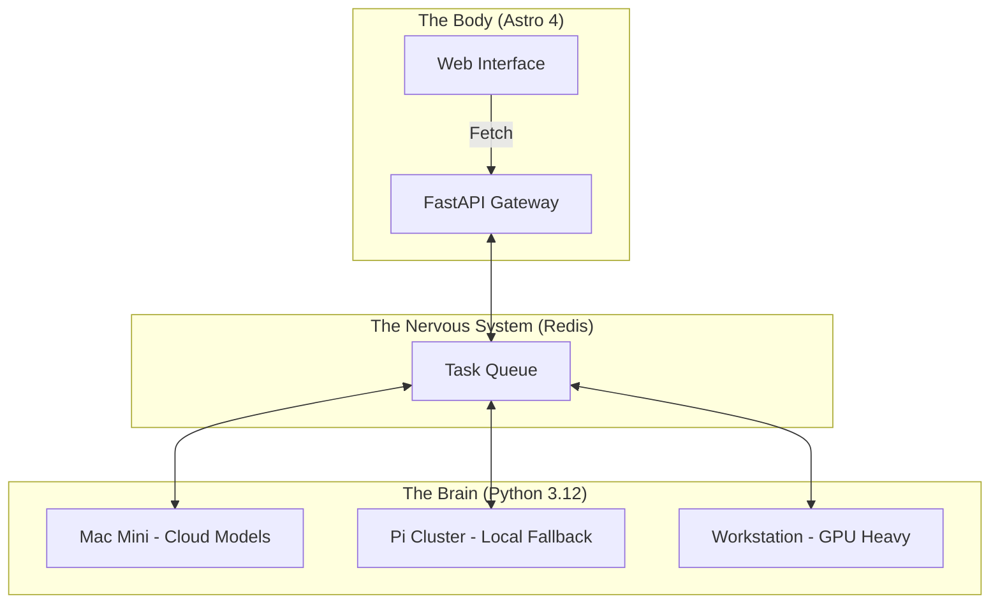

<TLDR>
  मोनोलिथ हे AI डेव्हलपर्ससाठी कर्जाचा सापळा आहेत. मी Gekro ला असिंक्रोनस रीझनिंगसाठी Python-चालित "ब्रेन" आणि उच्च-कार्यक्षम डिलिव्हरीसाठी Astro-आधारित "बॉडी" मध्ये विभागले. हा लेख हार्डवेअर स्टॅक, Mac Mini पासून Pi क्लस्टरपर्यंत, आणि त्यांना जोडणारी FastAPI मज्जासंस्था उलगडतो.
</TLDR>

बहुतेक डेव्हलपर LLM ला फुगवलेल्या डेटाबेस क्वेरीसारखे मानतात: एकाच Next.js किंवा Node सर्व्हरमध्ये हाताळले जाणारे सिंक्रोनस रिक्वेस्ट-रिस्पॉन्स चक्र. कामाला खरोखर वेळ लागेपर्यंतच हे टिकते. जेव्हा तुम्ही क्लिष्ट एजंटिक वर्कफ्लो चालवता, ज्यांना "विचार" करायला 30 सेकंद आणि पडताळणीला आणखी 10 सेकंद लागू शकतात, तेव्हा तुम्ही तुमचा UI थ्रेड ब्लॉक करू शकत नाही. माझ्या लॅबमध्ये मी **स्प्लिट-ब्रेन आर्किटेक्चर** स्वीकारले आहे. "ब्रेन" (बुद्धिमत्ता) वितरित हार्डवेअर क्लस्टरमध्ये पसरलेल्या विशेष Python वातावरणात राहते, तर "बॉडी" (इंटरफेस) ही एक सडपातळ, चपळ Astro मशीन आहे जी वेग आणि SEO ला प्राधान्य देते.

## आर्किटेक्चर

माझी लॅब वितरित आहे. मी सगळे कंप्यूट एकाच टोपलीत ठेवण्यावर विश्वास ठेवत नाही. एखादे डिप्लॉयमेंट कोसळल्याने लॅबची बुद्धिमत्ता ऑफलाइन जाऊ नये; आर्किटेक्चरने कोणत्याही एकट्या बिघाडातून तगून राहिले पाहिजे.



| स्तर | तंत्रज्ञान | प्राथमिक भूमिका |
| :--- | :--- | :--- |
| **बॉडी** | Astro + Tailwind v4 | UI डिलिव्हरी, SEO आणि स्थिर डॉक्युमेंटेशन. |
| **ब्रेन** | Python + LangGraph | दीर्घकाळ चालणारी रीझनिंग चक्रे आणि मॉडेल ऑर्केस्ट्रेशन. |
| **मज्जासंस्था** | FastAPI + Redis | असिंक्रोनस स्टेट व्यवस्थापन आणि इव्हेंट रूटिंग. |
| **कंप्यूट** | Together AI / Ollama | इन्फरन्स इंजिन (क्लाउड आणि लोकल). |

## बांधणी

अंमलबजावणीची सुरुवात डिकपलिंगने होते. "ब्रेन" ला कधीही CSS ची पर्वा नसावी, आणि "बॉडी" ला कधीही टेम्परेचर-सॅम्पलिंग किंवा top-p मूल्यांची.

### 1. ब्रेन: एक स्टेटलेस लॉजिक इंजिन

एजंट्सना उघड करण्यासाठी मी FastAPI वापरतो. यामुळे Astro ची "बॉडी" खालच्या Python डिपेंडन्सी न सांभाळता विचार सुरू करू शकते.

```python
# brain/main.py
from fastapi import FastAPI, BackgroundTasks
from pydantic import BaseModel
import redis

app = FastAPI()
r = redis.Redis(host='localhost', port=6379, db=0)

class Task(BaseModel):
    instruction: str
    session_id: str

@app.post("/think")
async def run_thought_cycle(task: Task, background_tasks: BackgroundTasks):
    # Update Body that we are 'Thinking'
    r.set(f"status:{task.session_id}", "processing")
    
    # Run the expensive AI logic in the background
    background_tasks.add_task(expensive_reasoning, task.instruction, task.session_id)
    
    return {"status": "accepted", "session_id": task.session_id}

def expensive_reasoning(prompt, sid):
    from gekro_client import GekroLLMClient
    client = GekroLLMClient()
    result = client.chat([{"role": "user", "content": prompt}])
    r.set(f"status:{sid}", "completed")
    r.set(f"result:{sid}", result)
```

### 2. बॉडी: Astro रिक्वेस्ट पॅटर्न

Astro मध्ये मी SSR दरम्यान सुरुवातीची स्टेट आणतो, पण एखादे विचार-चक्र सक्रिय असल्यास स्टेटस पोल करण्यासाठी एक लहान "आयलंड" (Preact किंवा SolidJS) वापरतो. यामुळे पहिला लोड तात्काळ राहतो.

```astro
---
// apps/web/src/pages/lab.astro
import LabStatus from '../components/LabStatus.tsx';

const initialStatus = await fetch('http://brain-gateway/status').then(res => res.json());
---

<Layout title="Lab Controls">
  <h1>System Orchestration</h1>
  <!-- The 'Island' that handles the live updates -->
  <LabStatus client:load initialData={initialStatus} />
</Layout>
```

### WSL2 टीप

Windows मशीनवर हे स्तर जोडताना मी Redis आणि FastAPI "ब्रेन" WSL2 च्या आत चालवतो, पण "बॉडी" साठी Windows-नेटिव्ह Astro डेव्ह सर्व्हर वापरतो. यामुळे मला UI कामासाठी Windows चा Chrome डीबगर वापरता येतो, आणि Linux साठी ऑप्टिमाइझ केलेला जड Python कोड त्याच्या नैसर्गिक वातावरणात चालतो.

## तडजोडी

सर्वात मोठे आव्हान कोड नाही; ते **स्टेट सिंक्रोनायझेशन** आहे. ब्रेनने एखादे काम पूर्ण केले पण बॉडीने अपडेटसाठी पोल केले नाही, तर वापरकर्त्याला जुना UI दिसतो. मी तीन आठवडे एका बगच्या मागे लागलो, ज्यात एका एजंटने 4k लॉग फाइलचा सारांश पूर्ण केला होता पण Redis की नीट प्रोपेगेट झाली नव्हती, ज्यामुळे ब्राउझरमध्ये "अनंत विचारांचे" लूप तयार होत होते.

विभागणी करण्यासाठी मी दोन ते तीन तासांचे बजेट ठेवले होते. त्याला पूर्ण एक दिवस लागला. जवळजवळ सगळा जादाचा वेळ ब्रेन आणि बॉडी यांच्यातील शिवणीवर गेला, जी सेटिंग्ज नीट होईपर्यंत किचकट असते आणि मग शांतपणे समस्या राहत नाही. तिने मला बऱ्याच काळापासून त्रास दिलेला नाही. पहिला आठवडा फक्त शिवणच शिवण होती.

वितरित सिस्टीमची गुंतागुंत हा स्वतःच एक प्रकारचा कर्जाचा प्रकार आहे. तुम्ही साधे ॲप बनवत असाल तर हे करू नका. पण रात्री 2 वाजताच्या क्लाउड ब्लॅकआउटमध्ये टिकून राहायची गरज असलेली लॅब बनवत असाल, तर तुम्हाला ती लवचिकता हवी जी फक्त स्प्लिट-ब्रेन आर्किटेक्चर देते.

आकृती सुचवते तितके हे हात-मोकळे नाही. गरज पडल्यास मी अजूनही वैयक्तिक Pi मध्ये SSH करतो, कारण प्रत्येक जण स्वतःचा प्रोजेक्ट चालवतो आणि कोणता कोणता हे मला माहीत आहे. हे डिझाइनमधील दोषापेक्षा हे मान्य करणे आहे की तीन-नोडचा क्लस्टर डोक्यात ठेवता येईल इतका लहान आहे, आणि मला अजून वेगळे सोंग घ्यावे लागलेले नाही.

## पुढे काय

हा सेटअप **फिजिकल फीडबॅक** कडे जात आहे. मी सध्या "ब्रेन" चे आउटपुट DFW मधील माझ्या ऑफिसातील Hue दिव्यांच्या संचाशी जोडत आहे. लॅबला एखाद्या रिमोट सर्व्हरवर गंभीर बिघाड आढळला, तर खोली अक्षरशः लाल होते. आर्किटेक्चर हे सॉफ्टवेअर जितके आहे तितकेच ते ज्या वातावरणात सॉफ्टवेअर चालते तेही आहे.
