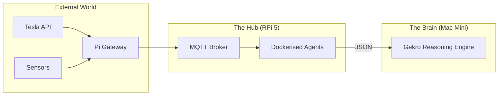

<TLDR>
  2,000 डॉलरचे वर्कस्टेशन cron जॉब्स आणि MQTT ब्रोकरिंगवर वाया घालवू नका. मी NVMe SSD असलेला Raspberry Pi 5 "लॅब असिस्टंट" म्हणून वापरतो: एक नेहमी चालू असणारा नोड, जो पुन्हा पुन्हा करावी लागणारी, कमी प्रोसेसिंग क्षमता लागणारी कामे सांभाळतो आणि त्यामुळे लॅबची धडधड स्थिर राहते. हा लेख हार्डवेअर सेटअप आणि Docker वर चालणारा युटिलिटी स्टॅक सांगतो, जो माझे भौतिक जग (Tesla आणि घर) माझ्या AI एजंट्सशी जोडतो.
</TLDR>

अब्जावधी डॉलरच्या डेटा सेंटर्सच्या या जगात, 80 डॉलरचा हा कॉम्प्युटर माझा सर्वात विश्वासार्ह कर्मचारी आहे. DFW मध्ये Gekro सुरू केले तेव्हा मला जाणवले की मला एक "Ground Truth" नोड हवा आहे: असा नोड जो माझा मुख्य Mac Mini रीबूट होत असतानाही किंवा माझे वर्कस्टेशन एखाद्या 3D रेंडरखाली दबलेले असतानाही चालू राहील. Raspberry Pi हा तो नांगर आहे. तो जड "विचार" करत नाही, पण ब्रेनला आवश्यक असलेला डेटा (जसे की माझ्या Tesla ची चार्जिंग स्थिती किंवा ऑफिसचे तापमान) नेहमी उपलब्ध आणि इंडेक्स केलेला असेल याची खात्री करतो.

## आर्किटेक्चर

Pi **गेटवे लेयर** म्हणून काम करतो. तो IoT उपकरणांच्या गोंधळलेल्या जगात आणि उच्च-कार्यक्षम रीझनिंग लेयरमध्ये बसतो.



| घटक | हार्डवेअर / सॉफ्टवेअर | भूमिका |
| :--- | :--- | :--- |
| **बोर्ड** | Raspberry Pi 5 (16GB) | उच्च-कार्यक्षम ARM प्रोसेसिंग. |
| **स्टोरेज** | M.2 HAT + NVMe 256GB SSD | SD कार्ड खराब होण्यापासून वाचवतो आणि I/O वेगवान करतो. |
| **ब्रोकर** | Mosquitto (Docker) | लॅबच्या सर्व टेलिमेट्रीचे "पोस्ट ऑफिस". |
| **शेड्युलर** | Cron / Supercronic | रात्रीचे संशोधन आणि साफसफाईचे एजंट चालवतो. |

## बांधणी

प्रोडक्शन Pi "Immutability-First" असायला हवा. बेस OS वर मी Docker आणि Tailscale शिवाय काहीही इन्स्टॉल करत नाही.

### 1. NVMe चा फायदा

वीकेंड प्रकल्पाशिवाय इतर कोणत्याही कामासाठी तुम्ही अजूनही SD कार्ड वापरत असाल, तर तुम्ही वाळूवर बांधकाम करत आहात. भरपूर लॉग लिहिणाऱ्या एका एजंटने उच्च दर्जाचे SD कार्ड खराब केल्यावर माझा तीन आठवड्यांचा डेटा गेला. आता मी NVMe SSD वापरतो.

```bash
# Verify NVMe is detected and using Gen 3 speeds
lsblk
sudo lspci -vvv | grep LnkSta
```

### 2. Docker वरील असिस्टंट स्टॅक

असिस्टंट नोडसाठी मी एक `docker-compose.yml` ठेवतो, जो बूट होताच आपोआप सुरू होतो.

```yaml
services:
  mqtt:
    image: eclipse-mosquitto:latest
    ports:
      - "1883:1883"
    volumes:
      - ./mosquitto/config:/mosquitto/config

  tesla-telemetry:
    build: ./agents/tesla-bridge
    restart: always
    environment:
      - TESLA_VIN=${VIN}
      - MQTT_HOST=mqtt

  nightly-summarizer:
    image: python:3.12-slim
    volumes:
      - ./scripts:/app
    command: ["python", "/app/daily_digest.py"]
```

### 3. WSL2 टीप: रिमोट व्यवस्थापन

मी Pi ला कधीच मॉनिटर जोडत नाही. क्लस्टरमधील कोणत्याही नोडवर लगेच पोहोचण्यासाठी मी माझ्या WSL2 वातावरणात एक खास Zsh फंक्शन वापरतो.

```bash
# Fast SSH to lab nodes
lab() {
  ssh rohit@192.168.1.$1
}
# Usage: lab 50 (connects to Pi at .50)
```

## तडजोडी

Pi ची सर्वात मोठी कमकुवत बाजू म्हणजे **कॉम्प्युट सॅच्युरेशन**. मी एकदा Pi वर आणखी चार एजंट्ससोबत एक लोकल व्हेक्टर डेटाबेस (ChromaDB) चालवण्याचा प्रयत्न केला. I/O वेट टाइम वाढला आणि माझा MQTT ब्रिज माझ्या Tesla चे संदेश गमावू लागला. तुम्हाला "रिसोर्स स्कॅव्हेंजर" व्हावे लागते. मी शिकलो आहे की Pi ला काटेकोरपणे **I/O-बाउंड कामांपुरते** (API वरून डेटा आणणे, संदेश रूट करणे) मर्यादित ठेवायचे आणि सर्व **CPU/GPU-बाउंड कामे** Mac Mini वर पाठवायची.

तसेच, **वीजपुरवठा महत्त्वाचा आहे**. "सामान्य" USB-C फोन चार्जरमुळे Pi 5 लोडखाली थ्रॉटल होईल. टेक्सासच्या उन्हाळ्यातील उष्णतेच्या लाटांमध्ये NVMe ड्राइव्ह आणि ऍक्टिव्ह कूलर पूर्ण क्षमतेने चालू ठेवण्यासाठी मला अधिकृत 27W PD पॉवर सप्लायवर जावे लागले.

## पुढे काय

मी सध्या Pi च्या GPIO पिनांना एक **फिजिकल किलस्विच** जोडत आहे. एखादा एजंट विचित्र वागताना किंवा API खर्चाच्या मर्यादेला पोहोचताना दिसला, तर माझ्या डेस्कवरचे एक खरेखुरे बटण संपूर्ण Docker स्टॅकला SIGTERM पाठवेल. संपूर्ण सार्वभौमत्व म्हणजे प्लगवर स्वतःचा प्रत्यक्ष हात असणे.
