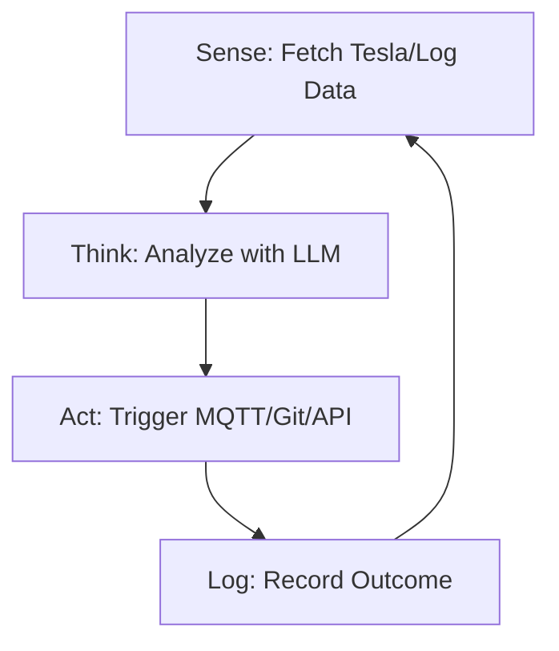

<TLDR>
  स्क्रिप्ट सूचनांच्या यादीचे पालन करते; एजंट एका ध्येयाचे. मी माझ्या Tesla च्या बॅटरीची पातळी पाहण्यासाठी माझा पहिला स्वायत्त लूप बनवला, जो बॅटरी ठराविक मर्यादेवर पोहोचताच आपोआप "Deep Discharge" नोटिफिकेशन पाठवतो. हा लेख रेषीय कोडकडून Sense-Think-Act लूपकडे झालेला आर्किटेक्चरमधला बदल सांगतो, जो माझ्या Pi क्लस्टरवर 24/7 चालतो.
</TLDR>

"कोड लिहिणे" ते "बुद्धिमत्तेला दिशा देणे" हे स्थित्यंतर एकाच क्षणात घडते. माझ्यासाठी तो क्षण डलासमधल्या एका मंगळवारी रात्री 11 वाजताचा होता. माझा एक एजंट लूपमध्ये चालू होता आणि माझ्या सर्व्हर लॉगमध्ये 404 एरर शोधत होता. मला फक्त अलर्ट देण्याऐवजी एजंटने स्वतःहून एक तुटलेली अंतर्गत लिंक ओळखली, ती दुरुस्त करण्यासाठी एक `sed` कमांड तयार केली आणि बदल Git मध्ये कमिट केला. मी कीबोर्डला हात न लावता स्वतःला "सुधारू" शकणाऱ्या सिस्टीमची विचित्र ताकद मला पहिल्यांदा जाणवली. हाच **Sense-Think-Act** लूप आहे आणि तोच Gekro Lab चा मूलभूत अणू आहे.

## आर्किटेक्चर

एजंट म्हणजे एखादे एकटे फंक्शन नाही; तो एक **स्टेट मशीन** आहे. तो कुठे आहे, त्याला काय साध्य करायचे आहे आणि त्याच्याकडे कोणती साधने आहेत हे त्याला माहीत असावे लागते.



| टप्पा | जबाबदारी | टूलिंग |
| :--- | :--- | :--- |
| **Sense** | कच्ची टेलिमेट्री किंवा फाइल डेटा घेणे. | `requests`, `tail`, `mqtt` |
| **Think** | ध्येयाच्या तुलनेत डेटावर तर्क करणे. | Together AI / Ollama |
| **Act** | वातावरणात बदल घडवणे. | `subprocess`, `git`, `curl` |
| **State** | मागच्या लूपमध्ये काय झाले ते लक्षात ठेवणे. | SQLite / JSON फाइल |

## बांधणी

तुमचा पहिला एजंट बनवण्यासाठी LLM कॉलला एका सतत चालणाऱ्या `while` लूपमध्ये गुंडाळावे लागते, आणि त्यात असे एरर हँडलिंग हवे जे API टाइमआउट झाल्यावर नुसते क्रॅश होणार नाही.

### 1. स्वायत्त लूप

ही "Guardian" एजंटची एक सोपी आवृत्ती आहे, जो माझ्या लॅबच्या आरोग्यावर लक्ष ठेवतो.

```python
import time
import logging
from gekro_client import GekroLLMClient # From my API Sovereignty post

class BasicAgent:
    def __init__(self, goal: str):
        self.goal = goal
        self.client = GekroLLMClient()
        self.state = {"iterations": 0, "last_action": "none"}

    def run(self):
        while True:
            self.state["iterations"] += 1
            print(f"\n--- Cycle {self.state['iterations']} ---")
            
            # SENSE: Get system stats
            # In production, use psutil.cpu_percent(), MQTT subscriptions, or API calls.
            # This static string is for demonstration only.
            context = "System Load: 85%, Temperature: 78C, Network: Latent"
            
            # THINK: Ask the Brain what to do
            prompt = f"Goal: {self.goal}\nCurrent Context: {context}\nLast Action: {self.state['last_action']}\nWhat is the next step?"
            decision = self.client.chat([{"role": "user", "content": prompt}])
            
            # ACT: (For safety, we just log in this example)
            self.execute(decision)
            self.state["last_action"] = decision
            
            time.sleep(60) # Wait 60 seconds before next sense cycle

    def execute(self, action):
        logging.info(f"Agent decided to: {action}")
        # Real execution logic (e.g., shell commands) would go here

if __name__ == "__main__":
    agent = BasicAgent(goal="Keep the lab temperatures below 80C by throttling compute.")
    agent.run()
```

### 2. स्टेट जतन करणे

स्मरणशक्ती नसलेला एजंट म्हणजे नुसती स्क्रिप्ट. लॅबमध्ये मी एजंटच्या विचारांचा "इतिहास" ठेवण्यासाठी एक साधी JSON फाइल वापरतो, म्हणजे तो तीच चूक सलग पाच वेळा करत नाही.

### WSL2 टीप

WSL2 मध्ये स्वायत्त लूप चालवताना **Tmux** वापरा. त्यामुळे तुम्ही सेशन डिटॅच करून एजंटला बॅकग्राउंडमध्ये चालू ठेवू शकता, टर्मिनल बंद केले किंवा तुमचे Windows मशीन स्लीपमध्ये गेले तरी (तुम्ही Windows सेटिंग्जमध्ये "Sleep" बंद केले आहे असे गृहीत धरून).

## तडजोडी

सुरुवातीच्या एजंट्सचे सर्वात मोठे अपयश म्हणजे **अनंत इन्फरन्स लूप**. एकदा मी एका एजंटला नीट न मांडलेल्या ध्येयासह चालू ठेवले: "डॉक्युमेंटेशनमधील सर्व टायपो दुरुस्त कर." "टायपो" ही व्यक्तिसापेक्ष गोष्ट असल्याने, एजंटने स्वतःच्याच दुरुस्त्या वारंवार "दुरुस्त" करत वर्तुळात फिरत तीन तासांत Together AI चे 40 डॉलरचे क्रेडिट खर्च केले. **नेहमी 'Max Iterations' ची मर्यादा किंवा बजेटची कमाल मर्यादा ठेवा.**

आणखी एक समस्या म्हणजे **कमांड हॅल्युसिनेशन**. एजंटला शेलचा (`subprocess.run`) प्रवेश दिला की तो कधी ना कधी अस्तित्वातच नसलेली कमांड चालवायचा प्रयत्न करतो, किंवा त्याहून वाईट म्हणजे विध्वंसक कमांड. मला हे तेव्हा कळले जेव्हा एका एजंटने "तात्पुरत्या" डिरेक्टरीवर `rm -rf` चालवायचा प्रयत्न केला, जिथे प्रत्यक्षात माझ्या Tesla चे API टोकन होते. कोणत्याही नवीन एजंटच्या तैनातीतील पहिले 48 तास "Dry Run" मोड वापरा.

## पुढे काय

आपण एकल-लूप एजंट्सपासून **मल्टी-एजंट सिस्टीम्सकडे** वळत आहोत. मी सध्या एक "Manager" एजंट बनवत आहे, जो तीन "Worker" एजंट्सवर देखरेख करतो (एक कोडिंगसाठी, एक संशोधनासाठी, एक सुरक्षेसाठी). मी लूपला दिशा देण्याऐवजी Manager वर्कर्सना दिशा देतो. लॅब बुद्धिमत्तेचा स्वतःला सुधारणारा कारखाना बनत आहे, आणि "Sense-Think-Act" ही त्याची असेंब्ली लाइन आहे.
