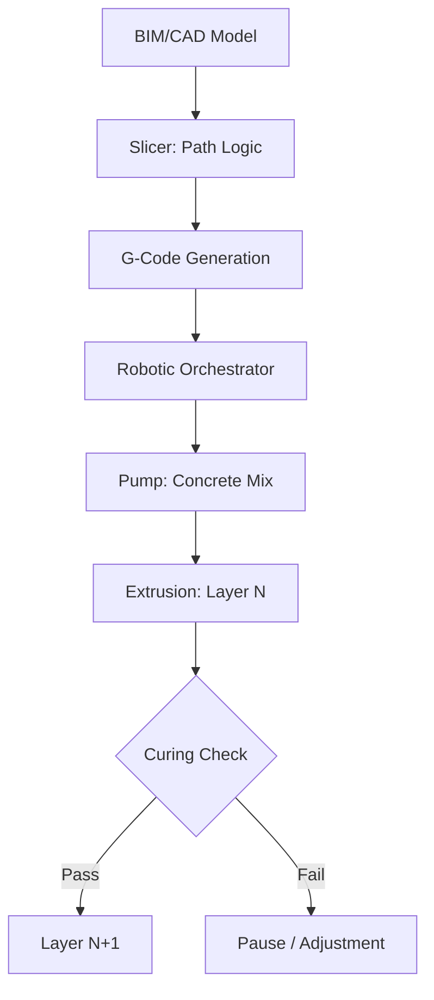

<TLDR>
  3D கட்டுமான அச்சிடலில் வேகம்தான் வெளிப்படையான வெற்றி. துல்லியம் அதைவிடப் பெரியது. கழித்தல் உற்பத்தியிலிருந்து சேர்ப்பு உற்பத்திக்கு மாறுவதால் பொருள் வீணாவதை 60% வரை குறைக்கலாம், சிக்கலான வெப்ப வடிவவியல்களை நேரடியாகச் சுவர் அமைப்புக்குள்ளேயே இணைக்கலாம். பசுமை உள்கட்டமைப்பின் வரையறை இதுதான்: உயர் செயல்திறன், குறைந்த வீணாக்கம், லோக்கல்-ஃபர்ஸ்ட்.
</TLDR>

கார்பன் இழையால் வலுப்படுத்தப்பட்ட கான்கிரீட் இழையை கேன்ட்ரி வகை 3D அச்சுப்பொறி வெளியேற்றுவதை முதன்முறை பார்த்தபோது, கட்டுவதற்கான ஒரு வேகமான வழியை மட்டும் நான் பார்க்கவில்லை. **பொருள் இறையாண்மையை** நோக்கிய ஒரு தொழில்நுட்பத் திருப்பத்தைப் பார்த்தேன்; இந்தக் கருத்து என் சமீபத்திய ஆய்வில் மீண்டும் மீண்டும் வந்துகொண்டிருக்கிறது.

பாரம்பரியக் கட்டுமான உலகில் மரக்கிடங்கின் அளவுகளாலும் அச்சின் வரம்புகளாலும் நாம் அடிக்கடி கட்டுப்பட்டிருக்கிறோம். வீணாவது திகைக்க வைக்கிறது; உலகளாவிய சராசரிகளின்படி கட்டுமான இடத்துக்கு அனுப்பப்படும் பொருட்களில் மிகப்பெரிய விகிதம் குப்பைத் தொட்டிக்கே போகிறது. கோட்பாட்டளவில், உள்கட்டமைப்பை மென்பொருள் சிக்கலாகப் பார்ப்பது, அதாவது டிஜிட்டல் நோக்கத்தைப் பௌதீக யதார்த்தமாக மொழிபெயர்க்கும் வழிமுறைகளின் தொகுப்பாகக் காண்பது, பூஜ்ஜிய-வீணாக்கத் துல்லியத்தை நோக்கிய புதிய பாதையைத் தரக்கூடும்.

## அடித்தளம்: மையும் பேனாவும்

பொருள் அறிவியலுக்குள் செல்லும் முன் வன்பொருளைப் புரிந்துகொள்ள வேண்டும். 3D கட்டுமான அச்சிடல் பொதுவாக இரண்டு முகாம்களாகப் பிரிகிறது: **கேன்ட்ரி அமைப்புகள்** மற்றும் **ரோபோ கரங்கள்**.

* **கேன்ட்ரி அமைப்புகள்**: இவை அடிப்படையில் உங்கள் மேசையில் வைக்கும் FDM அச்சுப்பொறியின் பிரம்மாண்ட வடிவங்கள். பணியிடத்தைச் சுற்றி ஒரு பெரிய சட்டகம் அமைக்கப்பட்டு, முனை X, Y, Z அச்சுகளில் நகரும். இவை மிகவும் நிலையானவை, பெரிய அளவில் நகரத் தொகுதிகளையே அச்சிட முடியும், ஆனால் இவற்றை நிறுவ நிறைய இடம் தேவை.
* **ரோபோ கரங்கள்**: இவை சுறுசுறுப்பான, பல-அச்சு தொழிற்சாலை ரோபோக்கள் (வாகனத் தயாரிப்பில் பயன்படுபவை போல), தண்டவாளங்களிலோ டிரெய்லர்களிலோ பொருத்தப்பட்டவை. சிக்கலான வடிவவியல்களுக்கு இவை அதிக நெகிழ்வு தருகின்றன, இடுக்கான இடங்களிலும் வேலை செய்யும்; ஆனால் அச்சிடும்போது கட்டமைப்பு நிலைத்தன்மையை உறுதிசெய்ய இவற்றுக்கு அடிக்கடி மேம்பட்ட பாதை அமைப்புத் தர்க்கம் தேவை.

"மை" என்பது "பேனா"வைப் போலவே முக்கியம். நாம் சாதாரண கான்கிரீட்டை மட்டும் பயன்படுத்துவதில்லை. சிறப்பு **சிமெண்ட் கலவைகளைப்** பயன்படுத்துகிறோம்: முனையின் வழியே திரவம்போல் பாய்ந்து, மேலே உள்ள அடுக்குகளின் எடையைத் தாங்க உடனே இறுகும்படி வடிவமைக்கப்பட்ட கலவைகள். இந்த "அடுக்கும் தன்மை"தான் எந்த 3D கட்டுமானத்திலும் உள்ள உண்மையான பொறியியல் தடை.

## ஏன்: பொருள் மேம்படுத்தல்

பாரம்பரியக் கட்டுமானத்தில் ஒவ்வொரு வளைவும் செலவு மையம். அச்சுகள் விலை உயர்ந்தவை, வீணாவது தவிர்க்க முடியாதது, உழைப்பு திரும்பத் திரும்ப வருவது. சேர்ப்பு உற்பத்தி இதைத் தலைகீழாக்குகிறது. 3D அச்சுப்பொறிக்கு, அளவுருக்கள் மூலம் மேம்படுத்தப்பட்ட சிக்கலான வளைவின் செலவு நேர்க்கோட்டின் செலவுக்குச் சமம்.

இதனால் **இடவியல் மேம்படுத்தலை** நாம் பயன்படுத்தலாம். உள்ளே குழிவான மையங்களுடன் சுவர்களை அச்சிடலாம்; அவை இயற்கை வெப்பக் காப்பாகவோ வயரிங், குழாய்களுக்கான சேவைப் பாதைகளாகவோ செயல்படும், வெளியேற்றச் செயல்முறையின்போதே நேரடியாக இணைந்துவிடும். மேலும் முக்கியமாக, இது **பசுமை ஜியோபாலிமர்களைப்** பயன்படுத்த வழி செய்கிறது. பாரம்பரிய போர்ட்லாந்து சிமெண்டுக்குப் பதிலாக ஃபிளை ஆஷ் அல்லது கசடு போன்ற தொழிற்சாலை உபபொருட்களைப் பிணைப்பிகளாகப் பயன்படுத்துவதன் மூலம், கூரை போடுவதற்கு முன்பே கட்டிடத்தின் "உடலின்" கார்பன் தடத்தை வெகுவாகக் குறைக்கலாம்.

## எப்படி: துண்டாக்கலிலிருந்து வெளியேற்றம் வரை

"மூளை" (டிஜிட்டல் வடிவமைப்பு), "உடல்" (பௌதீக அமைப்பு) ஆகியவற்றை இணைக்கும் பாலம் முன்னறியக்கூடிய, ஆனால் கடுமையான பைப்லைனைப் பின்பற்றுகிறது. இது பொருள் அறிவியலும் ரோபோட்டிக்ஸும் இணையும் அதிக அபாயமுள்ள ஒருங்கிணைப்பு.

## ஒப்பந்ததாரரின் புதிய பங்கு

இந்தத் தொழில்நுட்பம் ஒப்பந்ததாரரை நீக்குவதில்லை; உயர்த்துகிறது. "எதிர்கால ஒப்பந்ததாரர்" உடலுழைப்புத் தொழிலாளராக குறைவாகவும் **அமைப்பு ஒருங்கிணைப்பாளராக** அதிகமாகவும் இருக்கிறார்.

1. **பொருள் விஞ்ஞானி**: கலவையின் ரியாலஜியை அவர்கள் புரிந்துகொள்ள வேண்டும், அதாவது செவ்வாய்க்கிழமைக்கும் வியாழக்கிழமைக்கும் இடையே வெப்பநிலையும் ஈரப்பதமும் ஓட்டத்தை எப்படிப் பாதிக்கின்றன என்பதை.
2. **ரோபோ பைலட்**: கட்டுமானத்தின் டிஜிட்டல் இரட்டையை நிர்வகிக்கிறார்கள், விலகல்களுக்காக உணரிகளைக் கண்காணிக்கிறார்கள், நிகழ்நேரத்தில் பாதையைச் சரிசெய்கிறார்கள்.
3. **உள்கட்டமைப்பு கட்டிடக்கலைஞர்**: அச்சிடப்பட்ட பாதைகளுக்குள் MEP (இயந்திரவியல், மின்சாரம், குழாய்) ஒருங்கிணைப்பில் கவனம் செலுத்துகிறார்கள்; இதனால் சுவரை உடைக்கும் துளையிடல், "பிறகு" செய்யும் மாற்றங்கள் குறைகின்றன.

## இது எங்கே செல்கிறது / நான் கற்றது

3D கட்டுமானம் குறித்த இந்த ஆய்வு ஒரு அடிப்படை மாற்றத்தைச் சுட்டிக்காட்டுகிறது: **உள்கட்டமைப்பு மென்பொருளாகிக்கொண்டிருக்கிறது**. ஒரு சுவரின் வெப்பத் திணிவையோ ஒரு மூலையின் கட்டமைப்பு அடர்த்தியையோ நீங்கள் நிரலாக்க முடிந்தால், உள்ளூர் வன்பொருள் கடையின் "நிலையான அலகுகளுக்குள்" நீங்கள் அடைபட்டிருக்க மாட்டீர்கள்.

Gekro Lab இப்போது சுவர்களை அச்சிடவில்லை என்றாலும், **பசுமை உள்கட்டமைப்பின்** கோட்பாடுகள், அதாவது கடந்த காலத்தின் முரட்டு முறைகளைவிடப் பொருளைத் துல்லியமாகப் பயன்படுத்துவதற்கு முன்னுரிமை தருவது, டிஜிட்டல் நுண்ணறிவுக்கும் நம் பௌதீகச் சூழல்களுக்கும் இடையிலான இடைவெளியை நாம் இறுதியில் எப்படிக் குறைக்கலாம் என்பதற்கான வழிகாட்டியைத் தருகின்றன.
