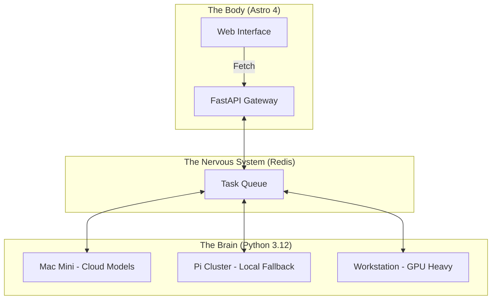

<TLDR>
  ஒற்றைக்கல் அமைப்புகள் AI டெவலப்பர்களுக்குக் கடன் பொறி. நான் Gekro-வை ஒத்திசைவற்ற காரணமறிதலுக்கான Python-இயக்கும் "மூளை"யாகவும், உயர் செயல்திறன் வழங்கலுக்கான Astro அடிப்படையிலான "உடலாகவும்" பிரித்தேன். இந்தக் கட்டுரை Mac Mini முதல் Pi கிளஸ்டர்கள் வரையிலான வன்பொருள் ஸ்டாக்கையும், அவற்றை இணைக்கும் FastAPI நரம்பு மண்டலத்தையும் விளக்குகிறது.
</TLDR>

பெரும்பாலான டெவலப்பர்கள் LLM-ஐ ஒரு மிகைப்படுத்தப்பட்ட தரவுத்தளக் கேள்வியாகக் கருதுகிறார்கள்: ஒரே Next.js அல்லது Node சர்வருக்குள் கையாளப்படும் ஒத்திசைவான கோரிக்கை-பதில் சுழற்சி. வேலைக்கு உண்மையாக நேரம் ஆகும் வரைதான் இது தாக்குப்பிடிக்கும். "சிந்திக்க" 30 வினாடிகளும் சரிபார்க்க இன்னும் 10 வினாடிகளும் ஆகக்கூடிய சிக்கலான ஏஜென்டிக் பணிப்பாய்வுகளை இயக்கும்போது, உங்கள் UI திரியைத் தடுக்க முடியாது. என் ஆய்வகத்தில் நான் **பிளவுபட்ட-மூளை கட்டமைப்பைத்** தேர்ந்தெடுத்தேன். "மூளை" (நுண்ணறிவு) பகிர்ந்தளிக்கப்பட்ட வன்பொருள் கிளஸ்டர் முழுவதும் பரவிய சிறப்பு Python சூழல்களில் வாழ்கிறது; "உடல்" (இடைமுகம்) வேகத்துக்கும் SEO-வுக்கும் முன்னுரிமை தரும் மெலிந்த, சுறுசுறுப்பான Astro இயந்திரம்.

## கட்டமைப்பு

என் ஆய்வகம் பகிர்ந்தளிக்கப்பட்டது. என் கணிப்பு ஆற்றல் முழுவதையும் ஒரே கூடையில் வைப்பதை நான் நம்பவில்லை. ஒரே ஒரு டெப்ளாய்மென்ட் செயலிழப்பது ஆய்வகத்தின் நுண்ணறிவை முடக்கிவிடக் கூடாது; எந்த ஒரு தனிப்பட்ட தோல்வியையும் கட்டமைப்பு தாங்கி நிற்க வேண்டும்.



| அடுக்கு | தொழில்நுட்பம் | முதன்மைப் பங்கு |
| :--- | :--- | :--- |
| **உடல்** | Astro + Tailwind v4 | UI வழங்கல், SEO, நிலையான ஆவணங்கள். |
| **மூளை** | Python + LangGraph | நீண்டநேரம் இயங்கும் காரணமறிதல் சுழற்சிகள், மாடல் ஒருங்கிணைப்பு. |
| **நரம்பு மண்டலம்** | FastAPI + Redis | ஒத்திசைவற்ற நிலை மேலாண்மை, நிகழ்வு வழிப்படுத்தல். |
| **கணிப்பு** | Together AI / Ollama | அனுமான இயந்திரங்கள் (கிளவுட் மற்றும் உள்ளூர்). |

## உருவாக்கம்

செயலாக்கம் பிரித்தல் மூலம் தொடங்குகிறது. "மூளை" ஒருபோதும் CSS பற்றிக் கவலைப்படக் கூடாது; "உடல்" ஒருபோதும் வெப்பநிலை-மாதிரியெடுப்பு அல்லது top-p மதிப்புகளைப் பற்றிக் கவலைப்படக் கூடாது.

### 1. மூளை: நிலை சேமிக்காத தர்க்க இயந்திரம்

ஏஜென்ட்களை வெளிப்படுத்த நான் FastAPI பயன்படுத்துகிறேன். இதனால் Astro "உடல்" கீழுள்ள Python சார்புகளை நிர்வகிக்காமலேயே எண்ணங்களைத் தூண்ட முடியும்.

```python
# brain/main.py
from fastapi import FastAPI, BackgroundTasks
from pydantic import BaseModel
import redis

app = FastAPI()
r = redis.Redis(host='localhost', port=6379, db=0)

class Task(BaseModel):
    instruction: str
    session_id: str

@app.post("/think")
async def run_thought_cycle(task: Task, background_tasks: BackgroundTasks):
    # Update Body that we are 'Thinking'
    r.set(f"status:{task.session_id}", "processing")
    
    # Run the expensive AI logic in the background
    background_tasks.add_task(expensive_reasoning, task.instruction, task.session_id)
    
    return {"status": "accepted", "session_id": task.session_id}

def expensive_reasoning(prompt, sid):
    from gekro_client import GekroLLMClient
    client = GekroLLMClient()
    result = client.chat([{"role": "user", "content": prompt}])
    r.set(f"status:{sid}", "completed")
    r.set(f"result:{sid}", result)
```

### 2. உடல்: Astro கோரிக்கை வடிவம்

Astro-வில் SSR-இன்போது தொடக்க நிலையைப் பெறுகிறேன், ஆனால் ஒரு சிந்தனைச் சுழற்சி செயலில் இருந்தால் நிலையை வினவ ஒரு சிறிய "தீவை" (Preact அல்லது SolidJS) பயன்படுத்துகிறேன். இது தொடக்க ஏற்றத்தை உடனடியாக வைத்திருக்கிறது.

```astro
---
// apps/web/src/pages/lab.astro
import LabStatus from '../components/LabStatus.tsx';

const initialStatus = await fetch('http://brain-gateway/status').then(res => res.json());
---

<Layout title="Lab Controls">
  <h1>System Orchestration</h1>
  <!-- The 'Island' that handles the live updates -->
  <LabStatus client:load initialData={initialStatus} />
</Layout>
```

### WSL2 குறிப்பு

Windows கணினியில் இந்த அடுக்குகளை இணைக்கும்போது, Redis மற்றும் FastAPI "மூளை"யை WSL2-க்குள் இயக்குகிறேன், ஆனால் "உடலுக்கு" Windows-நேட்டிவ் Astro மேம்பாட்டு சர்வரைப் பயன்படுத்துகிறேன். இதனால் UI வேலைக்கு Windows Chrome பிழைதிருத்தியைப் பயன்படுத்த முடிகிறது; Linux-க்காக மேம்படுத்தப்பட்ட கனமான Python குறியீடு அதன் இயல்பான சூழலில் ஓடுகிறது.

## சமரசங்கள்

மிகப்பெரிய சவால் குறியீடு அல்ல; அது **நிலை ஒத்திசைவு**. மூளை ஒரு வேலையை முடித்தும் உடல் புதுப்பிப்புக்காக வினவவில்லை என்றால், பயனருக்குப் பழைய UI தெரியும். 4k பதிவுக் கோப்பை ஒரு ஏஜென்ட் சுருக்கி முடித்திருந்தும், Redis விசை சரியாகப் பரவாததால் உலாவியில் "முடிவற்ற சிந்தனை" சுழல்கள் உருவான ஒரு பிழையை மூன்று வாரங்கள் துரத்தினேன்.

பிரிவைச் செய்ய இரண்டு முதல் மூன்று மணி நேரம் ஒதுக்கியிருந்தேன். அதற்கு முழுதாக ஒரு நாள் ஆனது. கூடுதல் நேரம் கிட்டத்தட்ட முழுவதும் மூளைக்கும் உடலுக்கும் இடையிலான தையலில் போனது; அமைப்புகள் சரியாகும் வரை அது தொல்லை தரும், பிறகு அமைதியாகப் பிரச்சினையாக இருப்பதை நிறுத்தும். நீண்ட காலமாக அது என்னைத் தொந்தரவு செய்யவில்லை. முதல் வாரம் தையல் மட்டும்தான்.

பகிர்ந்தளிக்கப்பட்ட அமைப்பின் சிக்கலே ஒருவகைக் கடன். நீங்கள் எளிய செயலியை உருவாக்கினால், இதைச் செய்யாதீர்கள். ஆனால் அதிகாலை 2 மணி கிளவுட் இருட்டடிப்பைத் தாங்க வேண்டிய ஆய்வகத்தை உருவாக்கினால், பிளவுபட்ட-மூளை கட்டமைப்பு மட்டுமே தரக்கூடிய நெகிழ்திறன் உங்களுக்குத் தேவை.

வரைபடம் உணர்த்துவதைவிட இதற்குக் கைமுறைத் தலையீடு அதிகம். தேவைப்படும்போது நான் இன்னும் தனித்தனி Pi-களுக்குள் SSH செய்கிறேன், ஏனெனில் ஒவ்வொன்றும் தன் சொந்தத் திட்டத்தை இயக்குகிறது, எது எது என்று எனக்குத் தெரியும். இது வடிவமைப்பின் குறைபாட்டை விட, மூன்று-நோட் கிளஸ்டர் மனதில் வைத்துக்கொள்ளும் அளவு சிறியது என்பதையும், வேறுவிதமாக நடிக்கும் தேவை எனக்கு இன்னும் வரவில்லை என்பதையும் ஒப்புக்கொள்வதே.

## இது எங்கே செல்கிறது

இந்த அமைப்பு **பௌதீகப் பின்னூட்டத்தை** நோக்கி நகர்கிறது. தற்போது "மூளை"யின் வெளியீடுகளை DFW-இல் உள்ள என் அலுவலகத்தின் Hue விளக்குத் தொகுதியுடன் இணைத்து வருகிறேன். ஆய்வகம் ஏதேனும் தொலைநிலை சர்வரில் தீவிரத் தோல்வியைக் கண்டறிந்தால், அறை உண்மையிலேயே சிவப்பாகிறது. கட்டமைப்பு என்பது மென்பொருள் எவ்வளவு முக்கியமோ, அந்த மென்பொருள் இயங்கும் சூழலும் அவ்வளவு முக்கியம்.
