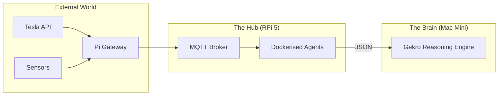

<TLDR>
  cron வேலைகளுக்கும் MQTT ப்ரோக்கருக்கும் 2,000 டாலர் வொர்க்ஸ்டேஷனை வீணாக்காதீர்கள். NVMe SSD-உடன் Raspberry Pi 5-ஐ "ஆய்வக உதவியாளராக" பயன்படுத்துகிறேன்: எப்போதும் இயங்கும் ஒரு நோட், ஆய்வகத்தின் இதயத்துடிப்பை நிலையாக வைத்திருக்கும் திரும்பத் திரும்ப வரும், குறைந்த கணினி வேலைகளைக் கையாள்கிறது. இந்தக் கட்டுரை வன்பொருள் அமைப்பையும், என் பௌதீக உலகத்தை (Tesla மற்றும் வீடு) என் AI ஏஜென்ட்களுடன் இணைக்கும் Docker அடிப்படையிலான பயன்பாட்டு ஸ்டாக்கையும் விளக்குகிறது.
</TLDR>

பில்லியன் டாலர் தரவு மையங்களின் இந்த உலகில், 80 டாலர் கணினிதான் என் மிகவும் நம்பகமான ஊழியர். DFW-இல் Gekro-வைத் தொடங்கியபோது, எனக்கு ஒரு "Ground Truth" நோட் தேவை என்று உணர்ந்தேன்: என் முதன்மை Mac Mini மறுதொடக்கம் ஆகும்போதும், என் வொர்க்ஸ்டேஷன் ஏதேனும் 3D ரெண்டரில் மூழ்கியிருக்கும்போதும் உயிருடன் இருக்கும் ஒன்று. Raspberry Pi அதன் நங்கூரம். அது கனமான "சிந்தனை" வேலையைச் செய்வதில்லை, ஆனால் மூளைக்குத் தேவையான தரவு (என் Tesla-வின் சார்ஜ் நிலை அல்லது அலுவலக வெப்பநிலை போன்றவை) எப்போதும் கிடைப்பதையும் அட்டவணைப்படுத்தப்பட்டிருப்பதையும் உறுதி செய்கிறது.

## கட்டமைப்பு

Pi **கேட்வே லேயராக** செயல்படுகிறது. IoT சாதனங்களின் குழப்பமான உலகத்துக்கும் உயர் செயல்திறன் கொண்ட ரீசனிங் லேயருக்கும் இடையில் இது அமர்கிறது.



| கூறு | வன்பொருள் / மென்பொருள் | பங்கு |
| :--- | :--- | :--- |
| **போர்டு** | Raspberry Pi 5 (16GB) | உயர் செயல்திறன் ARM கணிப்பு. |
| **சேமிப்பு** | M.2 HAT + NVMe 256GB SSD | SD கார்டு சிதைவதைத் தடுத்து I/O-வை வேகப்படுத்துகிறது. |
| **ப்ரோக்கர்** | Mosquitto (Docker) | ஆய்வகத்தின் அனைத்து டெலிமெட்ரிக்கும் "தபால் நிலையம்". |
| **திட்டமிடுபவர்** | Cron / Supercronic | இரவு நேர ஆய்வு மற்றும் சுத்தம் செய்யும் ஏஜென்ட்களை இயக்குகிறது. |

## உருவாக்கம்

உற்பத்தி Pi "Immutability-First" ஆக இருக்க வேண்டும். அடிப்படை OS-இல் Docker மற்றும் Tailscale தவிர வேறு எதையும் நான் நிறுவுவதில்லை.

### 1. NVMe-யின் நன்மை

வார இறுதித் திட்டத்தைத் தவிர வேறு எதற்கும் இன்னும் SD கார்டுகளைப் பயன்படுத்தினால், நீங்கள் மணலில் கட்டுகிறீர்கள். நிறைய பதிவுகளை எழுதும் ஒரு ஏஜென்ட் உயர்தர SD கார்டை அழித்ததால் மூன்று வாரத் தரவை இழந்தேன். இப்போது NVMe SSD பயன்படுத்துகிறேன்.

```bash
# Verify NVMe is detected and using Gen 3 speeds
lsblk
sudo lspci -vvv | grep LnkSta
```

### 2. Docker அடிப்படையிலான உதவியாளர் ஸ்டாக்

உதவியாளர் நோடுக்காக ஒரு `docker-compose.yml` வைத்திருக்கிறேன், அது பூட் ஆனதும் தானாகத் தொடங்கும்.

```yaml
services:
  mqtt:
    image: eclipse-mosquitto:latest
    ports:
      - "1883:1883"
    volumes:
      - ./mosquitto/config:/mosquitto/config

  tesla-telemetry:
    build: ./agents/tesla-bridge
    restart: always
    environment:
      - TESLA_VIN=${VIN}
      - MQTT_HOST=mqtt

  nightly-summarizer:
    image: python:3.12-slim
    volumes:
      - ./scripts:/app
    command: ["python", "/app/daily_digest.py"]
```

### 3. WSL2 குறிப்பு: தொலைநிலை நிர்வாகம்

Pi-யில் நான் ஒருபோதும் மானிட்டரை இணைப்பதில்லை. கிளஸ்டரில் உள்ள எந்த நோடுக்கும் உடனே தாவ, என் WSL2 சூழலில் ஒரு குறிப்பிட்ட Zsh செயல்பாட்டைப் பயன்படுத்துகிறேன்.

```bash
# Fast SSH to lab nodes
lab() {
  ssh rohit@192.168.1.$1
}
# Usage: lab 50 (connects to Pi at .50)
```

## சமரசங்கள்

Pi-யின் மிகப்பெரிய பலவீனம் **கணிப்புச் செறிவு**. ஒருமுறை Pi-யில் மேலும் நான்கு ஏஜென்ட்களுடன் ஒரு லோக்கல் வெக்டர் தரவுத்தளத்தை (ChromaDB) இயக்க முயன்றேன். I/O காத்திருப்பு நேரங்கள் உயர்ந்தன, என் MQTT பாலம் என் Tesla-விடமிருந்து வரும் செய்திகளைத் தவறவிடத் தொடங்கியது. நீங்கள் "வள சேகரிப்பாளராக" இருக்க வேண்டும். Pi-யைக் கண்டிப்பாக **I/O சார்ந்த வேலைகளுக்கு** (API-இலிருந்து தரவு பெறுதல், செய்திகளை வழிநடத்துதல்) மட்டுப்படுத்தவும், அனைத்து **CPU/GPU சார்ந்த வேலைகளையும்** Mac Mini-க்கு மாற்றவும் கற்றுக்கொண்டேன்.

மேலும், **மின்சாரம் முக்கியம்**. "வழக்கமான" USB-C தொலைபேசி சார்ஜர் சுமையின்போது Pi 5-ஐ வேகம் குறைக்கச் செய்யும். டெக்சாஸ் கோடை வெப்ப அலைகளில் NVMe டிரைவையும் ஆக்டிவ் கூலரையும் முழுத் திறனில் இயக்க, அதிகாரப்பூர்வ 27W PD மின்சார விநியோகத்துக்கு மாற வேண்டியிருந்தது.

## இது எங்கே செல்கிறது

தற்போது Pi-யின் GPIO பின்களில் ஒரு **பௌதீக கில்ஸ்விட்சை** இணைத்து வருகிறேன். ஒரு ஏஜென்ட் ஒழுங்கற்று நடப்பதையோ API செலவு வரம்பைத் தொடுவதையோ கண்டால், என் மேசையில் உள்ள உண்மையான பொத்தான் முழு Docker ஸ்டாக்கிற்கும் SIGTERM அனுப்பும். முழு இறையாண்மை என்றால் பிளக்கின் மீது உண்மையான கை இருப்பது.
