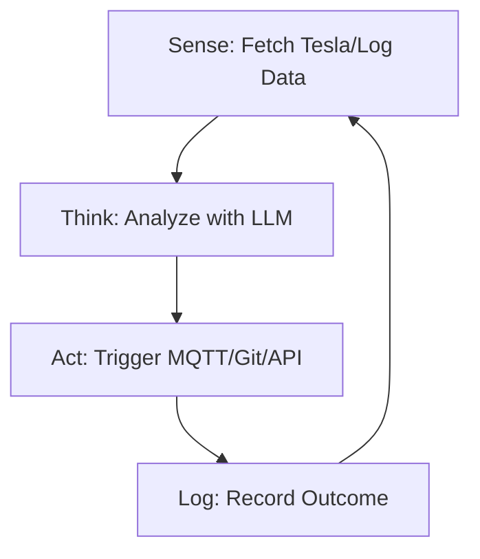

<TLDR>
  ஸ்கிரிப்ட் வழிமுறைகளின் பட்டியலைப் பின்பற்றும்; ஏஜென்ட் ஒரு இலக்கைப் பின்பற்றும். என் Tesla-வின் பேட்டரி அளவைக் கண்காணிக்க என் முதல் தன்னாட்சி லூப்பை உருவாக்கினேன்; அது ஒரு குறிப்பிட்ட வரம்பை எட்டியதும் தானாகவே "Deep Discharge" அறிவிப்பை அனுப்பும். இந்தக் கட்டுரை நேர்கோட்டுக் குறியீட்டிலிருந்து, என் Pi கிளஸ்டரில் 24/7 இயங்கும் Sense-Think-Act லூப்புக்கு மாறிய கட்டமைப்பு மாற்றத்தை விளக்குகிறது.
</TLDR>

"குறியீடு எழுதுவது" என்பதிலிருந்து "நுண்ணறிவை வழிநடத்துவது" என்பதற்கான மாற்றம் ஒரே தருணத்தில் நிகழ்கிறது. எனக்கு அது டல்லாஸில் ஒரு செவ்வாய்க்கிழமை இரவு 11 மணிக்கு நிகழ்ந்தது. என் ஏஜென்ட் ஒன்று லூப்பில் இயங்கி, என் சர்வர் பதிவுகளில் 404 பிழைகளைத் தேடிக்கொண்டிருந்தது. எனக்கு எச்சரிக்கை மட்டும் அனுப்புவதற்குப் பதிலாக, அந்த ஏஜென்ட் தானாகவே உடைந்த ஓர் உள் இணைப்பைக் கண்டறிந்து, அதைச் சரிசெய்ய ஒரு `sed` கட்டளையை உருவாக்கி, மாற்றத்தை Git-இல் கமிட் செய்தது. நான் விசைப்பலகையைத் தொடாமலேயே தன்னைத்தானே "மேம்படுத்திக்கொள்ளும்" ஓர் அமைப்பின் விசித்திர ஆற்றலை முதன்முறையாக உணர்ந்தேன். இதுதான் **Sense-Think-Act** லூப்; இதுதான் Gekro Lab-இன் அடிப்படை அணு.

## கட்டமைப்பு

ஏஜென்ட் என்பது ஒரு செயல்பாடு மட்டுமல்ல; அது ஒரு **நிலை இயந்திரம்**. தான் எங்கே இருக்கிறது, எதை அடைய விரும்புகிறது, தன்னிடம் என்ன கருவிகள் உள்ளன என்பதை அது அறிந்திருக்க வேண்டும்.



| கட்டம் | பொறுப்பு | கருவிகள் |
| :--- | :--- | :--- |
| **Sense** | மூல டெலிமெட்ரி அல்லது கோப்புத் தரவைப் பெறுதல். | `requests`, `tail`, `mqtt` |
| **Think** | இலக்குடன் ஒப்பிட்டுத் தரவின் மீது காரணம் காணுதல். | Together AI / Ollama |
| **Act** | சூழலில் ஒரு மாற்றத்தைச் செய்தல். | `subprocess`, `git`, `curl` |
| **State** | முந்தைய லூப்பில் என்ன நடந்தது என்பதை நினைவில் வைத்தல். | SQLite / JSON கோப்பு |

## உருவாக்கம்

உங்கள் முதல் ஏஜென்ட்டை உருவாக்க, LLM அழைப்பைத் தொடர்ந்து இயங்கும் `while` லூப்பில் உறையிட வேண்டும்; API காத்திருப்பு நேரம் முடிந்தால் வெறுமனே செயலிழக்காத பிழை கையாளுதலும் வேண்டும்.

### 1. தன்னாட்சி லூப்

இது என் ஆய்வகத்தின் நலனைக் கண்காணிக்கும் "Guardian" ஏஜென்ட்டின் எளிமைப்படுத்தப்பட்ட வடிவம்.

```python
import time
import logging
from gekro_client import GekroLLMClient # From my API Sovereignty post

class BasicAgent:
    def __init__(self, goal: str):
        self.goal = goal
        self.client = GekroLLMClient()
        self.state = {"iterations": 0, "last_action": "none"}

    def run(self):
        while True:
            self.state["iterations"] += 1
            print(f"\n--- Cycle {self.state['iterations']} ---")
            
            # SENSE: Get system stats
            # In production, use psutil.cpu_percent(), MQTT subscriptions, or API calls.
            # This static string is for demonstration only.
            context = "System Load: 85%, Temperature: 78C, Network: Latent"
            
            # THINK: Ask the Brain what to do
            prompt = f"Goal: {self.goal}\nCurrent Context: {context}\nLast Action: {self.state['last_action']}\nWhat is the next step?"
            decision = self.client.chat([{"role": "user", "content": prompt}])
            
            # ACT: (For safety, we just log in this example)
            self.execute(decision)
            self.state["last_action"] = decision
            
            time.sleep(60) # Wait 60 seconds before next sense cycle

    def execute(self, action):
        logging.info(f"Agent decided to: {action}")
        # Real execution logic (e.g., shell commands) would go here

if __name__ == "__main__":
    agent = BasicAgent(goal="Keep the lab temperatures below 80C by throttling compute.")
    agent.run()
```

### 2. நிலையைச் சேமித்தல்

நினைவகம் இல்லாத ஏஜென்ட் வெறும் ஸ்கிரிப்ட்தான். ஆய்வகத்தில் ஏஜென்ட்டின் எண்ணங்களின் "வரலாற்றை" சேமிக்க ஒரு எளிய JSON கோப்பைப் பயன்படுத்துகிறேன்; அதனால் அது ஒரே தவறைத் தொடர்ச்சியாக ஐந்து முறை செய்யாது.

### WSL2 குறிப்பு

WSL2-இல் தன்னாட்சி லூப்களை இயக்கும்போது **Tmux** பயன்படுத்துங்கள். நீங்கள் டெர்மினலை மூடினாலும், உங்கள் Windows கணினி உறக்கநிலைக்குச் சென்றாலும் (Windows அமைப்புகளில் "Sleep" ஐ முடக்கியிருப்பதாகக் கொண்டு) ஏஜென்ட் பின்னணியில் தொடர்ந்து இயங்க, அமர்வைப் பிரித்து வைக்க இது உதவுகிறது.

## சமரசங்கள்

ஆரம்ப கால ஏஜென்ட்களின் மிகப்பெரிய தோல்வி **முடிவில்லா அனுமான லூப்**. ஒருமுறை நான் சரியாக வரையறுக்கப்படாத இலக்குடன் ஒரு ஏஜென்ட்டை இயங்கவிட்டேன்: "ஆவணத்திலுள்ள எல்லா எழுத்துப்பிழைகளையும் திருத்து." "எழுத்துப்பிழை" என்பது அகநிலையானது என்பதால், அந்த ஏஜென்ட் தன் சொந்தத் திருத்தங்களையே மீண்டும் மீண்டும் "திருத்தி" வட்டத்தில் சுற்றி, மூன்று மணி நேரத்தில் Together AI கிரெடிட்டில் 40 டாலரைச் செலவழித்தது. **எப்போதும் 'Max Iterations' வரம்பையோ பட்ஜெட் உச்சவரம்பையோ செயல்படுத்துங்கள்.**

மற்றொரு பிரச்சினை **கட்டளை மாயத்தோற்றம்**. ஒரு ஏஜென்ட்டுக்கு ஷெல் (`subprocess.run`) அணுகலைக் கொடுத்தால், அது என்றாவது இல்லாத கட்டளையை, அல்லது அதைவிட மோசமாக, அழிவை ஏற்படுத்தும் கட்டளையை இயக்க முயலும். ஒரு ஏஜென்ட் "தற்காலிக" கோப்பகத்தின் மீது `rm -rf` இயக்க முயன்றபோது இதைக் கற்றுக்கொண்டேன்; அதில் உண்மையில் என் Tesla API டோக்கன்கள் இருந்தன. எந்தப் புதிய ஏஜென்ட் டெப்ளாய்மென்ட்டிலும் முதல் 48 மணி நேரம் "Dry Run" பயன்முறையைப் பயன்படுத்துங்கள்.

## இது எங்கே செல்கிறது

ஒற்றை-லூப் ஏஜென்ட்களிலிருந்து **பல-ஏஜென்ட் அமைப்புகளை** நோக்கி நாம் நகர்கிறோம். தற்போது மூன்று "Worker" ஏஜென்ட்களை (ஒன்று குறியீட்டுக்கு, ஒன்று ஆய்வுக்கு, ஒன்று பாதுகாப்புக்கு) மேற்பார்வையிடும் "Manager" ஏஜென்ட்டை உருவாக்கி வருகிறேன். லூப்பை நான் வழிநடத்துவதற்குப் பதிலாக, Manager வொர்க்கர்களை வழிநடத்துகிறது. ஆய்வகம் நுண்ணறிவின் சுய-மேம்படுத்தும் தொழிற்சாலையாக மாறி வருகிறது, "Sense-Think-Act" அதன் அசெம்பிளி லைன்.
