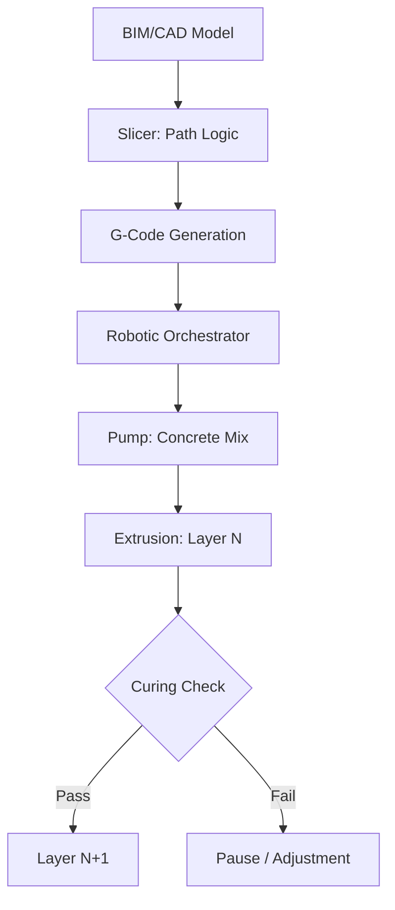

<TLDR>
  3D నిర్మాణ ప్రింటింగ్‌లో వేగమే స్పష్టమైన లాభం. కచ్చితత్వం అంతకన్నా పెద్ద లాభం. సబ్‌ట్రాక్టివ్ నుంచి అడిటివ్ మ్యానుఫ్యాక్చరింగ్‌కు మారడం ద్వారా మనం సామగ్రి వృథాను 60% వరకు తగ్గించవచ్చు, సంక్లిష్టమైన ఉష్ణ జ్యామితులను నేరుగా గోడ నిర్మాణంలోనే కలపవచ్చు. గ్రీన్ ఇన్‌ఫ్రాస్ట్రక్చర్ నిర్వచనం ఇదే: అధిక పనితీరు, తక్కువ వృథా, లోకల్-ఫస్ట్.
</TLDR>

కార్బన్-ఫైబర్‌తో బలపరచిన కాంక్రీట్ పూసను గ్యాంట్రీ తరహా 3D ప్రింటర్ వెలికితీయడం మొదటిసారి చూసినప్పుడు, నేను నిర్మాణానికి ఒక వేగవంతమైన మార్గాన్ని మాత్రమే చూడలేదు. **మెటీరియల్ సార్వభౌమత్వం** వైపు ఒక సాంకేతిక మలుపును చూశాను; ఈ భావన నా ఇటీవలి పరిశోధనలో మళ్లీ మళ్లీ వస్తున్న అంశం.

సంప్రదాయ నిర్మాణ ప్రపంచంలో మనం తరచుగా కలప గిడ్డంగి కొలతలకు, అచ్చు పరిమితులకు కట్టుబడి ఉంటాం. వృథా దిగ్భ్రాంతికరం; ప్రపంచ సగటుల ప్రకారం నిర్మాణ స్థలానికి పంపిన సామగ్రిలో చాలా పెద్ద శాతం చివరకు చెత్త డబ్బాలోకి చేరుతుంది. సిద్ధాంతపరంగా, ఇన్‌ఫ్రాస్ట్రక్చర్‌ను సాఫ్ట్‌వేర్ సమస్యగా చూడటం, అంటే డిజిటల్ ఉద్దేశాన్ని భౌతిక వాస్తవంగా మార్చే సూచనల సమితిగా చూడటం, సున్నా-వృథా కచ్చితత్వం వైపు కొత్త దారిని చూపగలదు.

## పునాది: సిరా మరియు కలం

మెటీరియల్ సైన్స్‌లోకి వెళ్లే ముందు, హార్డ్‌వేర్‌ను అర్థం చేసుకోవాలి. 3D నిర్మాణ ప్రింటింగ్ సాధారణంగా రెండు శిబిరాలుగా ఉంటుంది: **గ్యాంట్రీ సిస్టమ్స్** మరియు **రోబోటిక్ ఆర్మ్స్**.

* **గ్యాంట్రీ సిస్టమ్స్**: ఇవి ముఖ్యంగా మీ డెస్క్‌టాప్ FDM ప్రింటర్‌కు భారీ రూపాలు. పని స్థలం చుట్టూ ఒక పెద్ద ఫ్రేమ్ నిర్మిస్తారు, నాజిల్ X, Y, Z అక్షాల వెంట కదులుతుంది. ఇవి చాలా స్థిరంగా ఉంటాయి, భారీ స్థాయిలో మొత్తం నగర బ్లాకులనే ప్రింట్ చేయగలవు, కానీ వీటి ఏర్పాటుకు చాలా స్థలం కావాలి.
* **రోబోటిక్ ఆర్మ్స్**: ఇవి చురుకైన, బహుళ-అక్షాల పారిశ్రామిక రోబోట్లు (ఆటోమొబైల్ అసెంబ్లీలో వాడేవి లాంటివి), ట్రాక్‌లపై లేదా ట్రైలర్లపై అమర్చి ఉంటాయి. సంక్లిష్ట జ్యామితులకు ఇవి ఎక్కువ సౌలభ్యం ఇస్తాయి, ఇరుకైన స్థలాల్లోనూ పనిచేయగలవు, అయితే ప్రింట్ సమయంలో నిర్మాణ స్థిరత్వం కోసం తరచుగా మరింత అధునాతన పాథింగ్ లాజిక్ అవసరమవుతుంది.

"సిరా" కూడా "కలం" అంతే కీలకం. మనం సాధారణ కాంక్రీట్ మాత్రమే వాడం. ప్రత్యేకమైన **సిమెంటిషియస్ కాంపోజిట్లు** వాడతాం: నాజిల్ గుండా ద్రవంలా ప్రవహించి, పైన ఉన్న పొరల బరువును మోయడానికి వెంటనే గట్టిపడేలా రూపొందించిన మిశ్రమాలు. ఈ "స్టాకబిలిటీ"యే ఏ 3D నిర్మాణంలోనైనా అసలైన ఇంజినీరింగ్ సవాలు.

## ఎందుకు: సామగ్రి ఆప్టిమైజేషన్

సంప్రదాయ నిర్మాణంలో ప్రతి వంపూ ఖర్చుకు కేంద్రం. అచ్చులు ఖరీదైనవి, వృథా తప్పనిసరి, శ్రమ పునరావృతం. అడిటివ్ మ్యానుఫ్యాక్చరింగ్ దీన్ని తిరగరాస్తుంది. 3D ప్రింటర్‌కు పారామెట్రిక్‌గా ఆప్టిమైజ్ చేసిన సంక్లిష్ట వంపు ఖర్చు, సరళరేఖ ఖర్చుతో సమానం.

దీనివల్ల మనం **టోపాలజీ ఆప్టిమైజేషన్**ను వాడుకోవచ్చు. లోపల బోలు కోర్‌లతో గోడలను ప్రింట్ చేయవచ్చు; అవి సహజ ఇన్సులేషన్‌గా లేదా వైరింగ్, ప్లంబింగ్ కోసం సర్వీస్ చానెళ్లుగా పనిచేస్తాయి, ఎక్స్‌ట్రూషన్ ప్రక్రియలోనే నేరుగా కలిసిపోతాయి. మరీ ముఖ్యంగా, ఇది **గ్రీన్ జియోపాలిమర్ల** వాడకాన్ని సాధ్యం చేస్తుంది. సంప్రదాయ పోర్ట్‌ల్యాండ్ సిమెంట్‌కు బదులు ఫ్లై యాష్ లేదా స్లాగ్ వంటి పారిశ్రామిక ఉప ఉత్పత్తులను బైండర్లుగా వాడటం ద్వారా, పైకప్పు వేయకముందే భవనం "శరీరం" కార్బన్ పాదముద్రను భారీగా తగ్గించవచ్చు.

## ఎలా: స్లైసింగ్ నుంచి ఎక్స్‌ట్రూషన్ వరకు

"బ్రెయిన్" (డిజిటల్ డిజైన్), "బాడీ" (భౌతిక నిర్మాణం) మధ్య వంతెన ఊహించదగిన, కానీ కఠినమైన పైప్‌లైన్‌ను అనుసరిస్తుంది. ఇది మెటీరియల్ సైన్స్, రోబోటిక్స్‌ల అధిక ప్రమాదంతో కూడిన సమన్వయం.

## కాంట్రాక్టర్ కొత్త పాత్ర

ఈ సాంకేతికత కాంట్రాక్టర్‌ను తొలగించదు; పైకి ఎత్తుతుంది. "భవిష్యత్ కాంట్రాక్టర్" శారీరక శ్రమ చేసేవారు తక్కువ, **సిస్టమ్ ఆర్కెస్ట్రేటర్** ఎక్కువ.

1. **మెటీరియల్ సైంటిస్ట్**: వారు మిశ్రమం రియాలజీని అర్థం చేసుకోవాలి, అంటే మంగళవారం, గురువారాల్లో ఉష్ణోగ్రత, తేమ ప్రవాహాన్ని ఎలా ప్రభావితం చేస్తాయో.
2. **రోబోటిక్ పైలట్**: వారు నిర్మాణ డిజిటల్ ట్విన్‌ను నిర్వహిస్తారు, విచలనాల కోసం సెన్సార్లను గమనిస్తారు, రియల్-టైమ్‌లో పాథింగ్‌ను సర్దుబాటు చేస్తారు.
3. **ఇన్‌ఫ్రాస్ట్రక్చర్ ఆర్కిటెక్ట్**: ప్రింట్ చేసిన చానెళ్లలో MEP (మెకానికల్, ఎలక్ట్రికల్, ప్లంబింగ్) ఏకీకరణపై వారు దృష్టి పెడతారు; దీంతో విధ్వంసకర డ్రిల్లింగ్, "తర్వాత" చేసే మార్పుల అవసరం తగ్గుతుంది.

## ఇది ఎటు వెళ్తుంది / నేను నేర్చుకున్నది

3D నిర్మాణంపై ఈ పరిశోధన ఒక ప్రాథమిక మార్పును చూపుతోంది: **ఇన్‌ఫ్రాస్ట్రక్చర్ సాఫ్ట్‌వేర్‌గా మారుతోంది**. గోడ ఉష్ణ ద్రవ్యరాశిని లేదా ఒక మూల నిర్మాణ సాంద్రతను మీరు ప్రోగ్రామ్ చేయగలిగినప్పుడు, స్థానిక హార్డ్‌వేర్ దుకాణంలోని "ప్రామాణిక యూనిట్లకు" మీరు పరిమితం కారు.

Gekro Lab ప్రస్తుతం గోడలను ప్రింట్ చేయకపోయినా, **గ్రీన్ ఇన్‌ఫ్రాస్ట్రక్చర్** సూత్రాలు, అంటే గతంలోని బలప్రయోగ పద్ధతులకన్నా సామగ్రిని కచ్చితంగా వాడటానికి ప్రాధాన్యం ఇవ్వడం, డిజిటల్ మేధస్సుకూ మన భౌతిక పరిసరాలకూ మధ్య అంతరాన్ని చివరికి ఎలా పూడ్చవచ్చో ఒక రోడ్‌మ్యాప్ ఇస్తాయి.
