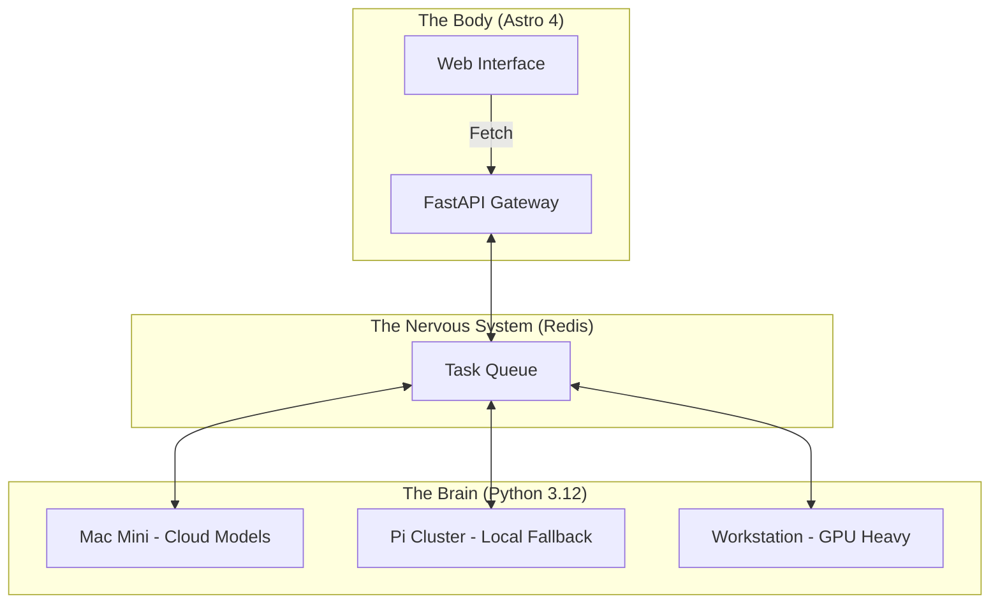

<TLDR>
  AI డెవలపర్లకు మోనోలిథ్‌లు అప్పుల ఉచ్చు. నేను Gekro ను అసింక్రోనస్ రీజనింగ్ కోసం Python ఆధారిత "బ్రెయిన్"గా, అధిక పనితీరు డెలివరీ కోసం Astro ఆధారిత "బాడీ"గా విభజించాను. ఈ వ్యాసం హార్డ్‌వేర్ స్టాక్‌ను, Mac Mini ల నుంచి Pi క్లస్టర్ల వరకు, వాటిని కలిపే FastAPI నాడీ వ్యవస్థను విడమరుస్తుంది.
</TLDR>

చాలామంది డెవలపర్లు LLM ను హంగులు అద్దిన ఒక సాధారణ డేటాబేస్ క్వెరీలా చూస్తారు: ఒకే Next.js లేదా Node సర్వర్‌లో నిర్వహించే సింక్రోనస్ రిక్వెస్ట్-రెస్పాన్స్ చక్రం. పనికి నిజంగా సమయం పట్టే వరకే ఇది నిలుస్తుంది. "ఆలోచించడానికి" 30 సెకన్లు, ధ్రువీకరించడానికి మరో 10 సెకన్లు పట్టే సంక్లిష్ట ఏజెంటిక్ వర్క్‌ఫ్లోలను నడుపుతున్నప్పుడు, మీ UI థ్రెడ్‌ను బ్లాక్ చేయలేరు. నా ల్యాబ్‌లో నేను **స్ప్లిట్-బ్రెయిన్ ఆర్కిటెక్చర్**ను ఎంచుకున్నాను. "బ్రెయిన్" (మేధస్సు) పంపిణీ చేసిన హార్డ్‌వేర్ క్లస్టర్‌లో విస్తరించిన ప్రత్యేక Python వాతావరణాల్లో ఉంటుంది; "బాడీ" (ఇంటర్‌ఫేస్) వేగానికి, SEO కు ప్రాధాన్యమిచ్చే సన్నని, చురుకైన Astro యంత్రం.

## ఆర్కిటెక్చర్

నా ల్యాబ్ పంపిణీ చేయబడినది. నా కంప్యూట్ మొత్తాన్ని ఒకే బుట్టలో పెట్టడాన్ని నేను నమ్మను. ఒక డిప్లాయ్‌మెంట్ పడిపోతే ల్యాబ్ మేధస్సు ఆఫ్‌లైన్ కాకూడదు; ఏ ఒక్క వైఫల్యాన్నైనా ఆర్కిటెక్చర్ తట్టుకుని నిలవాలి.



| పొర | సాంకేతికత | ప్రధాన పాత్ర |
| :--- | :--- | :--- |
| **బాడీ** | Astro + Tailwind v4 | UI డెలివరీ, SEO, స్థిర డాక్యుమెంటేషన్. |
| **బ్రెయిన్** | Python + LangGraph | దీర్ఘకాల రీజనింగ్ చక్రాలు, మోడల్ ఆర్కెస్ట్రేషన్. |
| **నాడీ వ్యవస్థ** | FastAPI + Redis | అసింక్రోనస్ స్టేట్ నిర్వహణ, ఈవెంట్ రూటింగ్. |
| **కంప్యూట్** | Together AI / Ollama | ఇన్ఫరెన్స్ ఇంజిన్లు (క్లౌడ్, లోకల్). |

## నిర్మాణం

అమలు డికప్లింగ్‌తో మొదలవుతుంది. "బ్రెయిన్"కు ఎప్పుడూ CSS గురించి పట్టింపు ఉండకూడదు, "బాడీ"కి ఎప్పుడూ టెంపరేచర్-శాంప్లింగ్ లేదా top-p విలువల గురించి.

### 1. బ్రెయిన్: స్టేట్‌లెస్ లాజిక్ ఇంజిన్

ఏజెంట్లను బహిర్గతం చేయడానికి నేను FastAPI వాడతాను. దీనివల్ల Astro "బాడీ" కింద ఉన్న Python డిపెండెన్సీలను నిర్వహించకుండానే ఆలోచనలను ప్రేరేపించగలదు.

```python
# brain/main.py
from fastapi import FastAPI, BackgroundTasks
from pydantic import BaseModel
import redis

app = FastAPI()
r = redis.Redis(host='localhost', port=6379, db=0)

class Task(BaseModel):
    instruction: str
    session_id: str

@app.post("/think")
async def run_thought_cycle(task: Task, background_tasks: BackgroundTasks):
    # Update Body that we are 'Thinking'
    r.set(f"status:{task.session_id}", "processing")
    
    # Run the expensive AI logic in the background
    background_tasks.add_task(expensive_reasoning, task.instruction, task.session_id)
    
    return {"status": "accepted", "session_id": task.session_id}

def expensive_reasoning(prompt, sid):
    from gekro_client import GekroLLMClient
    client = GekroLLMClient()
    result = client.chat([{"role": "user", "content": prompt}])
    r.set(f"status:{sid}", "completed")
    r.set(f"result:{sid}", result)
```

### 2. బాడీ: Astro రిక్వెస్ట్ ప్యాటర్న్

Astro లో SSR సమయంలో ప్రారంభ స్టేట్‌ను తీసుకుంటాను, కానీ ఒక ఆలోచన చక్రం చురుగ్గా ఉంటే స్టేటస్‌ను పోల్ చేయడానికి ఒక చిన్న "ఐలాండ్" (Preact లేదా SolidJS) వాడతాను. దీనివల్ల ప్రారంభ లోడ్ తక్షణమే ఉంటుంది.

```astro
---
// apps/web/src/pages/lab.astro
import LabStatus from '../components/LabStatus.tsx';

const initialStatus = await fetch('http://brain-gateway/status').then(res => res.json());
---

<Layout title="Lab Controls">
  <h1>System Orchestration</h1>
  <!-- The 'Island' that handles the live updates -->
  <LabStatus client:load initialData={initialStatus} />
</Layout>
```

### WSL2 గమనిక

Windows మెషీన్‌లో ఈ పొరలను కలుపుతున్నప్పుడు, నేను Redis, FastAPI "బ్రెయిన్"ను WSL2 లోపల నడుపుతాను, కానీ "బాడీ" కోసం Windows-నేటివ్ Astro డెవ్ సర్వర్‌ను వాడతాను. దీనివల్ల UI పనికి Windows Chrome డీబగ్గర్‌ను వాడగలను, Linux కోసం ఆప్టిమైజ్ చేసిన భారీ Python కోడ్ దాని సహజ వాతావరణంలో నడుస్తుంది.

## రాజీలు

అతిపెద్ద సవాలు కోడ్ కాదు; **స్టేట్ సింక్రోనైజేషన్**. బ్రెయిన్ పనిని పూర్తి చేసినా బాడీ అప్‌డేట్ కోసం పోల్ చేయకపోతే, వినియోగదారుకు పాత UI కనిపిస్తుంది. 4k లాగ్ ఫైల్‌ను ఒక ఏజెంట్ సారాంశం చేయడం పూర్తి చేసినా, Redis కీ సరిగా వ్యాపించకపోవడం వల్ల బ్రౌజర్‌లో "అనంత ఆలోచన" లూప్‌లు ఏర్పడిన ఒక బగ్ వెంట నేను మూడు వారాలు పరుగులు తీశాను.

విభజన చేయడానికి నేను రెండు నుంచి మూడు గంటల బడ్జెట్ వేశాను. దానికి పూర్తి ఒక రోజు పట్టింది. దాదాపు మొత్తం అదనపు సమయం బ్రెయిన్, బాడీ మధ్య కుట్టు మీదే పోయింది; సెట్టింగ్‌లు సరిగ్గా అయ్యేవరకు అది చికాకు పెడుతుంది, ఆ తర్వాత నిశ్శబ్దంగా సమస్య కావడం మానేస్తుంది. చాలా కాలంగా అది నన్ను ఇబ్బంది పెట్టలేదు. మొదటి వారమంతా కేవలం కుట్టే.

పంపిణీ వ్యవస్థ సంక్లిష్టత దానికదే ఒక రకమైన అప్పు. మీరు సాధారణ యాప్ నిర్మిస్తుంటే, ఇది చేయకండి. కానీ రాత్రి 2 గంటల క్లౌడ్ బ్లాక్‌అవుట్‌ను తట్టుకుని నిలవాల్సిన ల్యాబ్ నిర్మిస్తుంటే, స్ప్లిట్-బ్రెయిన్ ఆర్కిటెక్చర్ మాత్రమే ఇవ్వగల స్థితిస్థాపకత మీకు కావాలి.

రేఖాచిత్రం సూచించేంత దానంతట అదే నడిచేది కూడా కాదు. నేను ఇప్పటికీ అవసరమైనప్పుడు ఒక్కో Pi లోకి SSH చేస్తాను, ఎందుకంటే ప్రతి ఒక్కటి తనదైన ప్రాజెక్ట్ నడుపుతోంది, ఏది ఏదో నాకు తెలుసు. ఇది డిజైన్‌లో లోపం అనడం కన్నా, మూడు-నోడ్‌ల క్లస్టర్ మనసులో పెట్టుకోగలంత చిన్నదనీ, వేరే విధంగా నటించాల్సిన అవసరం నాకు ఇంకా రాలేదనీ అంగీకరించడం.

## ఇది ఎటు వెళ్తుంది

ఈ సెటప్ **ఫిజికల్ ఫీడ్‌బ్యాక్** వైపు సాగుతోంది. ప్రస్తుతం నేను "బ్రెయిన్" అవుట్‌పుట్‌లను DFW లోని నా ఆఫీసులో ఉన్న Hue లైట్ల సమితికి కలుపుతున్నాను. ల్యాబ్ ఏదైనా రిమోట్ సర్వర్‌పై కీలక వైఫల్యాన్ని గుర్తిస్తే, గది అక్షరాలా ఎర్రగా మారుతుంది. ఆర్కిటెక్చర్ అంటే సాఫ్ట్‌వేర్ ఎంత ముఖ్యమో, ఆ సాఫ్ట్‌వేర్ నడిచే వాతావరణమూ అంతే.
