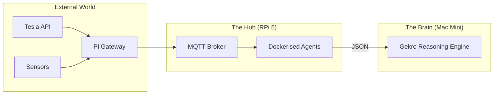

<TLDR>
  2,000 డాలర్ల వర్క్‌స్టేషన్‌ను cron జాబ్స్ మరియు MQTT బ్రోకరింగ్ కోసం వృథా చేయకండి. నేను NVMe SSD ఉన్న Raspberry Pi 5 ను "ల్యాబ్ అసిస్టెంట్"గా వాడతాను: ఎల్లప్పుడూ ఆన్‌లో ఉండే నోడ్, ల్యాబ్ గుండె చప్పుడును స్థిరంగా ఉంచే పునరావృత, తక్కువ కంప్యూట్ పనులను చూసుకుంటుంది. ఈ వ్యాసం హార్డ్‌వేర్ సెటప్‌ను, నా భౌతిక ప్రపంచాన్ని (Tesla మరియు ఇల్లు) నా AI ఏజెంట్లతో కలిపే Docker ఆధారిత యుటిలిటీ స్టాక్‌ను వివరిస్తుంది.
</TLDR>

బిలియన్ల డాలర్ల డేటా సెంటర్ల ఈ ప్రపంచంలో, 80 డాలర్ల ఈ కంప్యూటర్ నా అత్యంత నమ్మకమైన ఉద్యోగి. DFW లో Gekro ను మొదలుపెట్టినప్పుడు, నాకు ఒక "Ground Truth" నోడ్ అవసరమని అర్థమైంది: నా ప్రధాన Mac Mini రీబూట్ అవుతున్నప్పుడు లేదా నా వర్క్‌స్టేషన్ ఏదైనా 3D రెండర్ కింద నలిగిపోతున్నప్పుడు కూడా బ్రతికి ఉండేది. Raspberry Pi ఆ లంగరు. ఇది భారీ "ఆలోచన" చేయదు, కానీ బ్రెయిన్‌కు కావలసిన డేటా (నా Tesla ఛార్జింగ్ స్థితి లేదా ఆఫీస్ ఉష్ణోగ్రత వంటివి) ఎల్లప్పుడూ అందుబాటులో, ఇండెక్స్ చేసి ఉండేలా చూస్తుంది.

## ఆర్కిటెక్చర్

Pi **గేట్‌వే లేయర్**గా పనిచేస్తుంది. ఇది IoT పరికరాల గందరగోళ ప్రపంచానికి, అధిక పనితీరు గల రీజనింగ్ లేయర్‌కు మధ్య ఉంటుంది.



| భాగం | హార్డ్‌వేర్ / సాఫ్ట్‌వేర్ | పాత్ర |
| :--- | :--- | :--- |
| **బోర్డ్** | Raspberry Pi 5 (16GB) | అధిక పనితీరు గల ARM కంప్యూట్. |
| **స్టోరేజ్** | M.2 HAT + NVMe 256GB SSD | SD కార్డ్ పాడవకుండా ఆపుతుంది, I/O ని వేగవంతం చేస్తుంది. |
| **బ్రోకర్** | Mosquitto (Docker) | ల్యాబ్ టెలిమెట్రీ అంతటికీ "పోస్ట్ ఆఫీస్". |
| **షెడ్యూలర్** | Cron / Supercronic | రాత్రి పరిశోధన, శుభ్రపరిచే ఏజెంట్లను నడుపుతుంది. |

## నిర్మాణం

ప్రొడక్షన్ Pi "Immutability-First" గా ఉండాలి. బేస్ OS లో Docker, Tailscale తప్ప నేను ఏదీ ఇన్‌స్టాల్ చేయను.

### 1. NVMe ప్రయోజనం

వారాంతపు ప్రాజెక్టు తప్ప మరేదైనా పనికి ఇంకా SD కార్డులు వాడుతున్నట్లయితే, మీరు ఇసుక మీద నిర్మిస్తున్నారు. లాగ్‌లను ఎక్కువగా రాసే ఒక ఏజెంట్ ఖరీదైన SD కార్డ్‌ను నాశనం చేయడంతో నేను మూడు వారాల డేటాను కోల్పోయాను. ఇప్పుడు NVMe SSD వాడుతున్నాను.

```bash
# Verify NVMe is detected and using Gen 3 speeds
lsblk
sudo lspci -vvv | grep LnkSta
```

### 2. Docker ఆధారిత అసిస్టెంట్ స్టాక్

అసిస్టెంట్ నోడ్ కోసం నేను ఒక `docker-compose.yml` ఉంచుతాను, అది బూట్ అవ్వగానే దానంతట అదే మొదలవుతుంది.

```yaml
services:
  mqtt:
    image: eclipse-mosquitto:latest
    ports:
      - "1883:1883"
    volumes:
      - ./mosquitto/config:/mosquitto/config

  tesla-telemetry:
    build: ./agents/tesla-bridge
    restart: always
    environment:
      - TESLA_VIN=${VIN}
      - MQTT_HOST=mqtt

  nightly-summarizer:
    image: python:3.12-slim
    volumes:
      - ./scripts:/app
    command: ["python", "/app/daily_digest.py"]
```

### 3. WSL2 గమనిక: రిమోట్ నిర్వహణ

నేను Pi కి ఎప్పుడూ మానిటర్ కనెక్ట్ చేయను. క్లస్టర్‌లోని ఏ నోడ్‌లోకైనా వెంటనే వెళ్లడానికి నా WSL2 వాతావరణంలో ఒక ప్రత్యేక Zsh ఫంక్షన్ వాడతాను.

```bash
# Fast SSH to lab nodes
lab() {
  ssh rohit@192.168.1.$1
}
# Usage: lab 50 (connects to Pi at .50)
```

## రాజీలు

Pi యొక్క అతిపెద్ద బలహీనత **కంప్యూట్ సాచురేషన్**. ఒకసారి నేను Pi మీద మరో నాలుగు ఏజెంట్లతో పాటు లోకల్ వెక్టర్ డేటాబేస్ (ChromaDB) నడపడానికి ప్రయత్నించాను. I/O వెయిట్ టైమ్‌లు పెరిగిపోయాయి, నా MQTT బ్రిడ్జ్ నా Tesla నుండి వచ్చే సందేశాలను వదిలేయడం మొదలుపెట్టింది. మీరు "రిసోర్స్ స్కావెంజర్" కావాలి. Pi ని కఠినంగా **I/O-బౌండ్ పనులకు** (API నుండి డేటా తీసుకురావడం, సందేశాలను రూట్ చేయడం) పరిమితం చేసి, అన్ని **CPU/GPU-బౌండ్ పనులను** Mac Mini కి మార్చడం నేర్చుకున్నాను.

అలాగే, **పవర్ ముఖ్యం**. "సాధారణ" USB-C ఫోన్ ఛార్జర్ లోడ్ కింద Pi 5 ని థ్రాటిల్ చేస్తుంది. టెక్సాస్ వేసవి వడగాలుల్లో NVMe డ్రైవ్‌ను, యాక్టివ్ కూలర్‌ను పూర్తి సామర్థ్యంతో నడపడానికి నేను అధికారిక 27W PD పవర్ సప్లైకి మారాల్సి వచ్చింది.

## ఇది ఎటు వెళ్తుంది

ప్రస్తుతం నేను Pi యొక్క GPIO పిన్‌లకు ఒక **ఫిజికల్ కిల్‌స్విచ్** జతచేస్తున్నాను. ఏదైనా ఏజెంట్ అస్థిరంగా ప్రవర్తిస్తున్నట్లు లేదా API ఖర్చు పరిమితిని తాకుతున్నట్లు గుర్తిస్తే, నా డెస్క్ మీద ఉన్న నిజమైన బటన్ మొత్తం Docker స్టాక్‌కు SIGTERM పంపుతుంది. పూర్తి సార్వభౌమత్వం అంటే ప్లగ్ మీద భౌతికంగా చేయి ఉండటం.
