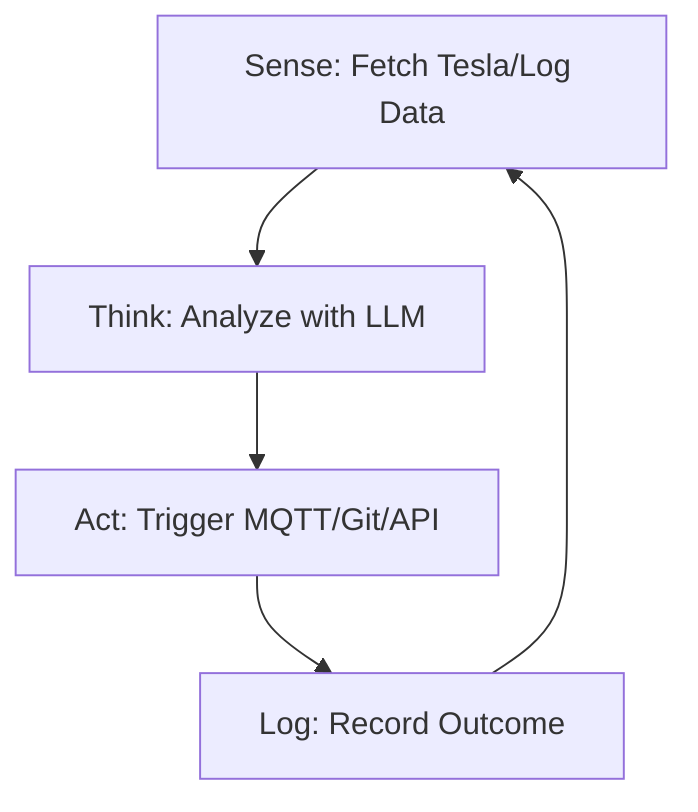

<TLDR>
  స్క్రిప్ట్ సూచనల జాబితాను అనుసరిస్తుంది; ఏజెంట్ ఒక లక్ష్యాన్ని అనుసరిస్తుంది. నా Tesla బ్యాటరీ స్థాయిని గమనించడానికి నా మొదటి స్వయంప్రతిపత్త లూప్‌ను నిర్మించాను; అది ఒక నిర్దిష్ట పరిమితికి చేరగానే దానంతట అదే "Deep Discharge" నోటిఫికేషన్ పంపుతుంది. ఈ వ్యాసం రేఖీయ కోడ్ నుంచి నా Pi క్లస్టర్‌లో 24/7 నడిచే Sense-Think-Act లూప్‌కు ఆర్కిటెక్చర్ మారిన తీరును వివరిస్తుంది.
</TLDR>

"కోడ్ రాయడం" నుంచి "మేధస్సును నడిపించడం" వైపు మార్పు ఒకే క్షణంలో జరుగుతుంది. నాకు అది డాలస్‌లో ఒక మంగళవారం రాత్రి 11 గంటలకు జరిగింది. నా ఏజెంట్ ఒకటి లూప్‌లో నడుస్తూ, నా సర్వర్ లాగ్‌లలో 404 లోపాల కోసం చూస్తోంది. కేవలం నాకు హెచ్చరిక ఇవ్వడానికి బదులు, ఆ ఏజెంట్ తనంతట తానే విరిగిన ఒక అంతర్గత లింక్‌ను గుర్తించి, దాన్ని సరిచేయడానికి ఒక `sed` కమాండ్ రూపొందించి, మార్పును Git లో కమిట్ చేసింది. నేను కీబోర్డ్ ముట్టుకోకుండానే తనను తాను "మెరుగుపరచుకోగల" సిస్టమ్ యొక్క వింత శక్తిని మొదటిసారి అనుభవించాను. ఇదే **Sense-Think-Act** లూప్, ఇదే Gekro Lab యొక్క మూల పరమాణువు.

## ఆర్కిటెక్చర్

ఏజెంట్ ఒక్క ఫంక్షన్ కాదు; అది ఒక **స్టేట్ మెషీన్**. అది ఎక్కడ ఉందో, ఏం సాధించాలనుకుంటోందో, తన దగ్గర ఏ సాధనాలు ఉన్నాయో దానికి తెలిసి ఉండాలి.



| దశ | బాధ్యత | టూలింగ్ |
| :--- | :--- | :--- |
| **Sense** | ముడి టెలిమెట్రీ లేదా ఫైల్ డేటాను స్వీకరించడం. | `requests`, `tail`, `mqtt` |
| **Think** | లక్ష్యంతో పోలుస్తూ డేటాపై తర్కించడం. | Together AI / Ollama |
| **Act** | పరిసరంలో ఒక మార్పు చేయడం. | `subprocess`, `git`, `curl` |
| **State** | గత లూప్‌లో ఏం జరిగిందో గుర్తుంచుకోవడం. | SQLite / JSON ఫైల్ |

## నిర్మాణం

మీ మొదటి ఏజెంట్‌ను నిర్మించాలంటే, LLM కాల్‌ను ఒక నిరంతర `while` లూప్‌లో చుట్టాలి; API టైమ్‌అవుట్ అయినప్పుడు కేవలం క్రాష్ కాకుండా ఉండేలా ఎర్రర్ హ్యాండ్లింగ్ ఉండాలి.

### 1. స్వయంప్రతిపత్త లూప్

ఇది నా ల్యాబ్ ఆరోగ్యాన్ని గమనించే "Guardian" ఏజెంట్ యొక్క సరళీకృత రూపం.

```python
import time
import logging
from gekro_client import GekroLLMClient # From my API Sovereignty post

class BasicAgent:
    def __init__(self, goal: str):
        self.goal = goal
        self.client = GekroLLMClient()
        self.state = {"iterations": 0, "last_action": "none"}

    def run(self):
        while True:
            self.state["iterations"] += 1
            print(f"\n--- Cycle {self.state['iterations']} ---")
            
            # SENSE: Get system stats
            # In production, use psutil.cpu_percent(), MQTT subscriptions, or API calls.
            # This static string is for demonstration only.
            context = "System Load: 85%, Temperature: 78C, Network: Latent"
            
            # THINK: Ask the Brain what to do
            prompt = f"Goal: {self.goal}\nCurrent Context: {context}\nLast Action: {self.state['last_action']}\nWhat is the next step?"
            decision = self.client.chat([{"role": "user", "content": prompt}])
            
            # ACT: (For safety, we just log in this example)
            self.execute(decision)
            self.state["last_action"] = decision
            
            time.sleep(60) # Wait 60 seconds before next sense cycle

    def execute(self, action):
        logging.info(f"Agent decided to: {action}")
        # Real execution logic (e.g., shell commands) would go here

if __name__ == "__main__":
    agent = BasicAgent(goal="Keep the lab temperatures below 80C by throttling compute.")
    agent.run()
```

### 2. స్టేట్ నిల్వ

జ్ఞాపకశక్తి లేని ఏజెంట్ కేవలం ఒక స్క్రిప్ట్. ల్యాబ్‌లో ఏజెంట్ ఆలోచనల "చరిత్ర"ను నిల్వ చేయడానికి ఒక సాధారణ JSON ఫైల్ వాడతాను; అందువల్ల అదే తప్పును వరుసగా ఐదుసార్లు చేయదు.

### WSL2 గమనిక

WSL2 లో స్వయంప్రతిపత్త లూప్‌లు నడిపేటప్పుడు **Tmux** వాడండి. దీనివల్ల సెషన్‌ను డిటాచ్ చేసి, మీరు టెర్మినల్ మూసినా లేదా మీ Windows మెషీన్ స్లీప్‌లోకి వెళ్లినా (Windows సెట్టింగ్స్‌లో "Sleep" ఆపివేశారని అనుకుంటే) ఏజెంట్‌ను నేపథ్యంలో నడవనివ్వవచ్చు.

## రాజీలు

తొలి ఏజెంట్ల అతిపెద్ద వైఫల్యం **అనంత ఇన్ఫరెన్స్ లూప్**. ఒకసారి నేను సరిగా నిర్వచించని లక్ష్యంతో ఒక ఏజెంట్‌ను నడిపేందుకు వదిలేశాను: "డాక్యుమెంటేషన్‌లోని అక్షర దోషాలన్నీ సరిచేయి." "అక్షర దోషం" అనేది వ్యక్తిగత అభిప్రాయం కాబట్టి, ఆ ఏజెంట్ తన సొంత సవరణలనే మళ్లీ మళ్లీ "సరిచేస్తూ" వృత్తంలో తిరుగుతూ మూడు గంటల్లో Together AI క్రెడిట్లలో 40 డాలర్లు ఖర్చు చేసింది. **ఎల్లప్పుడూ 'Max Iterations' పరిమితిని లేదా బడ్జెట్ గరిష్ఠ పరిమితిని అమలు చేయండి.**

మరో సమస్య **కమాండ్ హాల్యుసినేషన్**. ఏజెంట్‌కు షెల్ (`subprocess.run`) అందుబాటు ఇస్తే, అది ఎప్పుడో ఒకప్పుడు అసలు లేని కమాండ్‌ను, లేదా అంతకన్నా దారుణంగా, విధ్వంసకరమైన కమాండ్‌ను నడపడానికి ప్రయత్నిస్తుంది. ఒక ఏజెంట్ "తాత్కాలిక" డైరెక్టరీపై `rm -rf` నడపడానికి ప్రయత్నించినప్పుడు నేను ఇది నేర్చుకున్నాను; అందులో నిజానికి నా Tesla API టోకెన్లు ఉన్నాయి. ఏ కొత్త ఏజెంట్ డిప్లాయ్‌మెంట్‌కైనా మొదటి 48 గంటలు "Dry Run" మోడ్ వాడండి.

## ఇది ఎటు వెళ్తుంది

మనం ఒకే-లూప్ ఏజెంట్ల నుంచి **మల్టీ-ఏజెంట్ సిస్టమ్‌ల** వైపు వెళ్తున్నాం. ప్రస్తుతం నేను మూడు "Worker" ఏజెంట్లను (ఒకటి కోడింగ్ కోసం, ఒకటి పరిశోధన కోసం, ఒకటి భద్రత కోసం) పర్యవేక్షించే "Manager" ఏజెంట్‌ను నిర్మిస్తున్నాను. లూప్‌ను నేను నడిపించడానికి బదులు, Manager వర్కర్లను నడిపిస్తుంది. ల్యాబ్ మేధస్సు యొక్క స్వయం-ఆప్టిమైజింగ్ ఫ్యాక్టరీగా మారుతోంది, "Sense-Think-Act" దాని అసెంబ్లీ లైన్.
