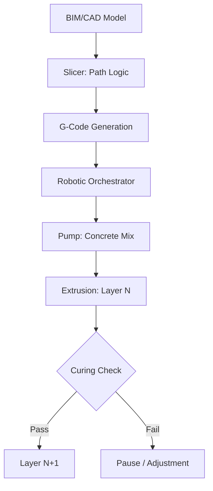

<TLDR>
  速度是 3D 建筑打印最明显的优势，精度则是更大的优势。从减材制造转向增材制造，我们可以把材料浪费最多减少 60%，并把复杂的热工几何结构直接集成到墙体结构里。这就是绿色基础设施的定义：高性能、低浪费、本地优先。
</TLDR>

第一次看到龙门式 3D 打印机挤出一条碳纤维增强混凝土时，我看到的不只是一种更快的建造方式。我看到的是通向**材料主权**的一次技术转向，这个概念在我最近的研究中反复出现。

在传统建筑行业，我们常常受制于木材场的规格和模具的局限。浪费惊人：全球平均数据显示，运到工地的材料中有很大一部分最终进了垃圾桶。理论上，把基础设施当作软件问题来对待，也就是把数字意图翻译成物理现实的一套指令，可以为零浪费的精度开辟一条新路。

## 地基：墨水与笔

在深入材料科学之前，我们需要先了解硬件。3D 建筑打印大体分为两大阵营：**龙门系统**和**机械臂**。

* **龙门系统**：它们本质上是你桌面 FDM 打印机的巨型版本。在工地周围搭起一个巨大的框架，喷嘴沿 X、Y、Z 轴移动。它们非常稳定，可以大规模打印整个城市街区，但需要相当大的安装占地。
* **机械臂**：它们是灵活的多轴工业机器人（比如汽车装配线上用的那种），安装在轨道或拖车上。它们为复杂几何形状提供更大的灵活性，也能在更狭窄的空间里工作，不过通常需要更先进的路径逻辑，才能保证打印过程中的结构稳定。

“墨水”和“笔”一样关键。我们用的不是普通混凝土，而是专门的**胶凝复合材料**：这种混合物经过设计，能像液体一样从喷嘴流出，又能瞬间凝固，以承受上面各层的重量。这种“可堆叠性”才是任何 3D 建造真正的工程难题。

## 为什么：材料优化

在传统建筑中，每一条曲线都是成本中心。模板昂贵，浪费难免，劳动重复。增材制造把这一切反过来。对 3D 打印机来说，经过参数化优化的复杂曲线，和一条直线的成本一样。

这让我们能够利用**拓扑优化**。我们可以打印带有内部空心芯的墙体，它们既能充当天然保温层，也能充当布线和管道的服务通道，在挤出过程中就直接集成进去。更重要的是，它让**绿色地质聚合物**得以应用。用粉煤灰或矿渣这类工业副产品代替传统的波特兰水泥作为胶结材料，我们可以在屋顶还没封上之前，就大幅削减建筑“躯体”的碳足迹。

## 怎么做：从切片到挤出

连接“大脑”（数字设计）和“身体”（物理结构）的，是一条可预测但严格的流水线。这是材料科学与机器人技术之间一场高风险的协同编排。

## 承包商的新角色

这项技术不会取消承包商，而是提升他们。“未来的承包商”不再是体力劳动者，而更像一位**系统编排者**。

1. **材料科学家**：他们必须理解混合料的流变学，也就是温度和湿度在周二与周四对流动性的影响有何不同。
2. **机器人驾驶员**：他们管理建造过程的数字孪生，监控传感器是否出现偏差，并实时调整路径。
3. **基础设施架构师**：他们专注于在打印出的通道内集成 MEP（机械、电气、管道），减少破坏性钻孔和“事后”修改的需要。

## 接下来 / 我学到了什么

对 3D 建造的这项研究凸显了一个根本性的转变：**基础设施正在变成软件**。当你可以编程一面墙的热质量或一个转角的结构密度时，你就不再受限于本地五金店的“标准规格”。

虽然 Gekro Lab 目前并不打印墙体，但**绿色基础设施**的原则，也就是优先精确使用材料，而不是沿用过去的蛮力做法，为我们最终如何弥合数字智能与物理环境之间的鸿沟提供了一张路线图。
