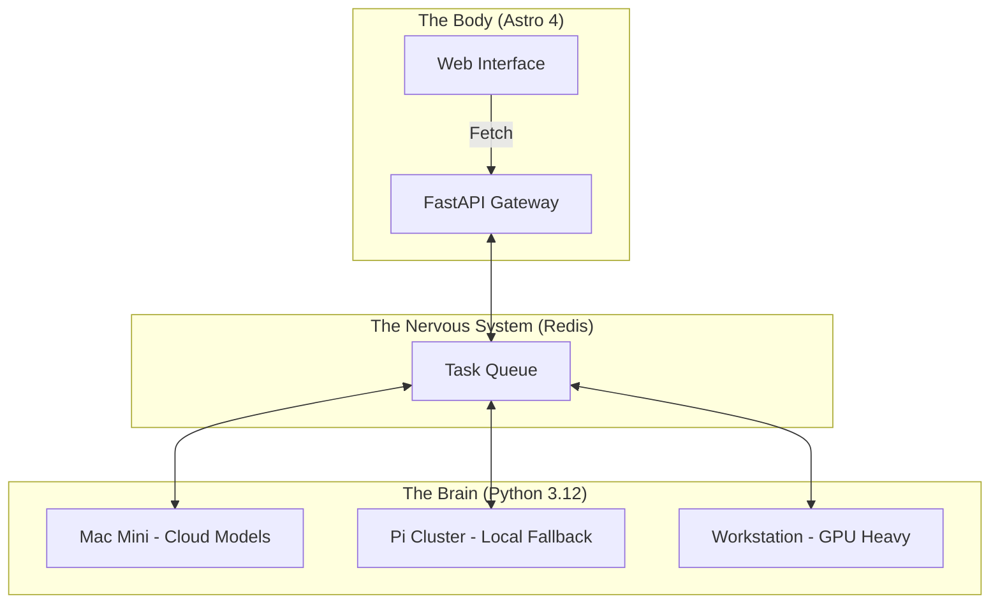

<TLDR>
  单体架构是 AI 开发者的债务陷阱。我把 Gekro 拆成了负责异步推理的、由 Python 驱动的“大脑”，和负责高性能交付的、基于 Astro 的“身体”。本文拆解了从 Mac Mini 到 Pi 集群的硬件栈，以及把它们连在一起的 FastAPI 神经系统。
</TLDR>

大多数开发者把 LLM 当成一个被神化的数据库查询：在单个 Next.js 或 Node 服务器内处理的同步请求-响应循环。这在工作真正耗时之前都没问题。当你运行复杂的智能体工作流，可能需要 30 秒“思考”、再花 10 秒验证时，你不能阻塞 UI 线程。在我的实验室里，我选定了**分脑架构**。“大脑”（智能）运行在分布式硬件集群上专门的 Python 环境里，而“身体”（界面）则是一台精干轻快的 Astro 机器，优先考虑速度和 SEO。

## 架构

我的实验室是分布式的。我不相信把所有算力放在一个篮子里。一次部署宕机不应该让实验室的智能离线；这套架构要能扛住任何单点故障。



| 层 | 技术 | 主要职责 |
| :--- | :--- | :--- |
| **身体** | Astro + Tailwind v4 | UI 交付、SEO 和静态文档。 |
| **大脑** | Python + LangGraph | 长时间运行的推理循环和模型编排。 |
| **神经系统** | FastAPI + Redis | 异步状态管理和事件路由。 |
| **算力** | Together AI / Ollama | 推理引擎（云端和本地）。 |

## 搭建

实现从解耦开始。“大脑”永远不该关心 CSS，“身体”永远不该关心温度采样或 top-p 的取值。

### 1. 大脑：无状态的逻辑引擎

我用 FastAPI 来暴露各个智能体。这样 Astro 的“身体”就能触发思考，而不用管理底层的 Python 依赖。

```python
# brain/main.py
from fastapi import FastAPI, BackgroundTasks
from pydantic import BaseModel
import redis

app = FastAPI()
r = redis.Redis(host='localhost', port=6379, db=0)

class Task(BaseModel):
    instruction: str
    session_id: str

@app.post("/think")
async def run_thought_cycle(task: Task, background_tasks: BackgroundTasks):
    # Update Body that we are 'Thinking'
    r.set(f"status:{task.session_id}", "processing")
    
    # Run the expensive AI logic in the background
    background_tasks.add_task(expensive_reasoning, task.instruction, task.session_id)
    
    return {"status": "accepted", "session_id": task.session_id}

def expensive_reasoning(prompt, sid):
    from gekro_client import GekroLLMClient
    client = GekroLLMClient()
    result = client.chat([{"role": "user", "content": prompt}])
    r.set(f"status:{sid}", "completed")
    r.set(f"result:{sid}", result)
```

### 2. 身体：Astro 请求模式

在 Astro 里，我在 SSR 阶段获取初始状态，但如果有思考循环正在进行，就用一个小的“岛”（Preact 或 SolidJS）去轮询状态。这样首次加载依然是瞬时的。

```astro
---
// apps/web/src/pages/lab.astro
import LabStatus from '../components/LabStatus.tsx';

const initialStatus = await fetch('http://brain-gateway/status').then(res => res.json());
---

<Layout title="Lab Controls">
  <h1>System Orchestration</h1>
  <!-- The 'Island' that handles the live updates -->
  <LabStatus client:load initialData={initialStatus} />
</Layout>
```

### WSL2 说明

在 Windows 机器上桥接这些层时，我把 Redis 和 FastAPI“大脑”运行在 WSL2 里，而“身体”用的是 Windows 原生的 Astro 开发服务器。这样我做 UI 工作时可以使用 Windows 的 Chrome 调试器，而为 Linux 优化过的重型 Python 代码则在它的原生环境中运行。

## 取舍

最大的挑战不是代码，而是**状态同步**。如果大脑完成了任务，但身体没有轮询更新，用户看到的就是过时的界面。我曾花三周追查一个缺陷：一个智能体已经总结完一份 4k 的日志文件，但 Redis 键没有正确传播，导致浏览器里出现“无限思考”的循环。

我给这次拆分预留了两到三个小时，结果用了整整一天。几乎所有的超支都花在大脑和身体之间的接缝上，在设置到位之前它很烦人，之后就悄无声息地不再是问题。它已经很久没给我添麻烦了。第一周全是接缝。

分布式系统的复杂性本身就是一种债务。如果你在做一个简单的应用，别这么做。但如果你在构建一个需要扛过凌晨 2 点云服务大面积中断的实验室，你就需要只有分脑架构才能提供的韧性。

它也没有图上看起来那么省心。我仍然会按需 SSH 进各台 Pi，因为每一台都在运行自己的项目，而我知道哪台是哪台。与其说这是设计上的缺陷，不如说是一种承认：三节点的集群小到可以装在脑子里，而我还没有需要假装不是这样。

## 接下来

这套设置正朝着**物理反馈**演进。我目前正把“大脑”的输出接到我在 DFW 办公室里的一组 Hue 灯上。如果实验室检测到某台远程服务器出现严重故障，房间会真的变红。架构既是软件本身，也是软件运行的环境。
