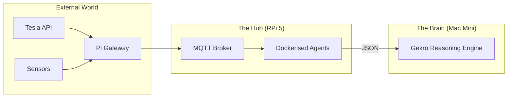

<TLDR>
  不要把 2,000 美元的工作站浪费在 cron 任务和 MQTT 代理上。我把带 NVMe SSD 的 Raspberry Pi 5 当作“实验室助手”：一个始终在线的节点，负责那些重复、低算力的任务，让实验室的心跳保持平稳。本文介绍硬件配置，以及用 Docker 搭建的通用服务栈，它把我的现实世界（Tesla 和家）与我的 AI 智能体连接起来。
</TLDR>

在数十亿美元数据中心的时代，这台 80 美元的电脑是我最可靠的员工。当我在 DFW 开始搭建 Gekro 时，我意识到自己需要一个“Ground Truth”节点：即使我的主力 Mac Mini 正在重启，或者工作站被 3D 渲染压得喘不过气，它也能保持在线。Raspberry Pi 就是这个锚点。它不负责繁重的“思考”，但能确保 Brain 所需的数据（比如我的 Tesla 的充电状态或办公室的温度）始终可用并已建立索引。

## 架构

Pi 充当**网关层**。它位于混乱的 IoT 设备世界和高性能推理层之间。



| 组件 | 硬件 / 软件 | 作用 |
| :--- | :--- | :--- |
| **主板** | Raspberry Pi 5 (16GB) | 高性能 ARM 计算。 |
| **存储** | M.2 HAT + NVMe 256GB SSD | 避免 SD 卡损坏，并加快 I/O。 |
| **代理** | Mosquitto (Docker) | 所有实验室遥测数据的“邮局”。 |
| **调度器** | Cron / Supercronic | 触发夜间的研究和清理智能体。 |

## 搭建

生产环境的 Pi 必须“Immutability-First”。除了 Docker 和 Tailscale，我不会在基础系统上安装任何东西。

### 1. NVMe 的优势

如果你除了周末小项目还在用 SD 卡，那就是在沙子上盖房子。有一次，一个大量写日志的智能体把一张高端 SD 卡写坏了，我因此丢了三周的数据。现在我用 NVMe SSD。

```bash
# Verify NVMe is detected and using Gen 3 speeds
lsblk
sudo lspci -vvv | grep LnkSta
```

### 2. 用 Docker 搭建的助手栈

我为助手节点维护一个 `docker-compose.yml`，开机后自动启动。

```yaml
services:
  mqtt:
    image: eclipse-mosquitto:latest
    ports:
      - "1883:1883"
    volumes:
      - ./mosquitto/config:/mosquitto/config

  tesla-telemetry:
    build: ./agents/tesla-bridge
    restart: always
    environment:
      - TESLA_VIN=${VIN}
      - MQTT_HOST=mqtt

  nightly-summarizer:
    image: python:3.12-slim
    volumes:
      - ./scripts:/app
    command: ["python", "/app/daily_digest.py"]
```

### 3. WSL2 说明：远程管理

我从不给 Pi 接显示器。我在 WSL2 环境里写了一个专用的 Zsh 函数，可以瞬间跳转到集群里的任何节点。

```bash
# Fast SSH to lab nodes
lab() {
  ssh rohit@192.168.1.$1
}
# Usage: lab 50 (connects to Pi at .50)
```

## 取舍

Pi 最大的弱点是**算力饱和**。有一次，我试图在 Pi 上运行本地向量数据库（ChromaDB），同时还跑着另外四个智能体。I/O 等待时间飙升，我的 MQTT 桥开始丢掉来自 Tesla 的消息。你得做一个“资源拾荒者”。我学会了把 Pi 严格限制在**受 I/O 限制的任务**（拉取 API 数据、转发消息）上，把所有**受 CPU/GPU 限制的任务**交给 Mac Mini。

另外，**供电很重要**。“普通”的 USB-C 手机充电器会让 Pi 5 在负载下降频。为了让 NVMe 硬盘和主动散热器在德州夏季热浪中全速运行，我不得不换成官方的 27W PD 电源。

## 接下来

我目前正在给 Pi 的 GPIO 引脚接一个**物理急停开关**。如果我发现某个智能体行为异常，或者触及 API 花费上限，我桌上的一个实体按钮就会向整个 Docker 栈发送 SIGTERM。完全的自主权，意味着手要真正按在电源插头上。
