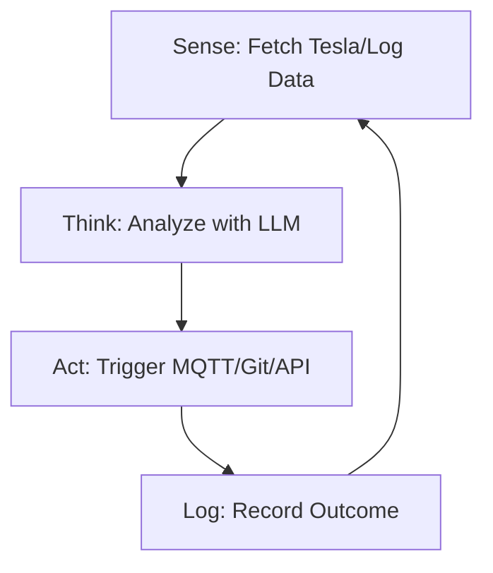

<TLDR>
  脚本遵循一份指令清单，智能体则追随一个目标。我构建了第一个自主循环来监控我的 Tesla 的电量，电量到达某个阈值时，它会自动触发一条“Deep Discharge”通知。本文介绍架构上的转变：从线性代码转向在我的 Pi 集群上 24/7 运行的 Sense-Think-Act 循环。
</TLDR>

从“写代码”到“指挥智能”，只发生在一瞬间。对我来说，那是达拉斯一个周二的晚上 11 点。我有一个智能体在循环中运行，监控服务器日志里的 404 错误。它没有只是提醒我，而是自己找出了一个失效的内部链接，生成了一条 `sed` 命令来修复它，并把改动提交到了 Git。那是我第一次感受到一个系统能在我没碰键盘的情况下“改进”自己的那种诡异力量。这就是 **Sense-Think-Act** 循环，也是 Gekro Lab 的基本单元。

## 架构

智能体不是一个单独的函数，而是一台**状态机**。它需要知道自己在哪里、想要达成什么，以及手头有哪些工具。



| 阶段 | 职责 | 工具 |
| :--- | :--- | :--- |
| **Sense** | 摄入原始遥测数据或文件数据。 | `requests`, `tail`, `mqtt` |
| **Think** | 对照目标对数据进行推理。 | Together AI / Ollama |
| **Act** | 对环境执行一项改动。 | `subprocess`, `git`, `curl` |
| **State** | 记住上一轮循环里发生了什么。 | SQLite / JSON 文件 |

## 搭建

要构建你的第一个智能体，你需要把 LLM 调用包进一个持续运行的 `while` 循环里，并配上错误处理，不要在 API 超时时就直接崩溃。

### 1. 自主循环

这是监控我实验室健康状况的“Guardian”智能体的简化版本。

```python
import time
import logging
from gekro_client import GekroLLMClient # From my API Sovereignty post

class BasicAgent:
    def __init__(self, goal: str):
        self.goal = goal
        self.client = GekroLLMClient()
        self.state = {"iterations": 0, "last_action": "none"}

    def run(self):
        while True:
            self.state["iterations"] += 1
            print(f"\n--- Cycle {self.state['iterations']} ---")
            
            # SENSE: Get system stats
            # In production, use psutil.cpu_percent(), MQTT subscriptions, or API calls.
            # This static string is for demonstration only.
            context = "System Load: 85%, Temperature: 78C, Network: Latent"
            
            # THINK: Ask the Brain what to do
            prompt = f"Goal: {self.goal}\nCurrent Context: {context}\nLast Action: {self.state['last_action']}\nWhat is the next step?"
            decision = self.client.chat([{"role": "user", "content": prompt}])
            
            # ACT: (For safety, we just log in this example)
            self.execute(decision)
            self.state["last_action"] = decision
            
            time.sleep(60) # Wait 60 seconds before next sense cycle

    def execute(self, action):
        logging.info(f"Agent decided to: {action}")
        # Real execution logic (e.g., shell commands) would go here

if __name__ == "__main__":
    agent = BasicAgent(goal="Keep the lab temperatures below 80C by throttling compute.")
    agent.run()
```

### 2. 状态持久化

没有记忆的智能体只是一个脚本。在实验室里，我用一个简单的 JSON 文件保存智能体的“思考历史”，这样它就不会连续五次犯同样的错误。

### WSL2 说明

在 WSL2 中运行自主循环时，请使用 **Tmux**。它能让你分离会话，即使关闭终端或 Windows 机器进入睡眠（前提是你在 Windows 设置里关闭了“睡眠”），智能体也能在后台继续运行。

## 取舍

早期智能体最大的失败是**无限推理循环**。有一次，我让一个智能体带着定义糟糕的目标一直运行：“修正文档中所有的拼写错误。”由于“拼写错误”是主观的，这个智能体在三小时内花掉了 40 美元的 Together AI 额度，一遍又一遍地“修正”自己刚做的修改，原地打转。**务必设置“Max Iterations”上限或预算上限。**

还有**命令幻觉**的问题。当你让智能体访问 shell（`subprocess.run`）时，它迟早会尝试运行一条不存在的命令，或者更糟，一条有破坏性的命令。我是在一个智能体试图对一个“临时”目录执行 `rm -rf` 时学到这一点的，而那个目录里实际存放着我的 Tesla API 令牌。在任何新智能体部署的前 48 小时，请使用“Dry Run”模式。

## 接下来

我们正在从单循环智能体转向**多智能体系统**。我目前正在构建一个“Manager”智能体，它监督三个“Worker”智能体（一个负责编码，一个负责研究，一个负责安全）。不再由我来指挥循环，而是由 Manager 指挥各个 worker。实验室正在变成一座自我优化的智能工厂，而“Sense-Think-Act”就是它的流水线。
